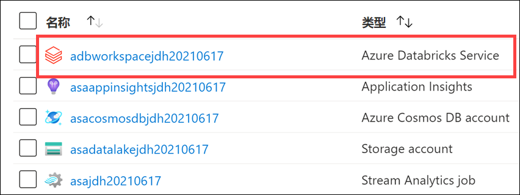
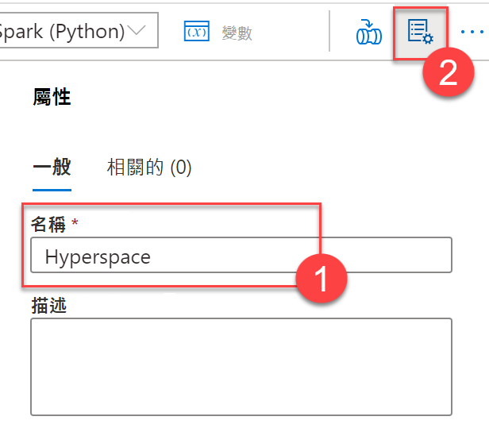
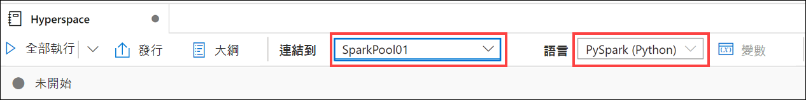
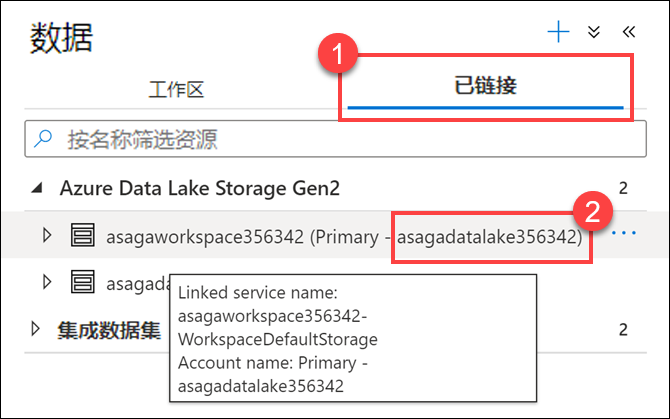
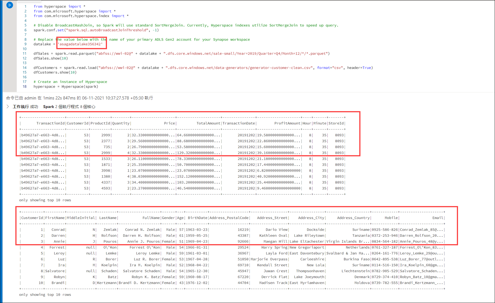
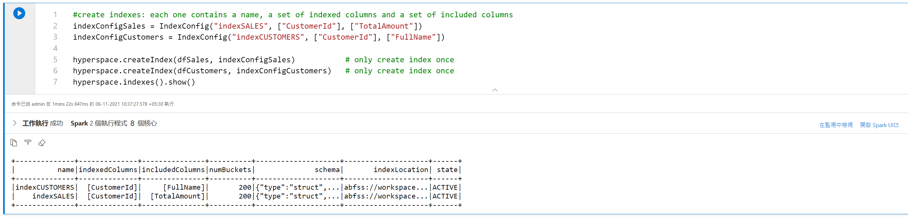
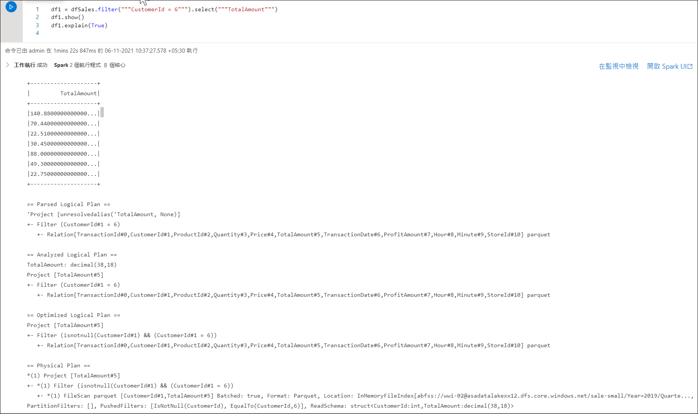
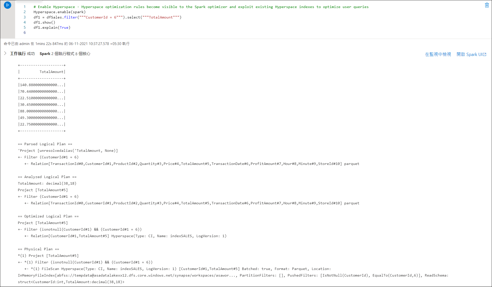
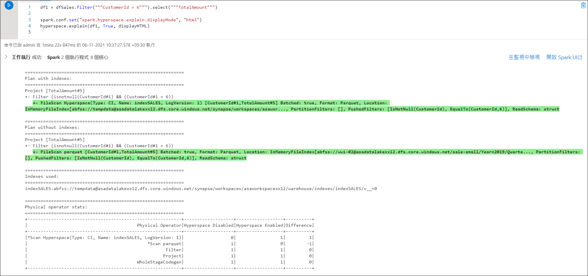
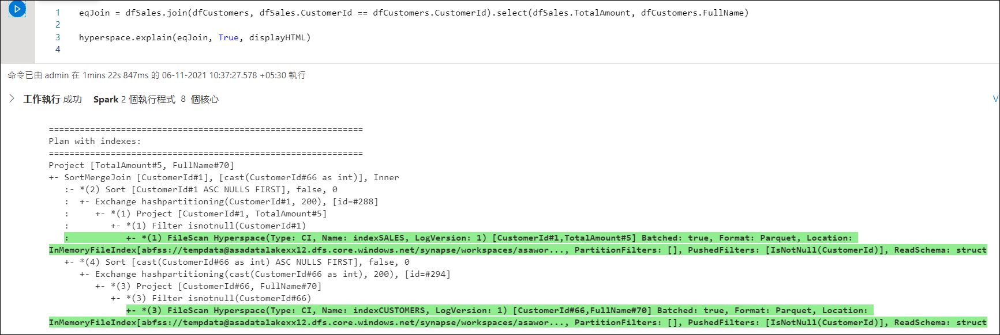

---
lab:
  title: 探索用于数据工程工作负载的计算和存储选项
  module: Module 1
---

# <a name="lab-1---explore-compute-and-storage-options-for-data-engineering-workloads"></a>实验室 1 - 探索用于数据工程工作负载的计算和存储选项

本实验室介绍用于构造 Data Lake 以及优化用于探索、流式处理和批处理工作负载的文件的方法。 你将学习在通过批处理和流式处理转换文件时如何将 Data Lake 整理到数据细化级别。 然后将了解如何对其数据集（例如 CSV、JSON 和 Parquet 文件）创建索引，并将这些索引用于潜在的查询和工作负载加速。

完成本实验室后，你将能够：

- 将流式处理和批处理与单个管道相结合
- 将数据湖组织成文件转换级别
- 用于查询和工作负载加速的索引数据湖存储

## <a name="lab-setup-and-pre-requisites"></a>实验室设置和先决条件

开始本实验室之前，请确保已成功完成创建实验室环境的安装步骤。

## <a name="exercise-1---delta-lake-architecture"></a>练习 1 - Delta Lake 体系结构

在此练习中，你将使用 Azure Databricks 工作区，并通过使用 Delta Lake 执行批处理作业的结构化流。 你需要在 Databricks 笔记本中完成练习。 首先，你需要有权访问 Azure Databricks 工作区。

### <a name="task-1-create-an-azure-databricks-cluster"></a>任务 1：创建 Azure Databricks 群集

1. 登录 Azure 门户 (`https://portal.azure.com`)，导航到本课程的设置脚本创建的 data-engineering-synapse-xxxxxxx 资源组。 然后选择 Azure Databricks 服务工作区。

    

2. 选择“启动工作区”，在新的选项卡中打开 Databricks 工作区。

    
    
    > 警告：由于存在一个已知的域权限问题，请使用“启动工作区”按钮上方提供的 URL（位于受管理资源组标识符下方），而不是按钮本身，因为这将导致显示权限错误。

3. 在 Databricks 工作区的左侧菜单中，选择“计算”。
4. 选择“+创建群集”，添加新的群集。

    

5. 单击以红色突出显示的 `LabUser_youruserid Cluster`，然后为群集输入一个名称，例如 `Test Cluster`。
6. 选择“单个节点”群集模式。
7. 选择“Databricks RuntimeVersion”。 建议使用最新运行时和 Scala 2.12。
8. 将“终止前等待”的超时时间设置为 30 分钟，然后选择默认节点类型。
9. 选择“创建群集”。

     
     
11. 等待群集启动。 请注意，在进行下一个任务之前，需要等待 5 - 7 分钟至群集启动。

### <a name="task-2-clone-the-databricks-archive"></a>任务 2：克隆 Databricks 存档

1. 在 Azure Databricks 工作区的左窗格中，依次选择“工作区” > “用户”，然后选择用户名（带房屋图标的条目） 。
1. 在显示的窗格中，选择名称旁边的箭头，然后选择“导入”。

    

1. 在“导入笔记本”对话框中，选择“URL”并粘贴以下 URL：

    ```
    https://github.com/MicrosoftLearning/DP-203-Data-Engineer/raw/master/Allfiles/microsoft-learning-paths-databricks-notebooks/data-engineering/DBC/11-Delta-Lake-Architecture.dbc
    ```

1. 选择“导入”。
1. 选择显示的“11-Delta-Lake-Architecture”文件夹。

### <a name="task-3-run-code-in-the-1-delta-architecture-notebook"></a>任务 3：在 1-Delta-Architecture 笔记本中运行代码。

1. 打开“1-Delta-Architecture”笔记本。
1. 将群集附加到笔记本中，然后按照说明运行笔记本中包含的单元格。 要运行代码单元，请选择要运行的单元格，然后使用右上角的 &#x23f5; 按钮运行它。

    在笔记本中，你将了解如何将流式处理和批处理与单个管道相结合。

    > 提示：请关闭 Databricks 群集 

1. 探索完 Azure Databricks 笔记本之后，在 Azure Databricks 工作区的左侧窗格中，选择“计算”然后选择群集。 然后选择“终止”以停止群集。

### <a name="task-4-execute-powershell-script"></a>任务 4：执行 PowerShell 脚本

1. 在为本课程提供的托管 VM 环境中，在管理员模式下打开 Powershell，然后执行以下命令，将执行策略设置为“无限制”，使你可以运行本地 Powershell 脚本文件：

    ```
    Set-ExecutionPolicy Unrestricted
    ```

    > **注意**：如果收到提示，指示你正在从不受信任的存储库安装模块，请选择“全部确认”以继续设置。

2. 将目录更改为本地文件系统中此存储库的根目录。

    ```
    cd C:\dp-203\data-engineering-ilt-deployment\Allfiles\00\artifacts\environment-setup\automation\
    ```

3. 输入以下命令运行 PowerShell 脚本，该脚本将在 Azure Data Lake 中创建对象，这些对象将在 Azure Synapse Analytics 笔记本中作为外部表或视图使用：

    ```
    .\dp-203-setup-Part02.ps1
    ```

4. 脚本完成后，在 PowerShell 窗口中运行以下命令：
   
   ```
   exit
   ```

> 注意：此脚本会在大约 10-15 分钟内运行，并将数据加载到 Synapse。 如果在为 SQLPool01 专用 SQL 池（有 3 个）创建链接服务时脚本似乎挂起，请按 Enter。 这通常会刷新 PowerShell 脚本并允许它继续运行到最后。

> ### <a name="potential-errors-that-you-can-ignore"></a>可以忽略的潜在错误
>
> 你可能会在脚本执行过程中遇到一些错误和警告。 可以忽略以下错误：
>
> 1. 在专用 SQL 池中创建 SQL 用户和添加角色分配时可能会出现以下错误，可以忽略这些错误：
>
>    无法创建主体“xxx@xxx.com”。只有与 Active Directory 帐户建立的连接才能创建其他 Active Directory 用户。

## <a name="exercise-2---working-with-apache-spark-in-synapse-analytics"></a>练习 2 - 在 Synapse Analytics 中使用 Apache Spark

此练习将演示如何在 Azure Synapse Analytics 中使用 Apache Spark。 此外，还将学习如何使用 Hyperspace 和 MSSparkUtil 等库，以优化使用 Spark 笔记本中的 Data Lake Storage 帐户的体验。

完成练习后，你将了解如何在 Azure Synapse Analytics 工作区中加载和使用 Spark 库。

### <a name="task-1-index-the-data-lake-storage-with-hyperspace"></a>任务 1：使用 Hyperspace 为 Data Lake Storage 创建索引

从 Azure Data Lake Gen 2 加载数据时，搜索数据是最消耗资源的操作之一。 [Hyperspace](https://github.com/microsoft/hyperspace) 为 Apache Spark 用户引入了在其数据集（如 CSV、JSON 和 Parquet）上创建索引的能力，并将它们用于潜在的查询和工作负载加速。

使用 Hyperspace，你可在从持久数据文件扫描的记录上创建索引。 成功创建后，与索引对应的条目将添加到 Hyperspace 的元数据中。 Apache Spark 的优化器稍后会在查询处理期间使用此元数据来查找并使用正确的索引。 如果基础数据发生变化，可以刷新现有索引以捕获该数据。

此外，用户可以使用 Hyperspace 在运行查询之前将他们的原始计划与更新之后依赖索引的计划进行比较。

1. 打开 Synapse Studio (`https://web.azuresynapse.net`)，如果出现提示，请选择 Azure Active Directory 租户、订阅和 Azure Synapse Analytics 工作区。 如果提示“我们使用可选的 Cookie 提供更出色的体验。” 然后选择“继续”。

2. 选择“开发”中心。

    

3. 依次选择“+”和“Notebook”，以创建新的 Synapse 笔记本 。

    

4. 输入 Hyperspace 作为笔记本名称 (1)，然后选择上方的“属性”按钮 (2)，以隐藏属性窗格   。

    

5. 将笔记本附加到 SparkPool01，并确将保语言设置为 PySpark (Python) 。

    

6. 将以下代码添加到笔记本中的新单元格：

    ```python
    from hyperspace import *  
    from com.microsoft.hyperspace import *
    from com.microsoft.hyperspace.index import *

    # Disable BroadcastHashJoin, so Spark will use standard SortMergeJoin. Currently, Hyperspace indexes utilize SortMergeJoin to speed up query.
    spark.conf.set("spark.sql.autoBroadcastJoinThreshold", -1)

    # Replace the value below with the name of your primary ADLS Gen2 account for your Synapse workspace
    datalake = 'asadatalakeSUFFIX'

    dfSales = spark.read.parquet("abfss://wwi-02@" + datalake + ".dfs.core.windows.net/sale-small/Year=2019/Quarter=Q4/Month=12/*/*.parquet")
    dfSales.show(10)

    dfCustomers = spark.read.load("abfss://wwi-02@" + datalake + ".dfs.core.windows.net/data-generators/generator-customer-clean.csv", format="csv", header=True)
    dfCustomers.show(10)

    # Create an instance of Hyperspace
    hyperspace = Hyperspace(spark)
    ```

7. 在“datalake”变量值中，使用唯一的资源名扩展名替换“SUFFIX”，这样变量就体现出 Azure Data Lake 存储帐户的名称（应该是 asadatalakexxxxxx）。

    >    要确认此操作，请执行以下步骤：
    >
    >    1. 导航到“数据”中心。
    >
    >        
    >
    >    1. 选择“链接”选项卡 (1)，展开 Azure Data Lake Storage Gen2 组，然后记下工作区名称旁边的主要 ADLS Gen2 名称 (2)  。
    >
    >        

8. 使用左边的 &#9655; 按钮或按“Shift+Enter”来运行修改后的代码单元格 。 它将使用来自 Data Lake 的数据加载两个 DataFrame，并初始化 Hyperspace。

    

    > **注意**：由于必须启动新的 Spark 群集，首次在笔记本中运行单元将花几分钟的时间。 每个后续单元格执行都必须更快。

9. 选择单元格输出内容下面的“+ 代码”按钮来创建一个新的代码单元格。

10. 将以下代码粘贴到新的单元格中：

    ```python
    #create indexes: each one contains a name, a set of indexed columns and a set of included columns
    indexConfigSales = IndexConfig("indexSALES", ["CustomerId"], ["TotalAmount"])
    indexConfigCustomers = IndexConfig("indexCUSTOMERS", ["CustomerId"], ["FullName"])

    hyperspace.createIndex(dfSales, indexConfigSales)           # only create index once
    hyperspace.createIndex(dfCustomers, indexConfigCustomers)   # only create index once
    hyperspace.indexes().show()
    ```

11. 运行新单元格。 将创建两个索引并显示其结构。

    

12. 使用以下代码将另一个新的代码单元格添加到笔记本中：

    ```python
    df1 = dfSales.filter("""CustomerId = 6""").select("""TotalAmount""")
    df1.show()
    df1.explain(True)
    ```

13. 运行新单元格。 输出将显示物理执行计划没有考虑任何索引（对原始数据文件执行文件扫描）。

    

14. 现在，使用以下代码将另一个新单元格添加到笔记本中（注意开头额外的一行，用于在 Spark 引擎中启用 Hyperspace 优化）：

    ```python
    # Enable Hyperspace - Hyperspace optimization rules become visible to the Spark optimizer and exploit existing Hyperspace indexes to optimize user queries
    Hyperspace.enable(spark)
    df1 = dfSales.filter("""CustomerId = 6""").select("""TotalAmount""")
    df1.show()
    df1.explain(True)
    ```

15. 运行新单元格。 输出将显示物理执行计划目前正在使用索引而不是原始数据文件。

    

16. Hyperspace 提供了一个 Explain API，可以比较没有索引和有索引的执行计划。 使用以下代码添加新单元格：

    ```python
    df1 = dfSales.filter("""CustomerId = 6""").select("""TotalAmount""")

    spark.conf.set("spark.hyperspace.explain.displayMode", "html")
    hyperspace.explain(df1, True, displayHTML)
    ```

17. 运行新单元格。 输出显示 `Plan with indexes` 与 `Plan without indexes` 之间的比较。仔细观察比较，使用索引文件的第一种情况和使用原始数据文件的第二种情况。

    

18. 现在，让我们研究涉及联接操作的更复杂的情况。 使用以下代码添加新单元格：

    ```python
    eqJoin = dfSales.join(dfCustomers, dfSales.CustomerId == dfCustomers.CustomerId).select(dfSales.TotalAmount, dfCustomers.FullName)

    hyperspace.explain(eqJoin, True, displayHTML)
    ```

19. 运行新单元格。 输出再次显示 `Plan with indexes` 与 `Plan without indexes` 之间的比较，其中第一种情况使用索引，第二种情况使用原始数据文件。

    

20. 要停用 Hyperspace 并清理索引，请使用以下代码添加并运行一个新单元格：

    ```python
    # Disable Hyperspace - Hyperspace rules no longer apply during query optimization. Disabling Hyperspace has no impact on created indexes because they remain intact
    Hyperspace.disable(spark)

    hyperspace.deleteIndex("indexSALES")
    hyperspace.vacuumIndex("indexSALES")
    hyperspace.deleteIndex("indexCUSTOMERS")
    hyperspace.vacuumIndex("indexCUSTOMERS")
    ```

### <a name="task-2-explore-the-data-lake-storage-with-the-mssparkutil-library"></a>任务 2：通过 MSSparkUtil 库浏览 Data Lake Storage

Microsoft Spark 实用工具 (MSSparkUtils) 是内置的包，可帮助你轻松执行常见任务。 你可以使用 MSSparkUtils 来处理文件系统、获取环境变量以及处理机密。

1. 继续使用上一个任务中的笔记本，并使用以下代码添加新单元格：

    ```python
    from notebookutils import mssparkutils

    #
    # Microsoft Spark Utilities
    #
    # https://docs.microsoft.com/en-us/azure/synapse-analytics/spark/microsoft-spark-utilities?pivots=programming-language-python
    #

    # Azure storage access info
    blob_account_name = datalake
    blob_container_name = 'wwi-02'
    blob_relative_path = '/'
    linkedServiceName = datalake
    blob_sas_token = mssparkutils.credentials.getConnectionStringOrCreds(linkedServiceName)

    # Allow SPARK to access from Blob remotely
    spark.conf.set('fs.azure.sas.%s.%s.blob.core.windows.net' % (blob_container_name, blob_account_name), blob_sas_token)

    files = mssparkutils.fs.ls('/')
    for file in files:
        print(file.name, file.isDir, file.isFile, file.path, file.size)

    mssparkutils.fs.mkdirs('/SomeNewFolder')

    files = mssparkutils.fs.ls('/')
    for file in files:
        print(file.name, file.isDir, file.isFile, file.path, file.size)
    ```

2. 运行新单元格，并观察如何使用 MSSparkUtils 来处理文件系统。

### <a name="task-3-stop-the-session"></a>任务 3 停止会话

1. 使用笔记本右上角的“停止会话”按钮，然后选择“立即停止”来停止笔记本会话 。
1. 如果想稍后再次查看，请发布该笔记本。 然后将其关闭。

## <a name="resources"></a>资源

请使用以下资源详细了解本实验室中涵盖的主题：

- [Azure Synapse Analytics 中的 Apache Spark](https://docs.microsoft.com/azure/synapse-analytics/spark/apache-spark-overview)
- [宣布用于 Azure Synapse 的 Azure 数据资源管理器数据连接器](https://techcommunity.microsoft.com/t5/azure-data-explorer/announcing-azure-data-explorer-data-connector-for-azure-synapse/ba-p/1743868)
- [使用适用于 Azure Synapse Analytics 的 Apache Spark 连接到 Azure 数据资源管理器](https://docs.microsoft.com/azure/synapse-analytics/quickstart-connect-azure-data-explorer)
- [Azure Synapse Analytics 共享元数据](https://docs.microsoft.com/azure/synapse-analytics/metadata/overview)
- [Microsoft Spark 实用工具简介](https://docs.microsoft.com/azure/synapse-analytics/spark/microsoft-spark-utilities?pivots=programming-language-python)
- [Hyperspace - 一个开放源代码索引子系统，可加速 Apache Spark™ 和大数据工作负载基于索引的查询](https://github.com/microsoft/hyperspace)
