---
lab:
    title: '使用无服务器 SQL 池运行交互式查询'
    module: '模块 2'
---

# 实验室 2 - 使用无服务器 SQL 池运行交互式查询

在本实验室中，你将了解如何通过 Azure Synapse Analytics 中的无服务器 SQL 池执行的 T-SQL 语句使用 Data Lake 中的文件和外部文件源。你将查询 Data Lake 中的 Parquet 文件，以及外部数据存储中的 CSV 文件。接下来，你将创建 Azure Active Directory 安全组并通过基于角色的访问控制 (RBAC) 和访问控制列表 (ACL) 强制访问 Data Lake 中的文件。

完成本实验室后，你将能够：

- 使用无服务器 SQL 池查询 Parquet 数据
- 创建用于 Parquet 和 CSV 文件的外部表
- 使用无服务器 SQL 池创建视图
- 使用无服务器 SQL 池时，保护对数据湖中数据的访问
- 使用基于角色的访问控制 (RBAC) 和访问控制列表 (ACL) 配置数据湖安全性

## 实验室设置和先决条件

开始本实验室之前，请确保已成功完成创建实验室环境的设置步骤。

## 练习 1：在 Azure Synapse Analytics 中使用无服务器 SQL 池查询 Data Lake Store

通过数据探索来理解数据也是当今数据工程师和数据科学家面临的核心挑战之一。不同的数据处理引擎的性能、复杂性和灵活性会有所不同，具体取决于数据的底层结构以及探索过程的具体要求。

在 Azure Synapse Analytics 中，可以使用 SQL 和/或 Apache Spark for Synapse。对服务的选择主要取决于你的个人偏好和专业知识。在执行数据工程任务时，这两种选择在很多情况下都是同样有效的。但是，在某些情况下，利用 Apache Spark 的强大功能有助于克服源数据的问题。这是因为在 Synapse 笔记本中，可以从大量的免费库进行导入，使用数据时这些库可以为环境添加功能。而在其他情况下，使用无服务器 SQL 池来探索数据，或者通过可以从外部工具（例如 Power BI）访问的 SQL 视图来公开数据湖中的数据，会更加方便且速度更快。

在本练习中，使用这两种选项探索数据湖。

### 任务 1：使用无服务器 SQL 池查询销售 Parquet 数据

在使用无服务器 SQL 池查询 Parquet 文件时，可以使用 T-SQL 语法探索数据。

1. 打开 Synapse Studio (<https://web.azuresynapse.net/>)，然后导航到“**数据**”中心。

    

2. 在左侧窗格的“**已链接**”选项卡上，展开“**Azure Data Lake Storage Gen2**”和“**asaworkspace*xxxxxx***”主 ADLS Gen2 帐户，然后选择“**wwi-02**”容器
3. 在“**sale-small/Year=2019/Quarter=Q4/Month=12/Day=20191231**”文件夹中，右键单击“**sale-small-20191231-snappy.parquet**”文件，选择“**新建 SQL 脚本**”，然后选择“**选择前 100 行**”。

    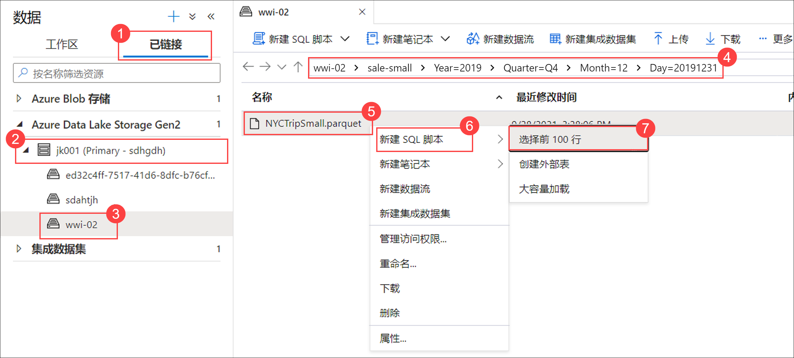

3. 确保已在查询窗口上方的“**连接到**”下拉列表中选择“**内置**”，然后运行查询。数据会由无服务器 SQL 终结点加载并处理，就和处理任何常规关系数据库的数据一样。

    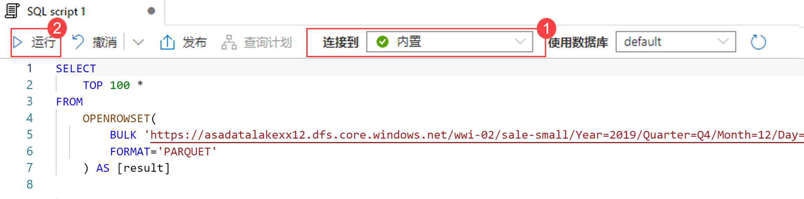

    单元格输出显示来自 Parquet 文件的查询结果。

    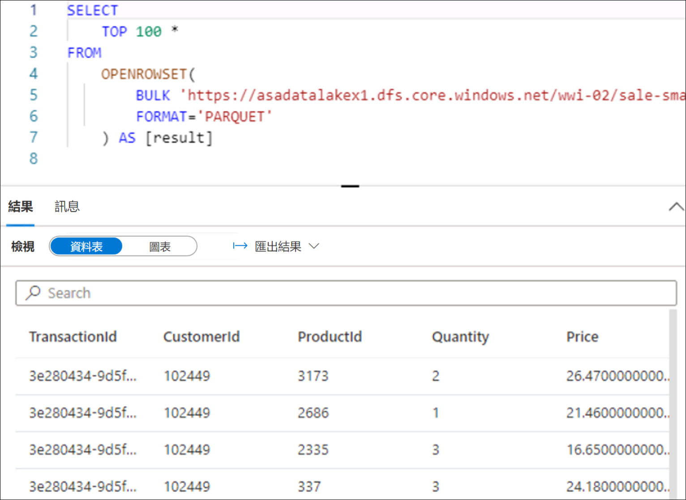

4. 修改 SQL 查询，执行聚合和分组操作以更好地理解数据。将查询替换为以下内容，其中将“*SUFFIX*”替换为 Azure Data Lake 存储的唯一后缀，并确保 OPENROWSET 函数中的文件路径与当前文件路径匹配：

    ```sql
    SELECT
        TransactionDate, ProductId,
            CAST(SUM(ProfitAmount) AS decimal(18,2)) AS [(sum) Profit],
            CAST(AVG(ProfitAmount) AS decimal(18,2)) AS [(avg) Profit],
            SUM(Quantity) AS [(sum) Quantity]
    FROM
        OPENROWSET(
            BULK 'https://asadatalakeSUFFIX.dfs.core.windows.net/wwi-02/sale-small/Year=2019/Quarter=Q4/Month=12/Day=20191231/sale-small-20191231-snappy.parquet',
            FORMAT='PARQUET'
        ) AS [r] GROUP BY r.TransactionDate, r.ProductId;
    ```

    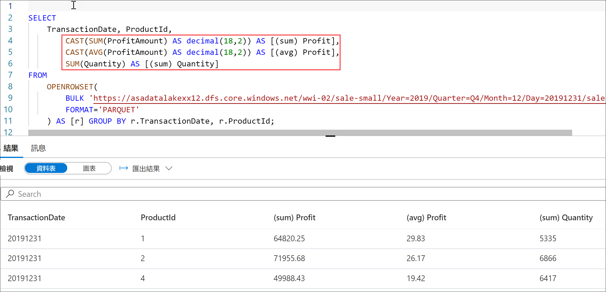

5. 让我们从 2019 年的这个单一文件过渡到更新的数据集。我们想要了解含所有 2019 年数据的 Parquet 文件中包含多少条记录。对于规划如何优化向 Azure Synapse Analytics 的数据导入，这些信息非常重要。为此，我们将使用以下内容替换查询（请务必在 BULK 语句中更新数据湖的后缀）：

    ```sql
    SELECT
        COUNT(*)
    FROM
        OPENROWSET(
            BULK 'https://asadatalakeSUFFIX.dfs.core.windows.net/wwi-02/sale-small/Year=2019/*/*/*/*',
            FORMAT='PARQUET'
        ) AS [r];
    ```

    > 请注意我们更新路径的方式，这样能包括“*sale-small/Year=2019*”的所有子文件夹中所有的 Parquet 文件。

    输出应该为 **4124857** 条记录。

### 任务 2：为 2019 销售数据创建外部表

在需要查询 Parquet 文件时，我们可以创建外部表，而不是每次都创建带有 OPENROWSET 和根 2019 文件夹路径的脚本。

1. 在 Synapse Studio 中，返回到“**wwi-02**”选项卡，此选项卡应仍显示“*sale-small/Year=2019/Quarter=Q4/Month=12/Day=20191231*”文件夹的内容。
2. 右键单击“**sale-small-20191231-snappy.parquet**”文件，依次选择“**新建 SQL 脚本**”和“**创建外部表**”。在“**新建外部表**”对话框中，单击“**继续**”。
3. 确保已为“**SQL 池**”选择“**内置**”。接着，在“**选择数据库**”下选择“**+ 新建**”，并创建名为`demo`的数据库，然后单击“**创建**”。对于“外部表名称”，输入`All2019Sales`。最后，在“**创建外部表**”下，确保已选择“**使用 SQL 脚本**”，然后选择“**打开脚本**”以生成 SQL 脚本。

    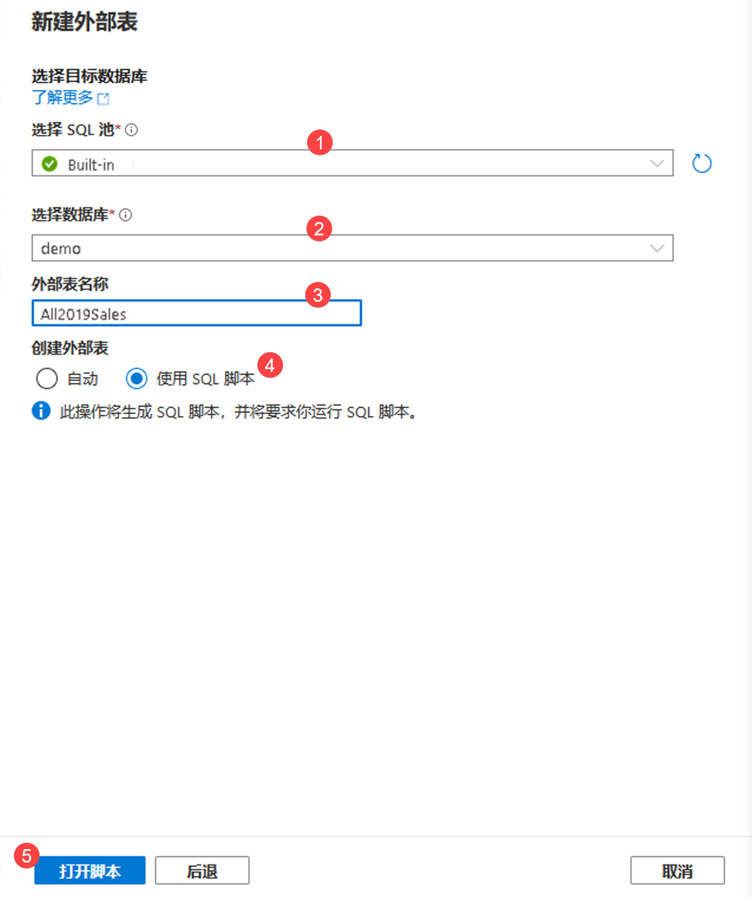

    > **备注**：脚本的“**属性**”窗格会自动打开。可以通过使用其右上方的“**属性**”按钮来关闭它，以便更轻松地处理脚本。

    生成的脚本包含以下组成部分：

    - **1)** 该脚本首先创建一个“*FORMAT_TYPE*”为“*PARQUET*”的“*SynapseParquetFormat*”外部文件格式。
    - **2)** 接着创建外部数据源，指向数据湖存储帐户的“*wwi-02*”容器。
    - **3)** CREATE EXTERNAL TABLE WITH 语句指定文件位置，并引用上述创建的新外部文件格式和数据源。
    - **4)** 最后，我们从 `2019Sales` 外部表中选择前 100 个结果。
    
4. 在 CREATE EXTERNAL TABLE 语句的“**[TransactionId] varchar(8000)**”行中，将 8000 更改为 4000 并添加 `COLLATE Latin1_General_100_BIN2_UTF8`，同时将“**LOCATION**”值替换为 `sale-small/Year=2019/*/*/*/*.parquet`，使语句如下所示（唯一资源 SUFFIX 除外）：

```sql
CREATE EXTERNAL TABLE All2019Sales (
    [TransactionId] varchar(8000) COLLATE Latin1_General_100_BIN2_UTF8,
    [CustomerId] int,
    [ProductId] smallint,
    [Quantity] smallint,
    [Price] numeric(38,18),
    [TotalAmount] numeric(38,18),  
    [TransactionDate] int,
    [ProfitAmount] numeric(38,18),
    [Hour] smallint,
    [Minute] smallint,
    [StoreId] smallint
    )
    WITH (
    LOCATION = 'sale-small/Year=2019/*/*/*/*.parquet',
    DATA_SOURCE = [wwi-02_asadatalakeSUFFIX_dfs_core_windows_net],
    FILE_FORMAT = [SynapseParquetFormat]
    )
GO
```

5. 请确保脚本已连接到无服务器 SQL 池（“**内置**”），且“**demo**”数据库已在“**使用数据库**”列表中选中（如果由于窗格太小而无法显示列表，请使用“**...**”按钮查看列表，然后根据需要使用 &#8635; 按钮刷新列表）。

    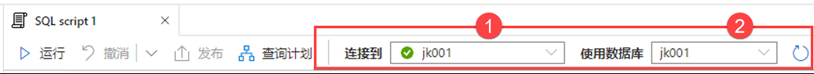

6. 运行修改后的脚本。

    运行脚本后，我们可以看到针对“**All2019Sales**”外部表的 SELECT 查询的输出。这会显示位于“*YEAR=2019*”文件夹中的 Parquet 文件中的前 100 条记录。

    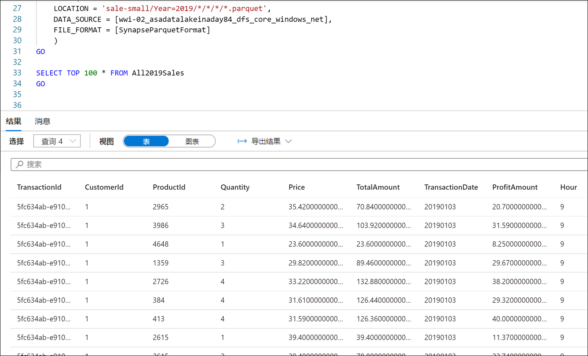

    > **提示**：如果因代码错误而出错，则应在重试前删除已成功创建的所有资源。可以通过以下方法执行此操作：运行合适的 DROP 语句，或切换到“**工作区**”选项卡，刷新“**数据库**”的列表，然后在“**demo**”数据库中删除对象。

### 任务 3：为 CSV 文件创建外部表

Tailwind Traders 找到了他们想要使用的国家人口数据的开放数据源。他们不想简单地复制这些数据，因为将来这些数据会根据预计的人口数量定期更新。

你决定创建连接到外部数据源的外部表。

1. 将你在上一个任务中运行的 SQL 脚本替换为以下代码：

    ```sql
    IF NOT EXISTS (SELECT * FROM sys.symmetric_keys) BEGIN
        declare @pasword nvarchar(400) = CAST(newid() as VARCHAR(400));
        EXEC('CREATE MASTER KEY ENCRYPTION BY PASSWORD = ''' + @pasword + '''')
    END

    CREATE DATABASE SCOPED CREDENTIAL [sqlondemand]
    WITH IDENTITY='SHARED ACCESS SIGNATURE',  
    SECRET = 'sv=2018-03-28&ss=bf&srt=sco&sp=rl&st=2019-10-14T12%3A10%3A25Z&se=2061-12-31T12%3A10%3A00Z&sig=KlSU2ullCscyTS0An0nozEpo4tO5JAgGBvw%2FJX2lguw%3D'
    GO

    -- Create external data source secured using credential
    CREATE EXTERNAL DATA SOURCE SqlOnDemandDemo WITH (
        LOCATION = 'https://sqlondemandstorage.blob.core.windows.net',
        CREDENTIAL = sqlondemand
    );
    GO

    CREATE EXTERNAL FILE FORMAT QuotedCsvWithHeader
    WITH (  
        FORMAT_TYPE = DELIMITEDTEXT,
        FORMAT_OPTIONS (
            FIELD_TERMINATOR = ',',
            STRING_DELIMITER = '"',
            FIRST_ROW = 2
        )
    );
    GO

    CREATE EXTERNAL TABLE [population]
    (
        [country_code] VARCHAR (5) COLLATE Latin1_General_BIN2,
        [country_name] VARCHAR (100) COLLATE Latin1_General_BIN2,
        [year] smallint,
        [population] bigint
    )
    WITH (
        LOCATION = 'csv/population/population.csv',
        DATA_SOURCE = SqlOnDemandDemo,
        FILE_FORMAT = QuotedCsvWithHeader
    );
    GO
    ```

    在脚本的顶部，我们采用随机密码创建了 MASTER KEY。接下来，我们使用用于委托访问的共享访问签名 (SAS)，为外部存储帐户中的容器创建数据库范围的凭据。在创建“**SqlOnDemandDemo**”外部数据源时会使用此凭据，该数据源指向包含人口数据的外部存储帐户的位置：

    

    > 当任何主体使用 DATA_SOURCE 调用 OPENROWSET 函数，或从不访问公共文件的外部表中选择数据时，将使用数据库范围的凭据。数据库范围的凭据不需要匹配存储帐户的名称，因为它将在定义存储位置的 DATA SOURCE 中显式使用。

    在脚本的下一部分中，我们创建了一个名为“**QuotedCsvWithHeader**”的外部文件格式。创建外部文件格式是创建外部表的先决条件。通过创建外部文件格式，可指定外部表引用的数据的实际布局。这里我们指定 CSV 字段终止符、字符串分隔符并将 FIRST_ROW 值设为 2，因为文件包含标题行：

    

    最后，在脚本的底部，我们创建了一个名为“**population**”的外部表。WITH 子句指定 CSV 文件的相对位置，指向上面创建的数据源以及 *QuotedCsvWithHeader* 文件格式：

    

2. 运行该脚本。

    请注意，此查询没有数据结果。

3. 将 SQL 脚本替换为以下内容，从人口外部表（按人口大于 1 亿的 2019 年数据进行筛选）中进行选择：

    ```sql
    SELECT [country_code]
        ,[country_name]
        ,[year]
        ,[population]
    FROM [dbo].[population]
    WHERE [year] = 2019 and population > 100000000
    ```

4. 运行该脚本。
5. 在查询结果中，选择“**图表**”视图，然后如下方式对其进行配置：

    - **图表类型**：条形图
    - **类别列**：country_name
    - **图例（系列）列**：population
    - **图例位置**：底部 - 中心

    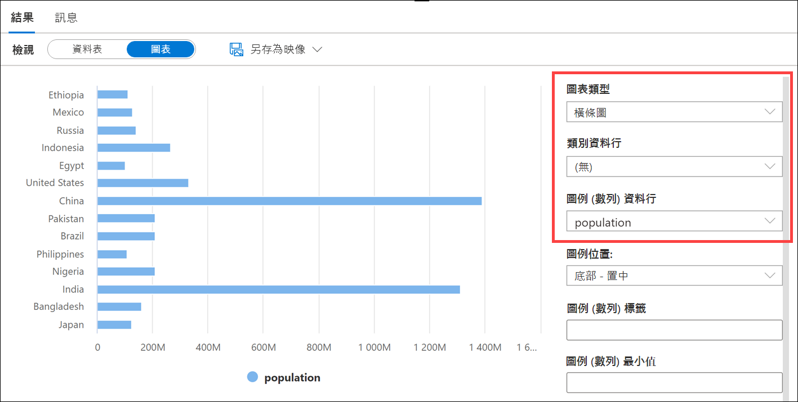

### 任务 4：使用无服务器 SQL 池创建视图

创建一个视图以包装 SQL 查询。通过视图，可以重用查询，如果希望将 Power BI 之类的工具与无服务器 SQL 池结合使用，也需使用视图。

1. 在“**数据**”中心的“**已链接**”选项卡的“**Azure Data Lake Storage Gen2/asaworkspace*xxxxxx*/ wwi-02**”容器上，导航到“**customer-info**”文件夹。然后右键单击“**customerinfo.csv**”文件，依次选择“**新建 SQL 脚本**”和“**选择前 100 行**”。

    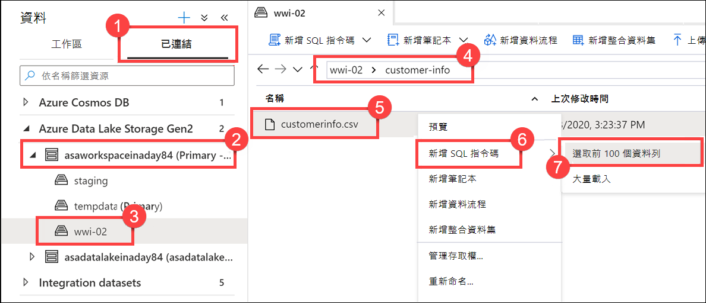

3. 选择“**运行**”以执行脚本，并注意 CSV 文件的第一行是列标题行。结果集中的列名称是 **C1**、**C2**，以此类推。

    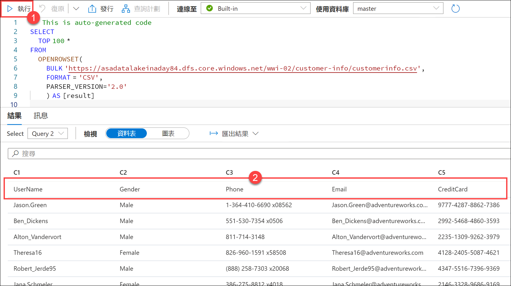

4. 通过以下代码更新脚本，**并确保将** OPENROWSET BULK 路径中的 **SUFFIX** 替换为唯一资源后缀。

    ```sql
    CREATE VIEW CustomerInfo AS
        SELECT * 
    FROM OPENROWSET(
            BULK 'https://asadatalakeSUFFIX.dfs.core.windows.net/wwi-02/customer-info/customerinfo.csv',
            FORMAT = 'CSV',
            PARSER_VERSION='2.0',
            FIRSTROW=2
        )
        WITH (
        [UserName] NVARCHAR (50),
        [Gender] NVARCHAR (10),
        [Phone] NVARCHAR (50),
        [Email] NVARCHAR (100),
        [CreditCard] NVARCHAR (50)
        ) AS [r];
        GO

    SELECT * FROM CustomerInfo;
    GO
    ```

    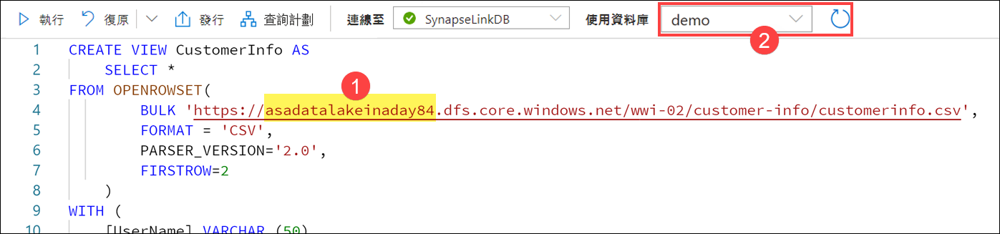

5. 在“**使用数据库**”列表中，请确保仍选中“**demo**”，然后运行脚本。

    我们刚刚创建了视图来包装从 CSV 文件中选择数据的 SQL 查询，然后从视图中选择了行：

    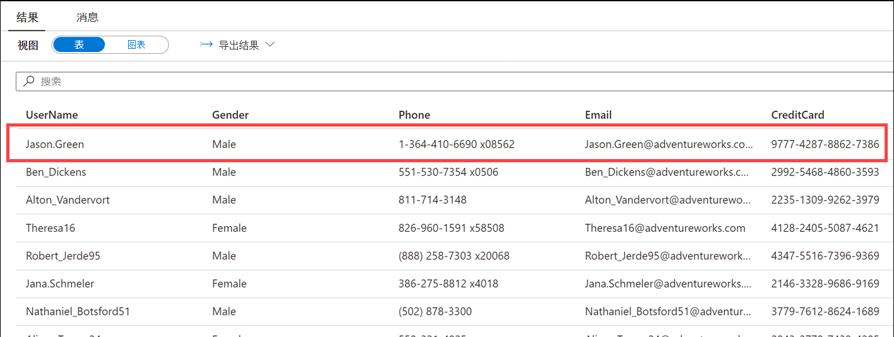

    注意，第一行不再包含列标题。这是因为我们在创建视图时在 OPENROWSET 语句中使用了 FIRSTROW=2 设置。

6. 在“**数据**”中心中，选择“**工作区**”选项卡。选择“数据库”组右侧的操作省略号 **(…)**，然后选择“**&#8635; 刷新**”。

    

7. 展开“**demo**”SQL 数据库。

    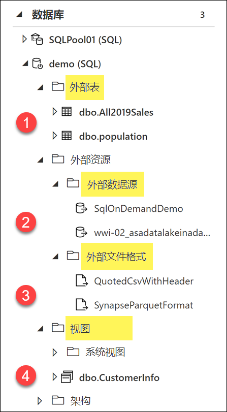

    该数据库包含以下我们在前面步骤中创建的对象：

    - **1) 外部表**：*All2019Sales* 和 *population*。
    - **2) 外部数据源**：*SqlOnDemandDemo* 和 *wwi-02_asadatalakeinadayXXX_dfs_core_windows_net*。
    - **3) 外部文件格式**：*QuotedCsvWithHeader* 和 *SynapseParquetFormat*。
    - **4) 视图**：*CustomerInfo*

## 练习 2 - 通过在 Azure Synapse Analytics 中使用无服务器 SQL 池来保护对数据的访问

Tailwind Traders 希望强制要求对销售数据的任何修改只能在本年度进行，同时允许所有授权用户查询全部数据。他们有一个小组的管理员，这些管理员可以根据需要修改历史数据。

- Tailwind Traders 应该在 AAD 中创建一个安全组（例如名为“**tailwind-history-owners**”的安全组），目的是让属于该组的所有用户都有权限修改以前年份的数据。
- 需要将 **tailwind-history-owners** 安全组分配至包含数据湖的 Azure 存储帐户的 Azure 存储内置 RBAC 角色**存储 Blob 数据所有者**。这让添加到该角色的 AAD 用户和服务主体能修改以前年份的所有数据。
- 他们需要将有权修改所有历史数据的用户安全主体添加到“**tailwind-history-owners**”安全组。
- Tailwind Traders 应该在 AAD 中创建另外一个安全组（例如名为 **tailwind-readers** 的安全组），目的是让属于该组的所有用户都有权限读取文件系统（在本例中为“**prod**”）中的所有内容，包括所有历史数据。
- 需要将 **tailwind-readers** 安全组分配至包含数据湖的 Azure 存储帐户的 Azure 存储内置 RBAC 角色**存储 Blob 数据读取者**。这让添加到该安全组的 AAD 用户和服务主体能读取文件系统中的所有数据，但是不能修改这些数据。
- Tailwind Traders 应该在 AAD 中创建另外一个安全组（例如名为“**tailwind-2020-writers**”的安全组），目的是让属于该组的所有用户都有权限修改仅 2020 年的数据。
- 他们要创建另外一个安全组（例如名为“**tailwind-current-writers**”的安全组），目的是仅向该组中添加安全组。该组仅具有修改当前年份数据的权限（使用 ACL 进行设置）。
- 他们需要将 **tailwind-readers** 安全组添加到 **tailwind-current-writers** 安全组。
- 在 2020 年初，Tailwind Traders 将“**tailwind-current-writers**”添加至“**tailwind-2020-writers**”安全组。
- 在 2020 年初，Tailwind Traders 对“**2020**”文件夹设置“**tailwind-2020-writers**”安全组的 ACL 权限 - 读取、写入和执行。
- 在 2021 年初，为了撤销对 2020 年数据的写入权限，他们从“**tailwind-2020-writers**”组中删除“**tailwind-current-writers**”安全组。“**tailwind-readers**”的成员依然能读取文件系统的内容，因为他们的读取和执行（列出）权限不是通过 ACL 授予的，而是通过文件系统级别上的 RBAC 内置角色授予的。
- 此方法考虑到对 ACL 的当前更改不继承权限，因此删除 write 权限需要编写遍历其所有内容的代码并在每个文件夹和文件对象上删除权限。
- 这种方法相对较快。无论受保护的数据量是多少，RBAC 角色分配的传播可能都需要 5 分钟。

### 任务 1：创建 Azure Active Directory 安全组

在这一段中，我们将如上所述创建安全组。但是，我们的数据集中只有到 2019 年的数据，所以我们将 2021 改为 2019，创建“**tailwind-2019-writers**”组。

1. 在另一个浏览器选项卡中切换回 Azure 门户 (<https://portal.azure.com>)，让 Synapse Studio 保持打开状态。

2. 在“**主页**”页面上，展开门户菜单（如果还未展开），然后选择“**Azure Active Directory**”。

    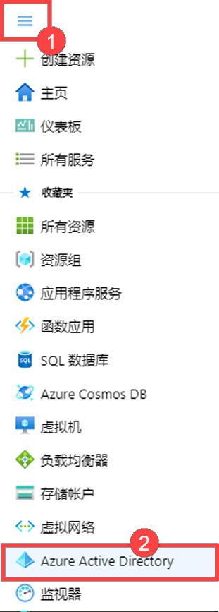

3. 在左侧菜单中选择“**组**”。

    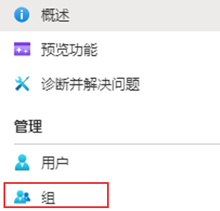

4. 选择“**+ 新建组**”。

5. 确保已选择“**安全**”组类型，并为“**组名称**”输入 `tailwind-history-owners-SUFFIX`（其中“*suffix*”是你的唯一资源后缀），然后选择“**创建**”。

    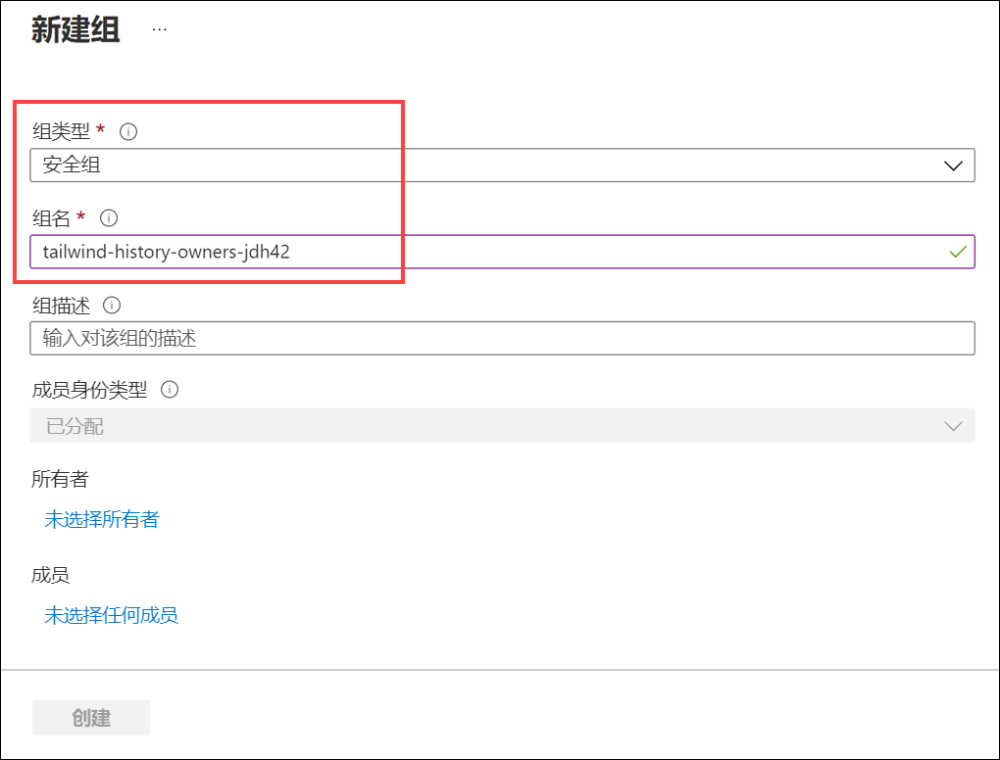

6. 添加第二个名为 `tailwind-readers-SUFFIX` 的新安全组（其中“*SUFFIX*”是你的唯一资源后缀）。
7. 添加第三个名为 `tailwind-current-writers-SUFFIX` 的安全组（其中“*SUFFIX*”是你的唯一资源后缀）。
8. 添加第四个名为 `tailwind-2019-writers-SUFFIX` 的安全组（其中“*SUFFIX*”是你的唯一资源后缀）。

> **备注**：在本练习剩余的说明中，为清楚起见，我们将省略角色名称的“*-SUFFIX*”部分。应基于特定资源后缀使用你的唯一标识角色名称。

### 任务 2：添加组成员

为了测试权限，我们将你自己的帐户添加到组。

1. 打开新创建的“**tailwind-readers**”组。

2. 选择左侧的“**成员**”，然后选择“**+ 添加成员**”。

    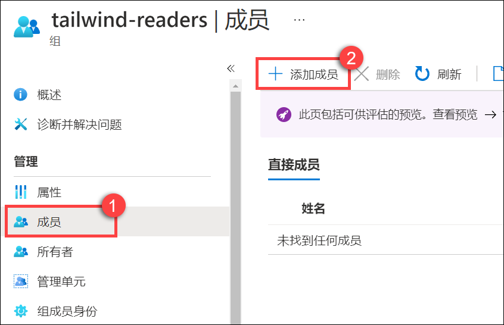

3. 搜索你针对实验室登录的用户帐户，然后选择“**选择**”。

4. 打开“**tailwind-2019-writers**”组。

5. 选择左侧的“**成员**”，然后选择“**+ 添加成员**”。

6. 搜索 `tailwind`，选择“**tailwind-current-writers**”组，然后选择“**选择**”。

    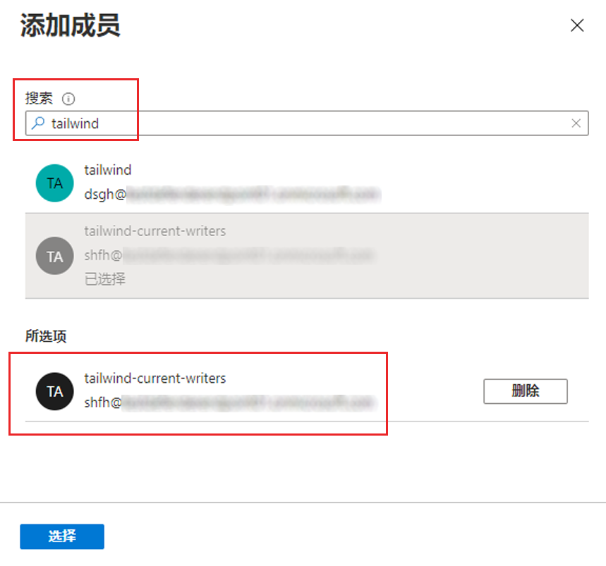

7. 选择左侧菜单中的“**概述**”，然后**复制对象 ID**。

    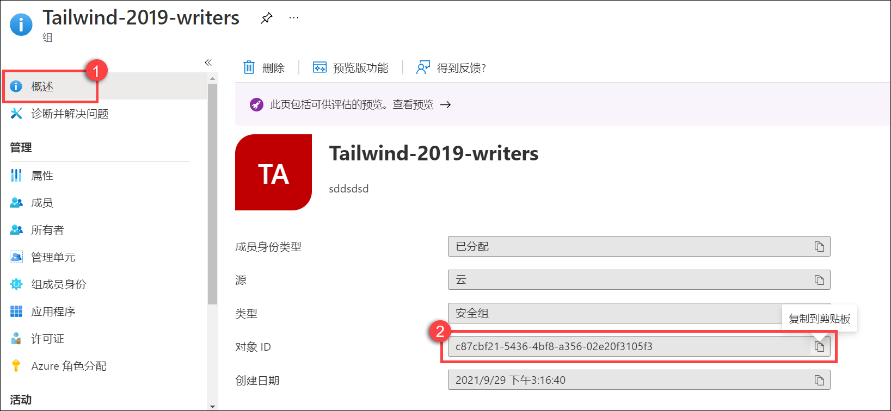

    > **备注**：将**对象 ID** 值保存至记事本或类似的文本编辑器。在稍后的步骤中，在存储帐户中分配访问控制时会用到此值。

### 任务 3：配置数据湖安全性 - 基于角色的访问控制 (RBAC)

1. 在 Azure 门户中，打开“**data-engineering-synapse-xxxxxxx**”资源组。

2. 打开“**asadatalake*xxxxxxx***”存储帐户。

    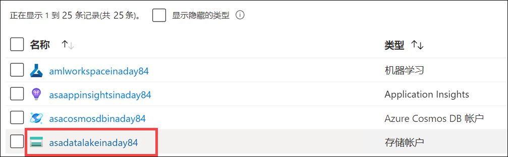

3. 在左侧菜单中选择“**访问控制(IAM)**”。

    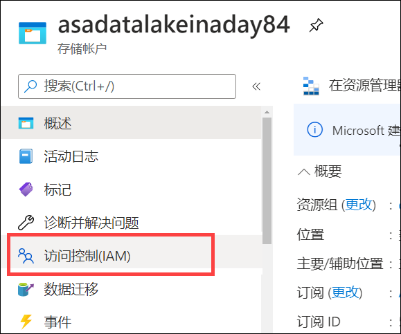

4. 选择“**角色分配**”选项卡。

    

5. 依次选择“**+ 添加**”和“**添加角色分配**”。

    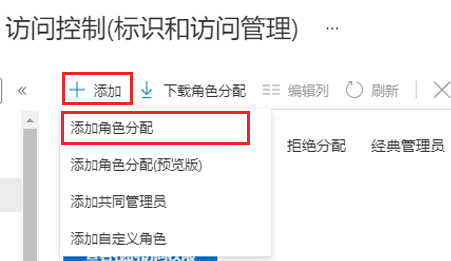

6. 在“**角色**”屏幕中，搜索并选择“**存储 Blob 数据读取者**”，然后单击“**下一步**”。在“**成员**”屏幕中，单击“**+ 选择成员**”，然后搜索`tailwind-readers`并在结果中选择“**tailwind-readers**”组。然后单击“**选择**”。接下来，单击“**查看 + 分配**”，再次单击“**查看 + 分配**”。

    由于你的用户帐户已添加到该组中，因此你拥有对该帐户的 blob 容器中所有文件的读取访问权限。Tailwind Traders 需要将所有用户添加到“**tailwind-readers**”安全组。

7. 依次选择“**+ 添加**”和“**添加角色分配**”。

    

8. 对于“**角色**”，搜索“**存储 Blob 数据所有者**”，然后选择“**下一步**”。

9. 在“**成员**”屏幕中，单击“**+ 选择成员**”，然后搜索`tailwind`并在结果中选择“**tailwind-history-owners**”组。然后单击“**查看 + 分配**”，并再次单击“**查看 + 分配**”。

    “**tailwind-history-owners**”安全组现已分配至包含数据湖的 Azure 存储帐户的 Azure 存储内置 RBAC 角色**存储 Blob 数据所有者**。这让添加到该角色的 Azure AD 用户和服务主体能修改所有数据。

    Tailwind Traders 需要将有权修改所有历史数据的用户安全主体添加到“**tailwind-history-owners**”安全组。

10. 在存储帐户的“**访问控制(IAM)**”列表中，选择“**存储 Blob 数据所有者**”角色下自己的 Azure 用户帐户，然后选择“**删除**”。

    请注意，“**tailwind-history-owners**”组分配至“**存储 Blob 数据所有者**”组，而“**tailwind-readers**”分配至“**存储 Blob 数据读取者**”组。

    > **备注**：你可能需要导航回资源组，然后返回此屏幕以查看所有新的角色分配。

### 任务 4：配置数据湖安全性 - 访问控制列表 (ACL)

1. 在左侧菜单中，选择“**存储资源管理器(预览)**”。展开“**容器**”并选择“**wwi-02**”容器。打开“**sale-small**”文件夹，右键单击“**Year=2019**”文件夹，然后选择“**管理访问权限..**”。

    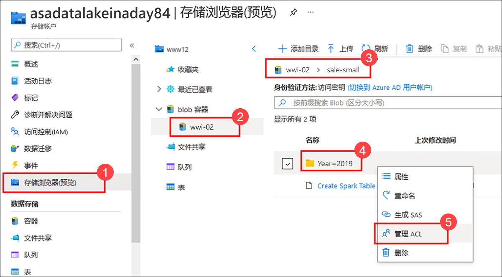

2. 在“**管理 ACL**”屏幕上的“**访问权限**”屏幕中，单击“**+ 添加主体**”，将从“**tailwind-2019-writers**”安全组复制的“**对象 ID**”值粘贴到“**添加主体**”搜索框中，单击“**tailwind-2019-writers-suffix**”，然后选中“**选择**”。

3. 现在，你应会看到在“管理 ACL”对话框中选中了“**tailwind-2019-writers**”组。选中“**读取**”、“**写入**”和“**执行**”复选框，然后选择“**保存**”。

4. 在“**管理 ACL**”屏幕上的“**默认权限**”屏幕中，单击“**+ 添加主体**”，将从“**tailwind-2019-writers**”安全组复制的“**对象 ID**”值粘贴到“**添加主体**”搜索框中，单击“**tailwind-2019-writers-suffix**”，然后选中“**选择**”。

    现在，安全 ACL 已被设置为允许任何添加到“**tailwind-current**”安全组的用户通过“**tailwind-2019-writers**”组写入“**Year=2019**”文件夹。这些用户只能管理当前（本例中为 2019）的销售文件。

    在第二年初，为了撤销对 2019 年数据的写入权限，他们从“**tailwind-2019-writers**”组中删除“**tailwind-current-writers**”安全组。“**tailwind-readers**”的成员依然能读取文件系统的内容，因为他们的读取和执行（列出）权限不是通过 ACL 授予的，而是通过文件系统级别上的 RBAC 内置角色授予的。

    请注意，我们在此配置中同时配置了 _访问_ ACL 和 _默认_ ACL。

    *访问* ACL 控制对某个对象的访问权限。文件和目录都具有访问 ACL。

    *默认* ACL 是与目录关联的 ACL 模板，用于确定在该目录下创建的任何子项的访问 ACL。文件没有默认 ACL。

    访问 ACL 和默认 ACL 具有相同的结构。

### 任务 5：测试权限

1. 在 Synapse Studio 中的“**数据**”中心的“**已链接**”选项卡上，选择“**Azure Data Lake Storage Gen2/asaworkspace*xxxxxxx*/wwi02**”容器，然后在“*sale-small/Year=2016/Quarter=Q4/Month=12/Day=20161231*”文件夹中，右键单击“**sale-small-20161231-snappy.parquet**”文件，依次选择“**新建 SQL 脚本**”和“**选择前 100 行**”。

    

2. 确保已在查询窗口上方的“**连接到**”下拉列表中选择“**内置**”，然后运行查询。数据由无服务器 SQL 池终结点加载，并像处理来自任何常规关系数据中的数据那样对其进行处理。

    

    单元格输出显示来自 Parquet 文件的查询结果。

    

    通过“**tailwind-readers**”安全组（随后通过“**存储 Blob 数据读取者**”角色分配获授存储帐户上的 RBAC 权限）分配给我们的 Parquet 文件的读取权限让我们能查看文件内容。

    但是，由于我们从“**存储 Blob 数据所有者**”角色中删除了自己的帐户，并且没有将帐户添加到“**tailwind-history-owners**”安全组中，因此若要尝试写入此目录，该如何操作呢？

    我们来试一试。

3. 在“**wwi-02**”窗格中，右键单击“**sale-small-20161231-snappy.parquet**”文件，依次选择“**新建笔记本**”和“**加载到 DataFrame**”。

    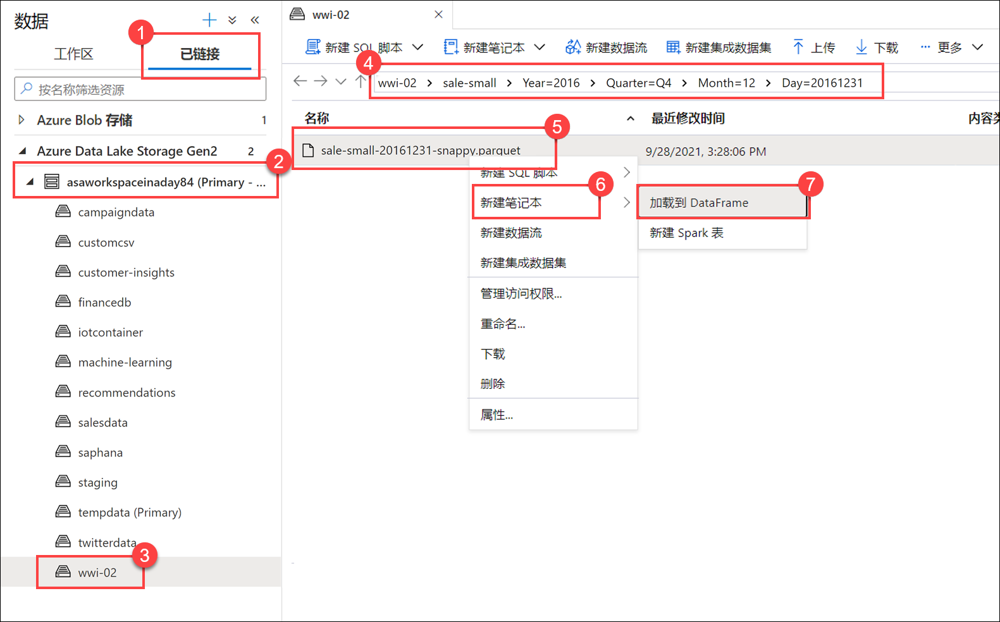

4. 将“**SparkPool01**”Spark 池附加到笔记本。

    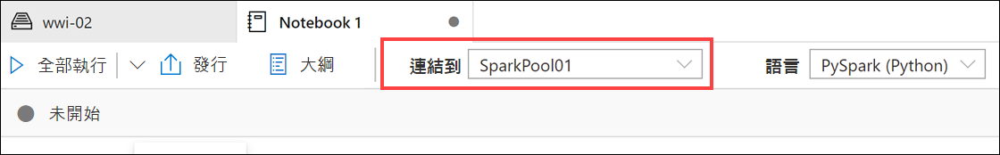

5. 运行笔记本中的单元格以将数据加载到 datafame 中。Spark 池启动时需要一段时间，但最终它应显示数据的前十行 - 再次确认你有权在此位置读取数据。

6. 在结果下，选择“**+ 代码**”，以在现有单元格下添加代码单元格。

7. 输入以下代码，将“*SUFFIX*”替换为数据湖资源的唯一后缀（可以从上面的单元格 1 中复制此后缀）：

    ```python
    df.write.parquet('abfss://wwi-02@asadatalakeSUFFIX.dfs.core.windows.net/sale-small/Year=2019/Quarter=Q4/Month=12/Day=20191231/sale-small-20191231-snappy-test.parquet')
    ```

8. 运行刚添加的新单元格。输出中应会显示 **403 错误**。

    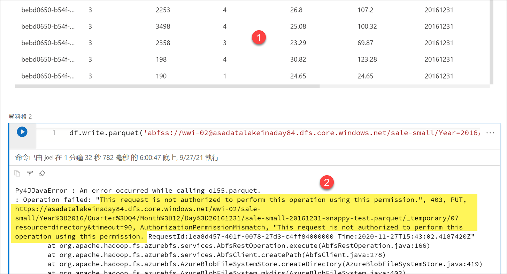

    正如预期的那样，你没有写入权限。单元格 2 返回的错误是“*This request is not authorized to perform this operation using this permission.*”，且带有状态代码 403。

9. 发布笔记本并结束会话。然后注销 Azure Synapse Studio，并关闭浏览器选项卡，返回到“Azure 门户”选项卡 (<https://portal.azure.com>)。

10. 在“主页”页面的门户菜单中，选择“**Azure Active Directory**”。

11. 在左侧菜单中选择“**组**”。

12. 在搜索框中键入 `tailwind`，然后在结果中选择“**tailwind-history-owners**”组。

13. 选择左侧的“**成员**”，然后选择“**+ 添加成员**”。

14. 添加你针对实验室所登录的用户帐户，然后选择“**选择**”。

15. 在新选项卡中，浏览到 Azure Synapse Studio (<https://web.azuresynapse.net/>)。然后在“**开发**”选项卡上，展开“**笔记本**”，并重新打开之前发布的笔记本。

16. 单击“**运行全部**”以重新运行笔记本中的所有单元格。一段时候后，Spark 会话将启动，代码将运行。单元格 2 应返回“**已成功**”状态，指示新文件已写入 Data Lake 存储。

    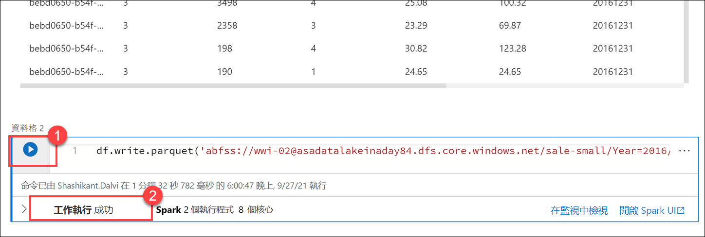

    该单元格这次能成功运行是因为我们将帐户添加到了“**tailwind-history-owners**”组，该组分配到了“**存储 Blob 数据所有者**”角色。

    > **备注**：如果这次出现相同的错误，请**停止笔记本上的 Spark 会话**，然后依次选择“**全部发布**”和“发布”。发布更改后，选择页面右上角的用户配置文件并**注销**。成功注销后，**关闭浏览器选项卡**，然后重启 Synapse Studio (<https://web.azuresynapse.net/>)，重新打开笔记本并重新运行该单元格。因为必须刷新安全令牌才能进行身份验证更改，所以可能需要这样做。

17. 使用笔记本右上角的“**停止会话**”按钮来停止笔记本会话。

18. 如果希望保存更改，请发布笔记本。然后将其关闭。

    现在我们来验证文件是否成功写入数据湖。

19. 在 Synapse Studio 中的“**数据**”中心的“**已链接**”选项卡上，选择“**Azure Data Lake Storage Gen2/asaworkspace*xxxxxxx*/wwi02**”容器，然后浏览到“*sale-small/Year=2016/Quarter=Q4/Month=12/Day=20161231*”文件夹，以验证新文件是否已添加到该文件夹。

    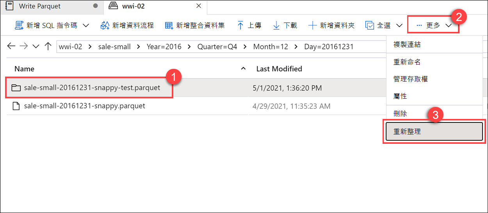
