---
lab:
    title: '使用 Apache Spark 探索、转换数据并将数据加载到数据仓库中'
    module: '模块 4'
---

# 实验室 4 - 使用 Apache Spark 探索、转换数据并将数据加载到数据仓库中

此实验室介绍如何浏览存储在 Data Lake 中的数据、转换数据以及将数据加载到关系数据存储中。你将浏览 Parquet 和 JSON 文件并使用技术查询和转换具有分层结构的 JSON 文件。然后，使用 Apache Spark 将数据加载到数据仓库中，并将 Data Lake 中的 Parquet 数据与专用 SQL 池中的数据联接起来。

完成本实验室后，你将能够：

- 在 Synapse Studio 中浏览数据
- 在 Azure Synapse Analytics 中使用 Spark 笔记本引入数据
- 使用 Azure Synapse Analytics 中 Spark 池中的 DataFrame 转换数据
- 在 Azure Synapse Analytics 中集成 SQL 和 Spark 池

## 实验室设置和先决条件

开始本实验室之前，请确保已成功完成创建实验室环境的安装步骤。然后完成以下设置任务以创建专用 SQL 池。

> **备注**：设置任务将需要大约 6-7 分钟。可以在脚本运行时继续本实验室。

### 任务 1：创建专用 SQL 池

1. 打开 Synapse Studio (<https://web.azuresynapse.net/>)。

2. 选择“**管理**”中心。

    

3. 选择左侧菜单中的“**SQL 池**”，然后选择“**+ 新建**”。

    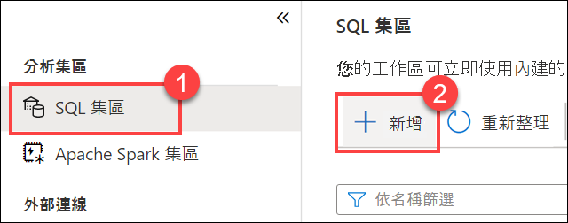

4. 在“**创建专用 SQL 池**”页面中，输入 “**`SQLPool01`**” （<u>必须</u>使用与此处显示完全相同的名称）作为池名，然后将性能级别设置为“**DW100c**”（将滑块移动到最左侧）。

5. 单击“**查看 + 创建**”。然后在验证步骤中选择“**创建**”。
6. 等待专用 SQL 池创建。

> **重要说明：** 启动后，专用 SQL 池会消耗 Azure 订阅中的额度，直到暂停为止。如果你要离开该实验室休息一下，或者决定不完成该实验室；请按照实验结尾处的说明**暂停 SQL 池**

### 任务 2：执行 PowerShell 脚本

1. 在为本课程提供的托管 VM 环境中，在管理员模式下打开 Powershell，然后执行以下命令，将执行策略设置为“无限制”，使你可以运行本地 Powershell 脚本文件：

    ```
    Set-ExecutionPolicy Unrestricted
    ```

    > **备注**：如果收到提示，指示你正在从不受信任的存储库安装模块，请选择“**全部确认**”以继续设置。

2. 将目录更改为本地文件系统中此存储库的根目录。

    ```
    cd C:\dp-203\data-engineering-ilt-deployment\Allfiles\00\artifacts\environment-setup\automation\
    ```

3. 输入以下命令以运行在 SQL 池中创建对象的 PowerShell 脚本：

    ```
    .\setup-sql.ps1
    ```

4. 当系统提示你登录 Azure 时，浏览器将打开；请使用你的凭据登录。登录后，可以关闭浏览器，然后返回到 Windows PowerShell。

5. 出现提示时，请再次登录你的 Azure 帐户（这是必需的，以便脚本可以管理 Azure 订阅中的资源 - 请确保使用与以前相同的凭据）。

6. 如果有多个 Azure 订阅，请在出现提示时，通过在订阅列表中输入订阅编号来选择要在实验室中使用的订阅。

7. 出现提示时，输入包含 Azure Synapse Analytics 工作区的资源组的名称（例如 **data-engineering-synapse-*xxxxxxx***）。

8. 在此脚本运行时**继续练习 1**。

> **备注**：完成此脚本需要 2-3 分钟。
> 
> 如果在为 SQLPool01 专用 SQL 池（有 3 个）创建链接服务时脚本似乎挂起，请按 **Enter**。这通常会刷新 PowerShell 脚本并允许它继续运行到最后。
>
> ### 可以忽略的潜在错误
>
> 你可能会在脚本执行过程中遇到一些错误和警告。可以忽略以下错误：
> 
> 1. 在专用 SQL 池中创建 SQL 用户和添加角色分配时可能会出现以下错误，可以忽略这些错误：
>
>       *无法创建主体'xxx@xxx.com'。只有与 Active Directory 帐户建立的连接才能创建其他 Active Directory 用户。*
>
>2.也可能会出现以下错误，可以忽略这些错误：
>
>       *07-Create-wwi-perf-sale-heap 与标签 CTAS：Sale_Heap。不能为空数组建立索引。*

## 练习 1 - 在 Synapse Studio 中浏览数据

在数据引入过程中，通常最先执行的数据工程任务之一是浏览要导入的数据。通过数据浏览，工程师可以更好地理解要引入的文件的内容。这一过程有助于识别任何可能阻碍自动引入过程的潜在数据质量问题。通过浏览，我们可以深入了解数据类型、数据质量，以及是否需要在将数据导入 Data Lake 或用于分析工作负载前对文件进行任何处理。

Tailspin Traders 的工程师在将一些销售数据引入数据仓库时遇到了问题，并请求相关协助来理解如何使用 Synapse Studio 帮助解决这些问题。此过程的第一步是要浏览数据，理解什么导致了他们遇到的问题，然后为他们提供解决方案。

### 任务 1：使用 Azure Synapse Studio 中的数据预览器浏览数据

Azure Synapse Studio 提供了多种浏览数据的方式，可以是简单的预览界面，也可以采用更复杂的编程方式（使用 Synapse Spark 笔记本）。在本练习中，你将学习如何使用这些功能来浏览、识别标识和修复有问题的文件。你将浏览存储在 Data Lake 的 **wwi-02/sale-poc** 文件夹中的 CSV 文件，并了解如何识别和修复问题。

1. 在 Azure Synapse Studio 中，导航到“**数据**”中心。

    

    > 在“数据”中心，你可以访问工作区中已预配的 SQL 池数据库和 SQL 无服务器数据库，以及访问外部数据源，例如存储帐户和其他链接服务。

2. 我们想要访问存储在工作区主 Data Lake 中的文件，所以要选择数据中心内的“**链接**”选项卡。

    

3. 在“链接”选项卡上，展开“**Azure Data Lake Storage Gen2**”，然后展开工作区的**主** Data Lake。

    

4. 在主 Data Lake 存储帐户内的容器列表中，选择 **wwi-02** 容器。

    

5. 在容器资源管理器窗口中，浏览到 **sale-poc**。

    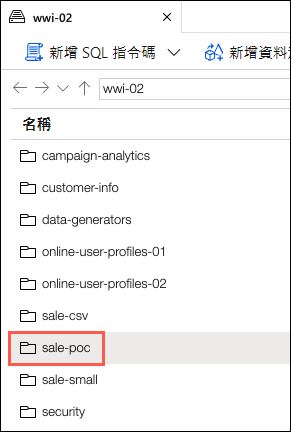

6. **sale-poc** 文件夹包含 2017 年 5 月的销售数据。该文件夹中包含一些文件。这些文件由临时程序导入帐户，以解决 Tailspin 导入过程的问题。现在让我们花几分钟时间浏览部分文件。

7. 右键单击列表中的第一个文件 **sale-20170501.csv**，然后从上下文菜单中选择“**预览**”。

    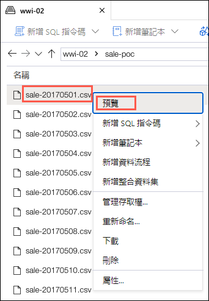

8. 通过 Synapse Studio 的预览功能，可以在无需使用代码的情况下快速检查文件内容。这是基本理解单个文件特征（列）和存储在其中的数据类型的有效方法。

    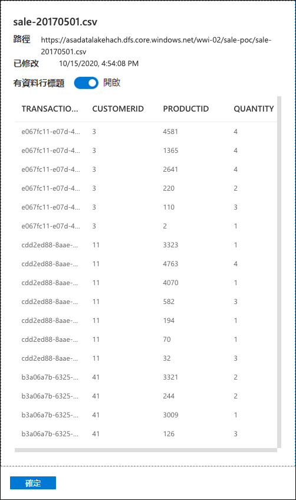

    > 在 **sale-20170501.csv** 的“预览”对话框中，花一点时间浏览文件预览。向下滚动只能显示预览中有限的行数，所以这只能大致了解文件结构。向右滚动可以看到文件中包含的列数及其名称。

9. 选择“**确定**”关闭预览。

10. 在执行数据浏览时，请务必查看多个文件，因为这有助于获得更具代表性的数据样本。让我们看看该文件夹中的下一个文件。右键单击 **sale-20170502.csv** 文件，然后从上下文菜单中选择“**预览**”。

    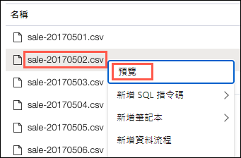

11. 请注意，此文件的结构与 **sale-20170501.csv** 文件不同。预览中未显示数据行，而列标题似乎包含数据而非字段名称。

    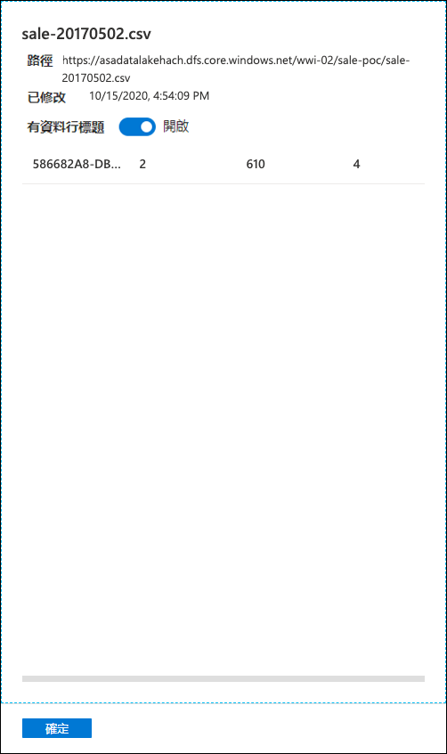

12. 该文件似乎不包含列标题，因此将“**包含列标题**”选项设置为“**关闭**”（可能需要一段时间更改才能完成）并检查结果。

    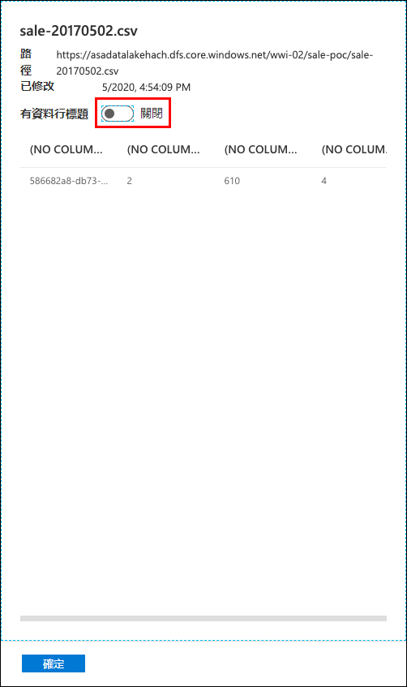

    > 将“**包含列标题**”设置为关闭可验证文件是否不包含列标题。所有列的标题中都有“（无列名称）”。此设置将数据适当地向下移动，使其看起来只是一行。通过向右滚动，可以注意到虽然看起来只有一行，但列数比预览第一个文件时看到的要多很多。该文件包含 11 列。

13. 我们已看到两种不同文件结构，现在通过查看另一个文件，再来看看我们是否可以了解 **sale-poc** 文件夹中哪种文件格式更具代表性。关闭 **sale-20170502.csv** 的预览，然后打开 **sale-20170503.csv** 的预览。

    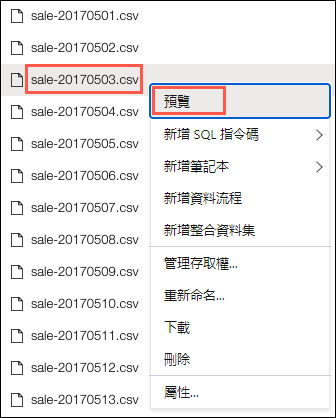

14. 验证 **sale-20170503.csv** 文件结构是否与 **20170501.csv** 的结构相似。

    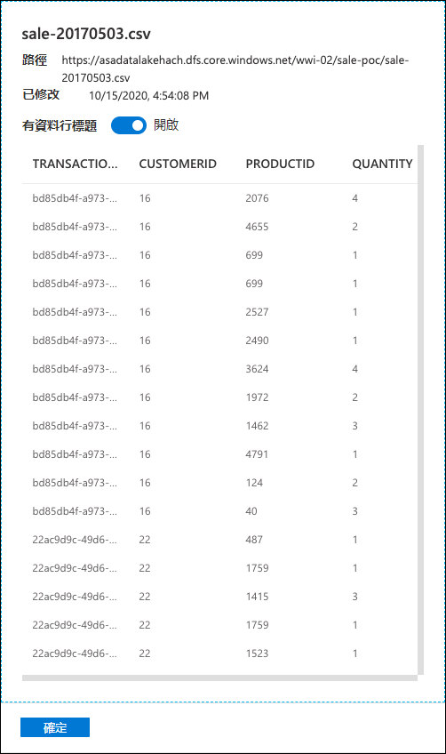

15. 选择“**确定**”关闭预览。

### 任务 2：使用无服务器 SQL 池浏览文件

Synapse Studio 中的预览功能有助于快速浏览文件，但不能让我们更深入地查看数据或深入了解有问题的文件。在此任务中，我们将使用 Synapse 的“**无服务器 SQL 池（内置）**”功能来通过 T-SQL 浏览这些文件。

1. 再次右键单击 **sale-20170501.csv** 文件，这次选择“**新建 SQL 脚本**”并从上下文菜单中选择“**前 100 行**”。

    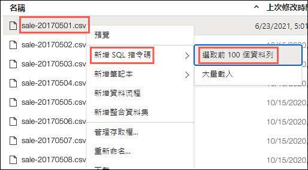

2. 一个新的 SQL 脚本选项卡将在 Synapse Studio 中打开，其中包含一个 SELECT 语句来读取文件的前 100 行。这提供了另一种方式来检查文件内容。通过限制要检查的行数，我们可以加快浏览过程，因为加载文件中所有数据的查询会运行得更慢。

    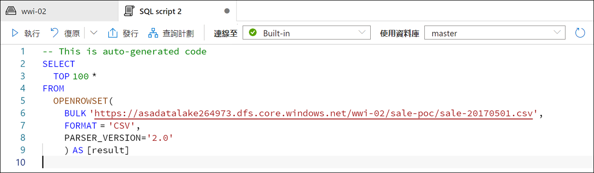

    > **提示**：隐藏脚本的“**属性**”窗格，以便更轻松地查看脚本。

    针对存储在数据湖中的文件的 T-SQL 查询利用了 OPENROWSET 函数，该函数可以在查询的 FROM 子句中引用，就像它是表一样。该函数通过内置的 BULK 提供程序（用于从文件中读取数据并将数据作为行集返回）支持批量操作。要了解详细信息，可以查看 [OPENROWSET 文档](https://docs.microsoft.com/azure/synapse-analytics/sql/develop-openrowset)。

3. 现在，请选择工具栏上的“**运行**”以执行查询。

    

4. 在“**结果**”窗格中，观察输出。

    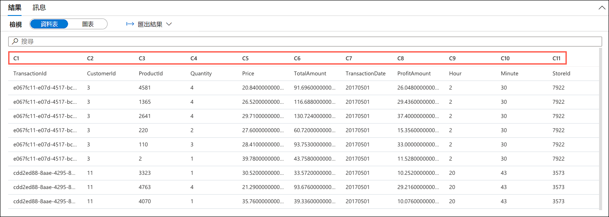

    > 在结果中，你将注意到包含列标题的第一行以数据行的形式呈现，分配给列的名称为 **C1** - **C11**。可以使用 OPENROWSET 函数的 FIRSTROW 参数来指定要显示为数据的文件首行的编号。默认值为 1，如果文件包含标题行，则可以将该值设置为 2 以跳过列标题。然后，可以使用 `WITH` 子句指定与文件关联的架构。

5. 如下所示修改查询以跳过标题行并指定结果集中列的名称；将 *SUFFIX* 替换为存储帐户的唯一资源后缀：

    ```sql
    SELECT
        TOP 100 *
    FROM
        OPENROWSET(
            BULK 'https://asadatalakeSUFFIX.dfs.core.windows.net/wwi-02/sale-poc/sale-20170501.csv',
            FORMAT = 'CSV',
            PARSER_VERSION='2.0',
            FIRSTROW = 2
        ) WITH (
            [TransactionId] varchar(50),
            [CustomerId] int,
            [ProductId] int,
            [Quantity] int,
            [Price] decimal(10,3),
            [TotalAmount] decimal(10,3),
            [TransactionDate] varchar(8),
            [ProfitAmount] decimal(10,3),
            [Hour] int,
            [Minute] int,
            [StoreId] int
        ) AS [result]
    ```

    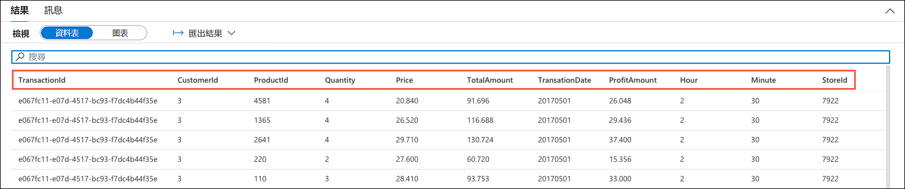

    > 现在，通过 OPENROWSET 函数，可以使用 T-SQL 语法进一步浏览数据。例如，可以使用 WHERE 子句来检查各种字段中的 *null* 或其他值，这些值可能需要在将数据用于高级分析工作负载之前处理。指定架构后，可以按名称引用字段以简化此过程。

6. 关闭 SQL 脚本选项卡。如果出现提示，请选择“**关闭 + 放弃更改**”。

    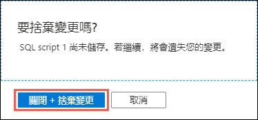

7. 使用“**预览**”功能时，可以看到 **sale-20170502.csv** 文件格式不佳。我们来看看能否使用 T-SQL 了解有关此文件中数据的更多信息。在 **wwi-02** 选项卡中，右键单击 **sale-20170502.csv** 文件并选择“**新建 SQL 脚本**”和“**选择前 100 行**”。

    

8. 运行自动生成的查询。

    

9. 观察到此查询导致错误，*处理外部文件时出错：“从 0 字节开始，发现超出所允许的 8388608 字节上限的行。”*

    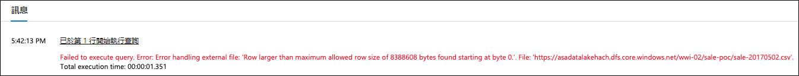

    > 此错误与此前在此文件的预览窗口中所看到的一致。在预览中，我们看到数据分为了多列，但所有数据都位于一行中。这意味着数据使用默认的字段分隔符（逗号）来拆分为列。然而，似乎缺少行终止符 `\r`。

10. 关闭“查询”选项卡，放弃更改，然后在“**wwi-02**”选项卡中，右键单击“**sale-20170502.csv**”文件并选择“**下载**”。这将下载文件并在浏览器中打开它。

11. 查看浏览器中的数据，注意没有行终止符；所有数据都在一行中（在浏览器显示中换行）。

12. 关闭包含 **sale-20170502.csv** 文件内容的浏览器选项卡。

    如果要修复文件，需要使用代码。T-SQL 和 Synapse Pipelines 不具备有效处理此类问题的功能。为解决此文件问题，需要使用 Synapse Spark 笔记本。

### 任务 3：使用 Synapse Spark 浏览和修复数据

在此任务中，你将使用 Synapse Spark 笔记本浏览 Data Lake 的 **wwi-02/sale-poc** 文件夹中的部分文件。你还需要使用 Python 代码修复 **sale-20170502.csv** 文件的问题，这样目录中的所有文件都可以稍后通过使用 Synapse 管道来引入。

1. 在 Synapse Studio 中，打开“**开发**”中心。

    

2. 在“**+**”菜单中，选择“**导入**”。

    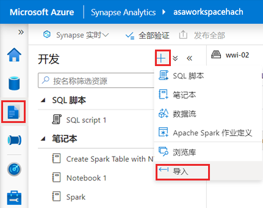

3. 在 C:\dp-203\data-engineering-ilt-deployment\Allfiles\synapse-apache-spark-notebooks 文件夹中导入“**使用 Spark.ipynb 浏览**”笔记本。

4. 按照笔记本中包含的说明，完成此任务的其余部分，将其附加到 **SparkPool01** Spark 池。请注意，第一个单元格的运行可能需要一些时间，因为必须启动 Spark 池。 

5. 完成“**使用 Spark 浏览**”笔记本后，选择笔记本工具栏右侧的“**停止会话**”按钮，释放 Spark 群集以进行下一个练习。

    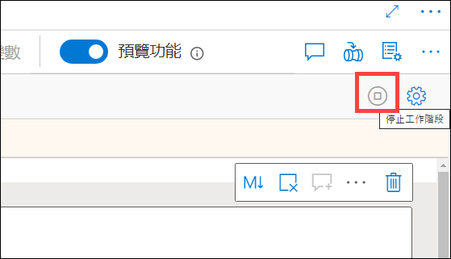

## 练习 2 - 在 Azure Synapse Analytics 中使用 Spark 笔记本引入数据

Tailwind Traders 拥有来自各种数据源的非结构化和半结构化文件。他们的数据工程师希望利用 Spark 专业知识来浏览、引入和转换这些文件。

你建议使用 Synapse 笔记本，这些笔记本已集成在 Azure Synapse Analytics 工作区中并可通过 Synapse Studio 使用。

### 任务 1：使用适用于 Azure Synapse 的 Apache Spark 从 Data Lake 中引入和浏览 Parquet 文件

1. 在 Azure Synapse Studio 中，选择“**数据**”中心。
2. 在“**链接**”选项卡上的 **wwi-02** 容器中，浏览到 *sale-small/Year=2019/Quarter=Q4/Month=12/Day=20191231* 文件夹。然后右键单击 Parquet 文件，选择“**新建笔记本**”，然后选择“**加载到 DataFrame**”。

    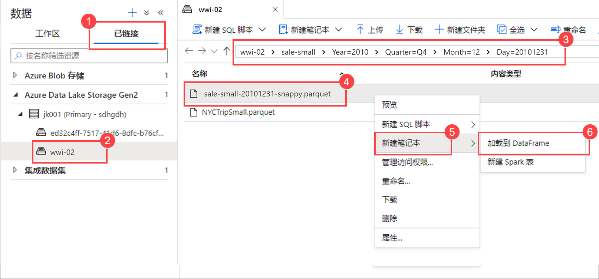

    这将生成一个包含 PySpark 代码的笔记本，用于将数据加载到 Spark 数据帧中，并显示带有标题的 10 行内容。

3. 将 **SparkPool01** Spark 池附加到笔记本，但 **<u>在此阶段不要运行/执行单元格</u>** -  需要先为数据湖的名称创建一个变量。

    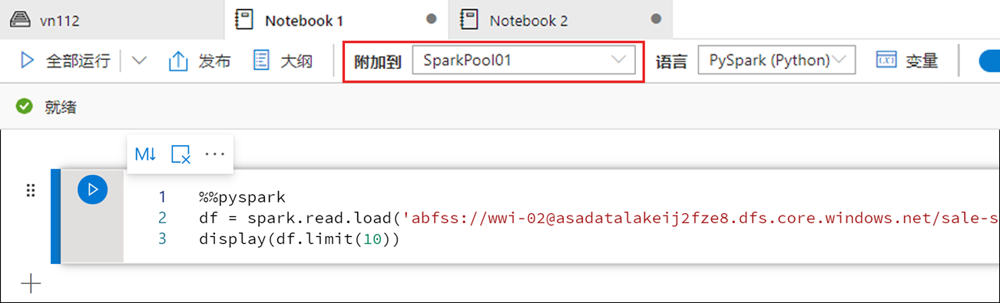

    Spark 池为所有笔记本计算提供计算。如果查看笔记本工具栏下方，会看到该池尚未启动。当运行笔记本中的单元格，但池处于空闲状态时，该池将启动并分配资源。这是一次性操作，直到池因空闲时间过长而自动暂停。

    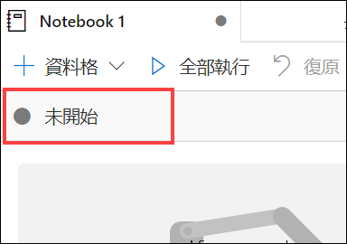

    > 自动暂停设置在“管理”中心内的 Spark 池配置上进行配置。

4. 在单元格的代码下面添加以下内容，定义一个名为 **datalake** 的变量，其值是主存储账户的名称（将 *SUFFIX* 替换为数据存储的唯一后缀）：

    ```python
    datalake = 'asadatalakeSUFFIX'
    ```

    

    此变量将在后续单元格中使用。

5. 在笔记本工具栏上选择“**全部运行**”，以执行笔记本。

    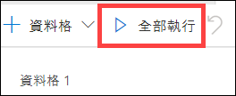

    > **备注：** 首次在 Spark 池中运行笔记本时，Azure Synapse 会创建一个新的会话。这大约需要 2-3 分钟时间。

    > **备注：** 若要仅运行单元格，请将鼠标悬停在单元格上，然后选择单元格左侧的“*运行单元格*”图标，或者选中单元格，再在键盘上按下 **Ctrl+Enter**。

6. 单元格运行完成后，在单元格输出中将视图更改为“**图表**”。

    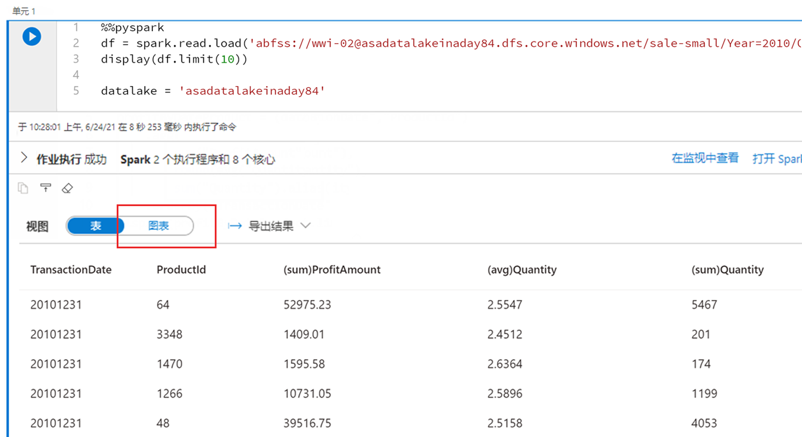

    默认情况下，使用 **display()** 函数时，单元格会输出为表格视图。我们在输出中看到 Parquet 文件（2019 年 12 月 31 日）中存储的销售交易数据。选择“**图表**”可视化效果可查看数据的不同视图。

7. 选择右侧的“**视图选项**”按钮。

    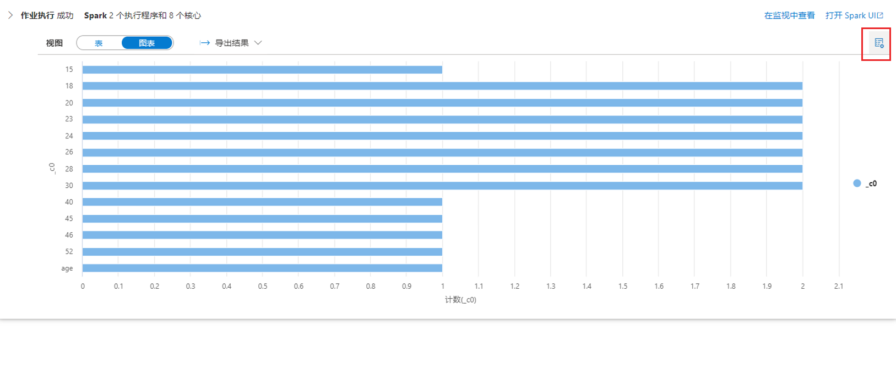

8. 将**键**设置为“**ProductId**”，将**值设置**为“**TotalAmount**”，然后选择“**应用**”。

    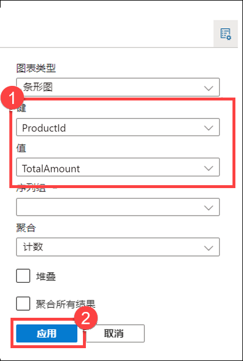

9. 已显示“图表”可视化效果。将鼠标悬停在条形上可查看详细信息。

    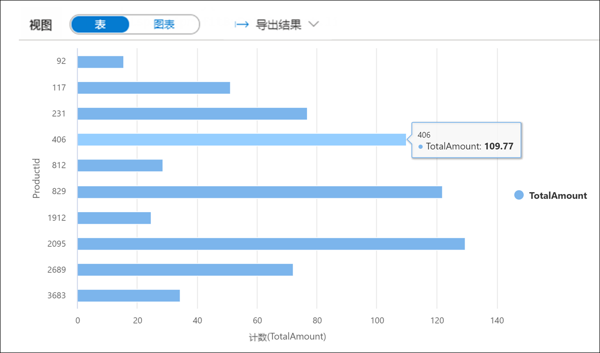

10. 通过选择“**+ 代码**”在下面创建一个新单元格。

11. Spark 引擎可分析 Parquet 文件并推断架构。若要实现这一点，请在新单元格中输入以下内容并运行它：

    ```python
    df.printSchema()
    ```

    输出应如下所示：

    ```
    root
     |-- TransactionId: string (nullable = true)
     |-- CustomerId: integer (nullable = true)
     |-- ProductId: short (nullable = true)
     |-- Quantity: byte (nullable = true)
     |-- Price: decimal(38,18) (nullable = true)
     |-- TotalAmount: decimal(38,18) (nullable = true)
     |-- TransactionDate: integer (nullable = true)
     |-- ProfitAmount: decimal(38,18) (nullable = true)
     |-- Hour: byte (nullable = true)
     |-- Minute: byte (nullable = true)
     |-- StoreId: short (nullable = true)
    ```

    Spark 会计算文件内容来推断架构。对于数据探索和大多数转换任务，这种自动推理通常就已经足够。但是，将数据加载到 SQL 表等外部资源时，有时需要声明自己的架构并将其应用于数据集。目前，架构似乎还不错。

12. 现在让我们使用聚合和分组操作来更好地理解数据。创建一个新代码单元格，然后输入以下内容，再运行该单元格：

    ```python
    from pyspark.sql import SparkSession
    from pyspark.sql.types import *
    from pyspark.sql.functions import *

    profitByDateProduct = (df.groupBy("TransactionDate","ProductId")
        .agg(
            sum("ProfitAmount").alias("(sum)ProfitAmount"),
            round(avg("Quantity"), 4).alias("(avg)Quantity"),
            sum("Quantity").alias("(sum)Quantity"))
        .orderBy("TransactionDate"))
    display(profitByDateProduct.limit(100))
    ```

    > 导入所需的 Python 库，以使用架构中定义的聚合函数和类型来成功执行查询。

    输出显示了上图中所示的相同数据，但现在具有 **sum** 和 **avg** 聚合 。请注意，我们使用 **alias** 方法来更改列名称。

    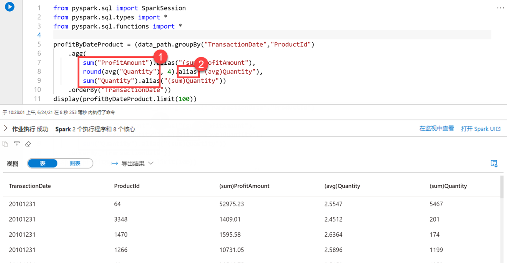

13. 使此笔记本保持打开状态以供下一练习使用。

## 练习 3 - 使用 Azure Synapse Analytics 的 Spark 池中的 DataFrame 转换数据

除了销售数据，Tailwind Traders 还有来自电子商务系统的客户资料数据，提供了过去 12 个月内网站每位访问者（客户）的购买最多的产品情况。这些数据存储在 Data Lake 的 JSON 文件中。他们一直在尝试引入、探索和转换这些 JSON 文件，希望得到你的指导。这些文件有一个层次结构，他们希望在将这些文件加载到关系数据存储中之前能够进行平展。他们还希望在数据工程过程中应用分组和聚合操作。你建议使用 Synapse 笔记本来探索并应用 JSON 文件上的数据转换。

### 任务 1：使用适用于 Azure Synapse 的 Apache Spark 查询和转换 JSON 数据

1. 在 Spark 笔记本中创建一个新代码单元格，输入以下代码并运行该单元格：

    ```python
    df = (spark.read \
            .option('inferSchema', 'true') \
            .json('abfss://wwi-02@' + datalake + '.dfs.core.windows.net/online-user-profiles-02/*.json', multiLine=True)
        )

    df.printSchema()
    ```

    > 你在第一个单元格中创建的 **datalake** 变量在这里用作文件路径的一部分。

    输出应如下所示：

    ```
    root
    |-- topProductPurchases: array (nullable = true)
    |    |-- element: struct (containsNull = true)
    |    |    |-- itemsPurchasedLast12Months: long (nullable = true)
    |    |    |-- productId: long (nullable = true)
    |-- visitorId: long (nullable = true)
    ```

    > 请注意，我们选择的是 **online-user-profiles-02** 目录中的所有 JSON 文件。每个 JSON 文件包含多行，这也是指定 **multiLine=True** 选项的原因。此外，我们将“**inferSchema**”选项设置为“**true**”，指示 Spark 引擎查看文件并根据数据的性质创建架构。

2. 到目前为止，我们在这些单元中一直使用的是 Python 代码。如果要使用 SQL 语法查询文件，一种选择是在数据帧中创建数据的临时视图。在新代码单元格中运行以下代码来创建名为 **user_profiles** 的视图：

    ```python
    # create a view called user_profiles
    df.createOrReplaceTempView("user_profiles")
    ```

3. 创建新代码单元格。由于我们要使用 SQL，而不是 Python，因此使用 **%%sql** *magic* 将单元格的语言设置为 SQL。在单元格中执行以下代码：

    ```sql
    %%sql

    SELECT * FROM user_profiles LIMIT 10
    ```

    请注意，输出显示了 **topProductPurchases** 的嵌套数据，其中包括一个包含 **productId** 和 **itemsPurchasedLast12Months** 值的数组。可以通过单击每行中的直角三角形来展开字段。

    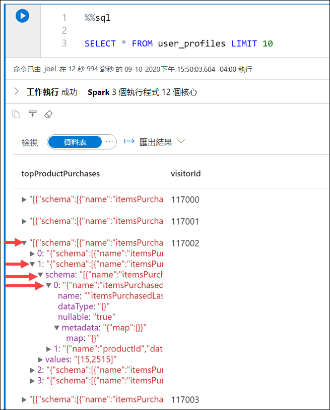

    这使分析数据变得有点困难。这是因为 JSON 文件的内容看起来如下所示：

    ```json
    [
        {
            "visitorId": 9529082,
            "topProductPurchases": [
                {
                    "productId": 4679,
                    "itemsPurchasedLast12Months": 26
                },
                {
                    "productId": 1779,
                    "itemsPurchasedLast12Months": 32
                },
                {
                    "productId": 2125,
                    "itemsPurchasedLast12Months": 75
                },
                {
                    "productId": 2007,
                    "itemsPurchasedLast12Months": 39
                },
                {
                    "productId": 1240,
                    "itemsPurchasedLast12Months": 31
                },
                {
                    "productId": 446,
                    "itemsPurchasedLast12Months": 39
                },
                {
                    "productId": 3110,
                    "itemsPurchasedLast12Months": 40
                },
                {
                    "productId": 52,
                    "itemsPurchasedLast12Months": 2
                },
                {
                    "productId": 978,
                    "itemsPurchasedLast12Months": 81
                },
                {
                    "productId": 1219,
                    "itemsPurchasedLast12Months": 56
                },
                {
                    "productId": 2982,
                    "itemsPurchasedLast12Months": 59
                }
            ]
        },
        {
            ...
        },
        {
            ...
        }
    ]
    ```

4. PySpark 包含一个特殊的 [**explode**](https://spark.apache.org/docs/latest/api/python/pyspark.sql.html?highlight=explode#pyspark.sql.functions.explode) 函数，它为数组的每个元素返回一个新行。这将有助于平展 **topProductPurchases** 列，以提高可读性或方便查询。在新代码单元格中运行以下代码：

    ```python
    from pyspark.sql.functions import udf, explode

    flat=df.select('visitorId',explode('topProductPurchases').alias('topProductPurchases_flat'))
    flat.show(100)
    ```

    在此单元格中，我们创建了一个名为 **flat** 的新数据帧，其中包括 **visitorId** 字段和一个名为 **topProductPurchases_flat** 的新别名字段。正如你所见，输出更易于阅读，而且通过扩展，更易于查询。

    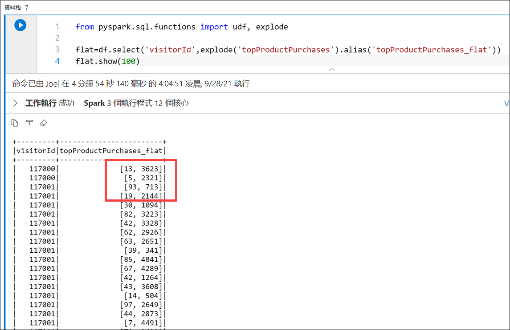

5. 创建一个新单元格并执行以下代码，以创建数据帧的新平展版本，该版本提取 **topProductPurchases_flat.productId** 和 **topProductPurchases_flat.itemsPurchasedLast12Months** 字段，为每个数据组合创建新行：

    ```python
    topPurchases = (flat.select('visitorId','topProductPurchases_flat.productId','topProductPurchases_flat.itemsPurchasedLast12Months')
        .orderBy('visitorId'))

    topPurchases.show(100)
    ```

    在输出中，请注意现在每个 **visitorId** 都有多行。

    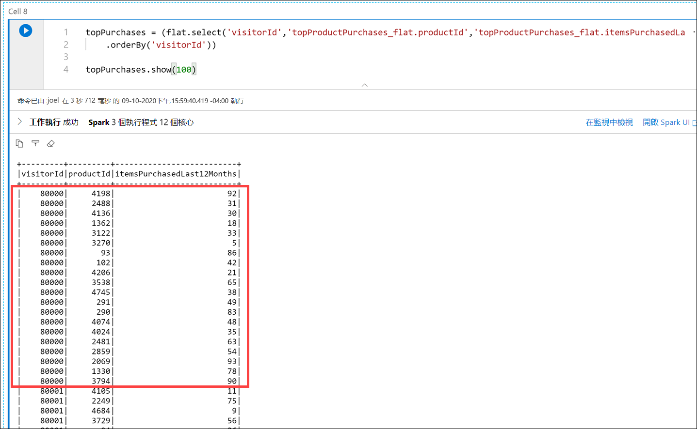

6. 我们按过去 12 个月内购买的商品数量来排序。创建新代码单元格并执行以下代码：

    ```python
    # Let's order by the number of items purchased in the last 12 months
    sortedTopPurchases = topPurchases.orderBy("itemsPurchasedLast12Months")

    display(sortedTopPurchases.limit(100))
    ```

    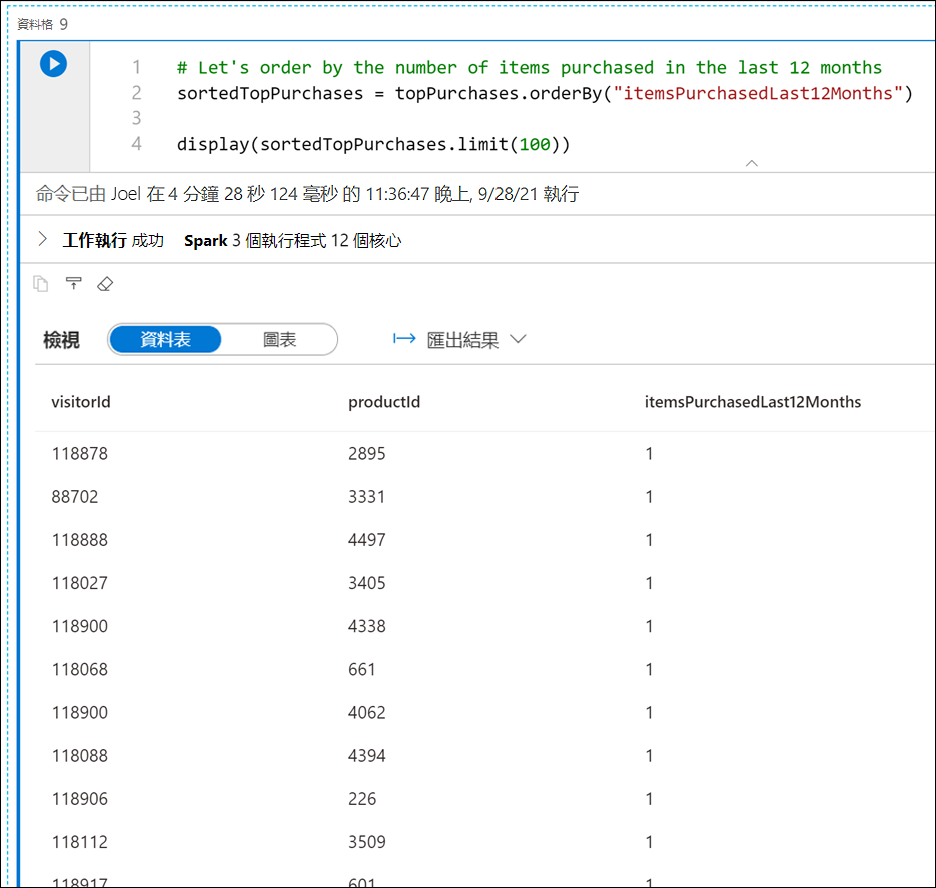

7. 如何按相反的顺序进行排序？可能有结论表示可进行如下调用：*topPurchases.orderBy("itemsPurchasedLast12Months desc")*。在新代码单元格中试用：

    ```python
    topPurchases.orderBy("itemsPurchasedLast12Months desc")
    ```

    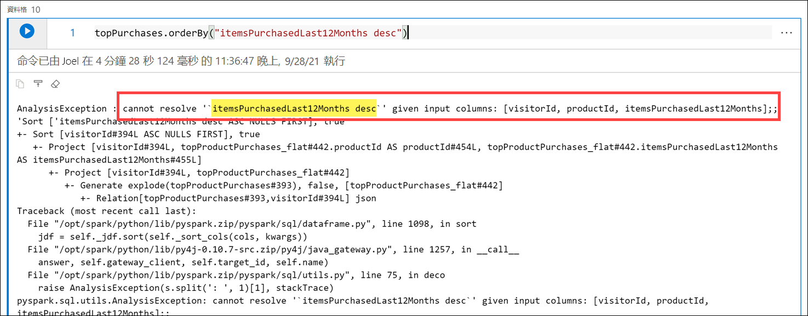

    请注意，出现了 **AnalysisException** 错误，因为 **itemsPurchasedLast12Months desc** 与列名不匹配。

    为什么这不起作用？

    - **DataFrames** API 在 SQL 引擎的基础上生成。
    - 一般来说，大家都很熟悉这个 API 和 SQL 语法。
    - 问题是 **orderBy(..)** 需要列的名称。
    - 我们指定的是“**requests desc**”形式的 SQL 表达式。
    - 但需要的是以编程方式表达此类表达式的方法。
    - 这将我们引向第二个变体 **orderBy(Column)**，更具体地说，则是 **Column** 类。

8. **Column** 类是一种对象，不仅包含列的名称，还包含列级转换，例如按降序排序。将之前失败的代码替换为以下代码并运行：

    ```python
    sortedTopPurchases = (topPurchases
        .orderBy( col("itemsPurchasedLast12Months").desc() ))

    display(sortedTopPurchases.limit(100))
    ```

    请注意，得益于 **col** 对象上的 **desc()** 方法，现在结果按 **itemsPurchasedLast12Months** 列以降序方式排序。

    

9. 每位客户购买了多少种*类型*的产品？为弄清楚这一点，需要按 **visitorId** 分组并聚合每位客户的行数。在新代码单元格中运行以下代码：

    ```python
    groupedTopPurchases = (sortedTopPurchases.select("visitorId")
        .groupBy("visitorId")
        .agg(count("*").alias("total"))
        .orderBy("visitorId") )

    display(groupedTopPurchases.limit(100))
    ```

    请注意我们如何在 **visitorId** 列上使用 **groupBy** 方法，以及在记录计数上使用 **agg** 方法来显示每位客户的总量。

    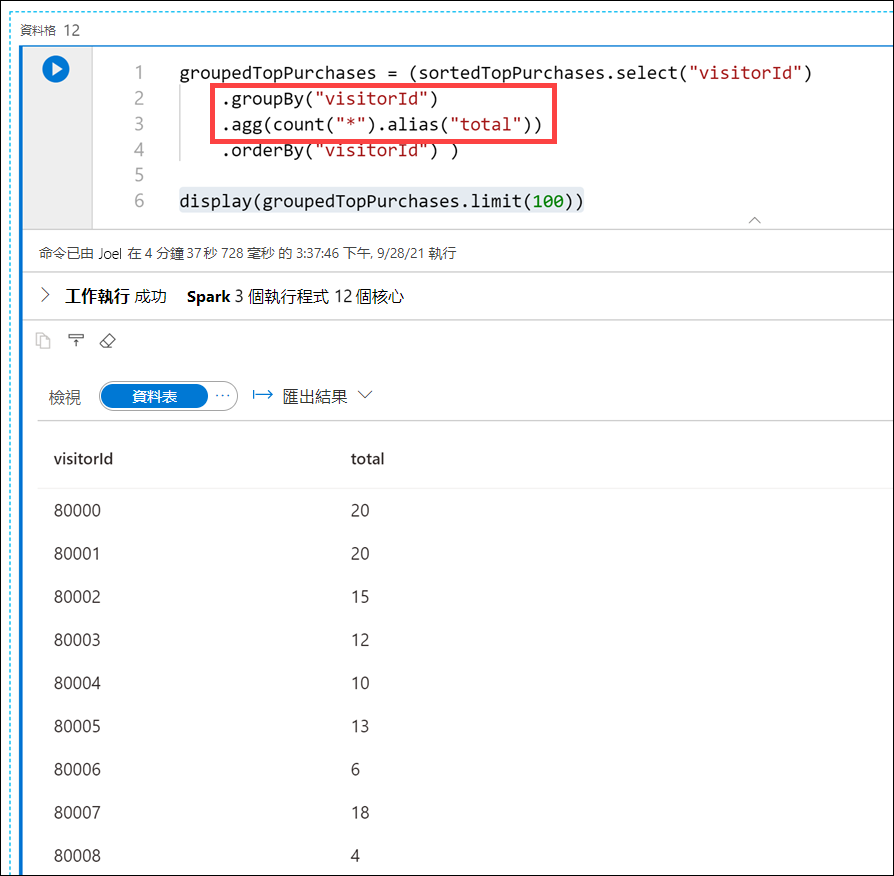

10. 每位客户*总共*购买了多少产品？为弄清楚这一点，需要按 **visitorId** 分组并聚合每位客户的 **itemsPurchasedLast12Months** 值的总和。在新代码单元格中运行以下代码：

    ```python
    groupedTopPurchases = (sortedTopPurchases.select("visitorId","itemsPurchasedLast12Months")
        .groupBy("visitorId")
        .agg(sum("itemsPurchasedLast12Months").alias("totalItemsPurchased"))
        .orderBy("visitorId") )

    display(groupedTopPurchases.limit(100))
    ```

    这里我们再次按 **visitorId** 分组，但现在是在 **agg** 方法中的 **itemsPurchasedLast12Months** 列上使用 **sum**。请注意，我们已将 **itemsPurchasedLast12Months** 列包含在 **select** 语句中，因此可以在 **sum** 中使用它。

    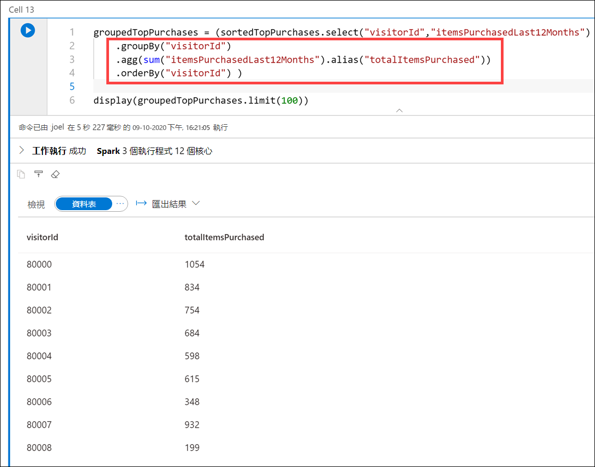

11. 使此笔记本保持打开状态以供下一练习使用。

## 练习 4 - 在 Azure Synapse Analytics 中集成 SQL 和 Spark 池

Tailwind Traders 希望在 Spark 中执行数据工程任务后，将数据写入与专用 SQL 池相关的 SQL 数据库，然后引用该 SQL 数据库作为与包含其他文件数据的 Spark 数据帧的联接源。

你决定使用 Synapse SQL 的 Apache Spark 连接器，以在 Azure Synapse 中的 Spark 数据库和 SQL 数据库之间高效进行数据传输。

可以使用 JDBC 来执行 Spark 数据库与 SQL 数据库之间的数据传输。但是，假设有两个分布式系统（例如 Spark 池和 SQL 池），则 JDBC 往往会成为串行数据传输的瓶颈。

Apache Spark 池到 Synapse SQL 的连接器是适用于 Apache Spark 的一个数据源实现。它使用 Azure Data Lake Storage Gen2 以及专用 SQL 池中的 PolyBase 在 Spark 群集与 Synapse SQL 实例之间高效地传输数据。

### 任务 1：更新笔记本

1. 到目前为止，我们在这些单元中一直使用的是 Python 代码。如果要使用 Apache Spark 池到 Synapse SQL 的连接器，一种选择是在数据帧内创建数据的临时视图。在新代码单元格中运行以下代码来创建名为 **top_purchases** 的视图：

    ```python
    # Create a temporary view for top purchases so we can load from Scala
    topPurchases.createOrReplaceTempView("top_purchases")
    ```

    我们从之前创建的 **topPurchases** 数据帧中创建了一个新的临时视图，其中包含平展的 JSON 用户购买数据。

2. 必须在 Scala 中运行使用 Apache Spark 池到 Synapse SQL 的连接器的代码。为此，我们将 **%%spark** magic 添加到单元格中。在新代码单元格中运行以下代码以从 **top_purchases** 视图中读取：

    ```scala
    %%spark
    // Make sure the name of the dedcated SQL pool (SQLPool01 below) matches the name of your SQL pool.
    val df = spark.sqlContext.sql("select * from top_purchases")
    df.write.synapsesql("SQLPool01.wwi.TopPurchases", Constants.INTERNAL)
    ```

    > **备注**：执行此单元所需的时间可能超过 1 分钟。如果之前运行过此命令，则会收到一条错误消息，指出“已存在名为…的对象”，原因是该表已经存在。

    单元格执行完毕后，查看一下 SQL 表的列表，以验证是否成功创建该表。

3. **让笔记本保持打开状态**，然后导航到“**数据**”中心（如果尚未选择）。

4. 选择“**工作区**”选项卡，在**数据库**的“**省略号(...)**”菜单中，选择“**刷新**”。然后展开 **SQLPool01** 数据库及其 **Tables** 文件夹，并展开 **wwi.TopPurchases** 表及其列。

    已根据 Spark 数据帧的派生架构，自动为我们创建 **wwi.TopPurchases** 表。Apache Spark 池到 Synapse SQL 的连接器负责创建表并高效将数据加载到其中。

5. 返回笔记本并在新代码单元格中运行以下代码，以从位于 *sale-small/Year=2019/Quarter=Q4/Month=12/* 文件夹中的所有 Parquet 文件中读取销售数据：

    ```python
    dfsales = spark.read.load('abfss://wwi-02@' + datalake + '.dfs.core.windows.net/sale-small/Year=2019/Quarter=Q4/Month=12/*/*.parquet', format='parquet')
    display(dfsales.limit(10))
    ```

    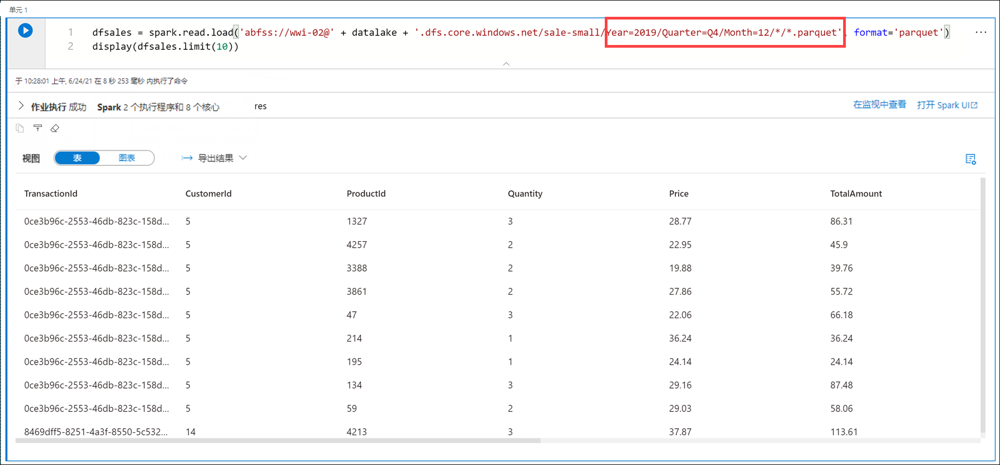

    将上面单元中的文件路径与第一个单元中的文件路径进行比较。在这里，我们使用相对路径从位于 **sale-small** 的 Parquet 文件中加载 **2019 年 12 月的所有销售**数据，而不仅仅是 2019 年 12 月 31 日的销售数据。

    接下来，我们将之前创建的 SQL 表中的 **TopSales** 数据加载到新的 Spark 数据帧中，然后将其与这个新的 **dfsales** 数据帧联接起来。为此，必须再次在新单元上使用 **%%spark** magic，因为我们将使用 Apache Spark 池到 Synapse SQL 的连接器从 SQL 数据库检索数据。然后，我们需要将数据帧内容添加到新的临时视图中，以便可通过 Python 访问数据。

6. 在新单元格中运行以下代码以从 **TopSales** SQL 表中读取数据，并将其保存到临时视图中：

    ```scala
    %%spark
    // Make sure the name of the SQL pool (SQLPool01 below) matches the name of your SQL pool.
    val df2 = spark.read.synapsesql("SQLPool01.wwi.TopPurchases")
    df2.createTempView("top_purchases_sql")

    df2.head(10)
    ```

    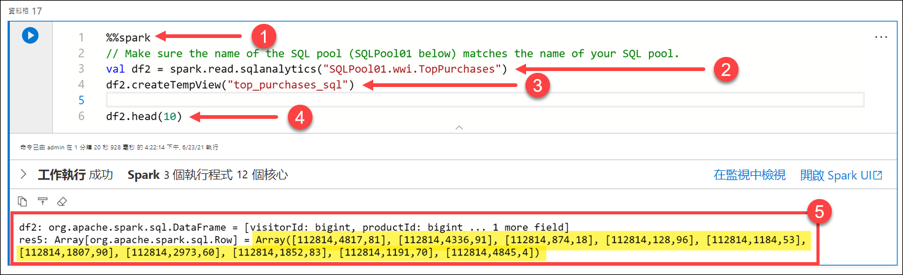

    在单元格顶部使用 **%%spark** magic 将单元格的语言设置为 Scala。我们将一个名为 **df2** 的新变量声明为由 **spark.read.synapsesql** 方法创建的新 DataFrame，该方法从 SQL 数据库中的 **TopPurchases** 表中读取数据。然后，我们填充了一个名为 **top_purchases_sql** 的新的临时视图。最后，我们显示了 **df2.head(10))** 行的前 10 条记录。单元格输出显示了数据帧值。

7. 在新代码单元格中运行以下代码，以便从 **top_purchases_sql** 临时视图中创建一个新的 Python 数据帧，然后显示前 10 个结果：

    ```python
    dfTopPurchasesFromSql = sqlContext.table("top_purchases_sql")

    display(dfTopPurchasesFromSql.limit(10))
    ```

    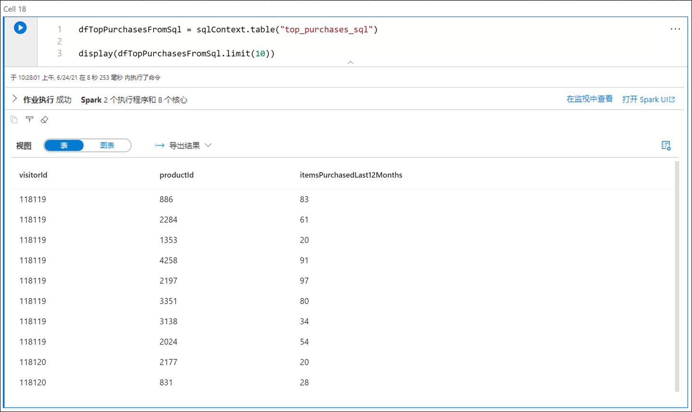

8. 在新代码单元格中运行以下代码，连接来自销售的 Parquet 文件和 **TopPurchases** SQL 数据库的数据：

    ```python
    inner_join = dfsales.join(dfTopPurchasesFromSql,
        (dfsales.CustomerId == dfTopPurchasesFromSql.visitorId) & (dfsales.ProductId == dfTopPurchasesFromSql.productId))

    inner_join_agg = (inner_join.select("CustomerId","TotalAmount","Quantity","itemsPurchasedLast12Months","top_purchases_sql.productId")
        .groupBy(["CustomerId","top_purchases_sql.productId"])
        .agg(
            sum("TotalAmount").alias("TotalAmountDecember"),
            sum("Quantity").alias("TotalQuantityDecember"),
            sum("itemsPurchasedLast12Months").alias("TotalItemsPurchasedLast12Months"))
        .orderBy("CustomerId") )

    display(inner_join_agg.limit(100))
    ```

    在查询中，我们联接了 **dfsales** 和 **dfTopPurchasesFromSql** 数据帧，在 **CustomerId** 和 **ProductId** 上进行匹配。此联接将 **TopPurchases** SQL 表数据与 2019 年 12 月销售的 Parquet 数据结合起来。

    我们按 **CustomerId** 和 **ProductId** 字段分组。由于 **ProductId** 字段名称不明确（在两个数据帧中都存在），因此我们必须完全限定 **ProductId** 名称以引用 **TopPurchases** 数据帧中的名称。

    然后，我们创建了一个聚合，其中汇总了 12 月在每种产品上花费的总金额、12 月的产品总数以及过去 12 个月内购买的产品总数。

    最后，我们在表视图中显示了联接和聚合的数据。

    > **备注**：可单击表视图中的列标题来对结果集进行排序。

    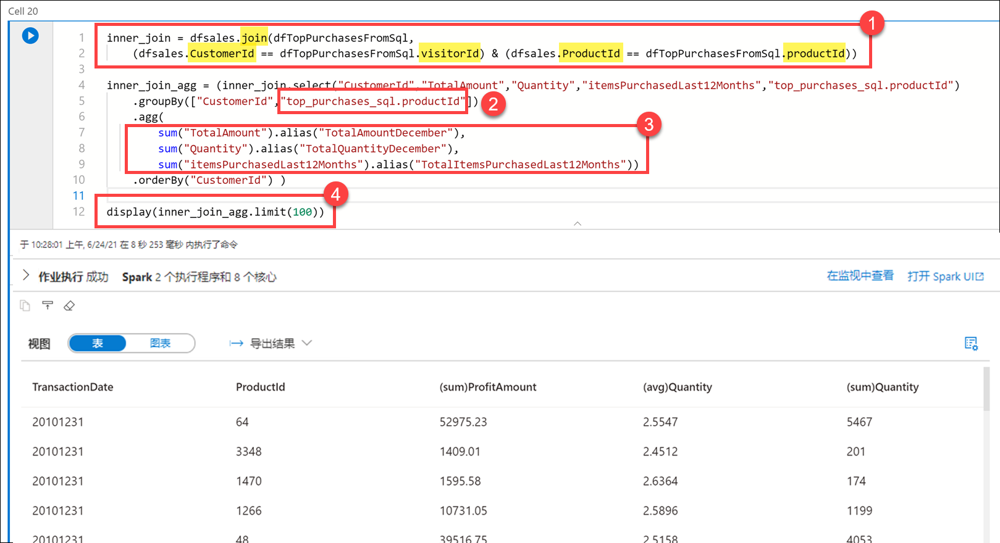

9. 使用笔记本右上角的“**停止会话**”按钮来停止笔记本会话。
10. 如果想稍后再次查看，请发布该笔记本。然后将其关闭。

## 重要说明：暂停 SQL 池

完成以下步骤，释放不再需要的资源。

1. 在 Synapse Studio 中，选择“**管理**”中心。
2. 在左侧菜单中，选择“**SQL 池**”。将鼠标悬停在“**SQLPool01**”专用 SQL 池上，并选择 **||**。

    

3. 出现提示时，选择“**暂停**”。
