---
lab:
    title: '将数据引入和加载到数据仓库中'
    module: '模块 5'
---

# 实验室 5 - 将数据引入和加载到数据仓库中

本实验室将教授如何通过 T-SQL 脚本和 Synapse Analytics 集成管道将数据引入数据仓库。你将了解如何使用 T-SQL 通过 PolyBase 和 COPY 将数据加载到 Synapse 专用 SQL 池。你还将了解如何使用工作负载管理以及 Azure Synapse 管道中的“复制”活动实现 PB 级数据引入。

完成本实验室后，你将能够：

- 使用 Azure Synapse 管道执行 PB 级的引入。
- 使用 T-SQL 通过 PolyBase 和 COPY 引入数据。
- 在 Azure Synapse Analytics 中使用数据加载最佳做法

## 实验室设置和先决条件

在开始本实验室之前，必须完成 **实验室 4：*使用 Apache Spark 探索、转换数据并将数据加载到数据仓库中***。

本实验室使用你在上一个实验室中创建的专用 SQL 池。你应该已在上一个实验室结束时暂停了 SQL 池，因此请按照以下说明恢复它：

1. 打开 Synapse Studio (<https://web.azuresynapse.net/>)。
2. 选择“**管理**”中心。
3. 在左侧菜单中，选择“**SQL 池**”。如果 **SQLPool01** 专用 SQL 池已暂停，请将鼠标悬停在其名称上并选择“**&#9655;**”。

    

4. 出现提示时，选择“**恢复**”。恢复池可能需要一到两分钟。

> **重要说明：** 启动后，专用 SQL 池会消耗 Azure 订阅中的额度，直到暂停为止。如果你要离开该实验室休息一下，或者决定不完成该实验室；请按照实验结尾处的说明暂停 SQL 池！

## 练习 1 - 使用 T-SQL 通过 PolyBase 和 COPY 引入数据。

将大量不同类型的数据加载到 Azure Synapse Analytics 中的方法有多种，例如通过使用 Synapse SQL 池的 T-SQL 命令，以及使用 Azure Synapse 管道。在我们的场景中，Wide World Importers 将大部分原始数据以不同的格式存储在 Data Lake 中。在可用的数据加载选项中，WWI 的数据工程师最喜欢使用 T-SQL。

但是，即便他们熟悉 SQL，在加载大型或不同文件类型和格式时也有一些注意事项。由于文件存储在 ADLS Gen2 中，WWI 可以使用 PolyBase 外部表或新的 COPY 语句。两个选项都支持快速和可缩放的加载操作，但是两者之间有一些区别：

| PolyBase | COPY |
| --- | --- |
| 需要 CONTROL 权限 | 宽松的权限 |
| 具有行宽限制 | 无行宽限制 |
| 文本中没有分隔符 | 支持文本中使用分隔符 |
| 固定的行分隔符 | 支持自定义列分隔符和行分隔符 |
| 在代码进行设置很复杂 | 减少代码量 |

WWI 听说 PolyBase 通常比 COPY 更快，尤其是在处理大型数据集时。

在本练习中，你将帮助 WWI 比较这些加载策略之间的设置方便性、灵活性和速度。

### 任务 1：创建暂存表

**Sale** 表有一个列存储索引，优化后可用于具有大量读取操作的工作负载。它还大量用于报表和特殊查询。为了实现最快的加载速度并尽可能将大量数据插入对 **Sale** 表的影响减少到最低程度，WWI 决定为加载创建一个暂存表。

在此任务中，你将在名为 **wwi_staging** 的新架构中创建一个名为 **SaleHeap** 的新暂存表。将其定义为[堆](https://docs.microsoft.com/sql/relational-databases/indexes/heaps-tables-without-clustered-indexes?view=sql-server-ver15)，并使用轮循分发。当 WWI 完成其数据加载管道后，会将数据加载到 **SaleHeap**，然后从堆表插入到 **Sale**。尽管这是一个两步过程，但第二步将行插入到生产表中不会导致数据跨分布区移动。

你还将在 **wwi_staging** 中创建一个新的 **Sale** 聚集列存储表，以比较数据加载速度。

1. 在 Synapse Analytics Studio 中，导航到“**开发**”中心。

    

2. 在“**+**”菜单中，选择“**SQL 脚本**”。

    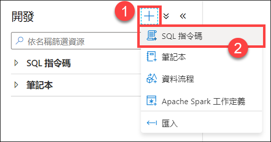

3. 在工具栏菜单中，连接到“**SQLPool01**”数据库。

    

4. 在查询窗口中，输入以下代码以验证 **wwi_staging** 架构是否存在。

    ```sql
    SELECT * FROM sys.schemas WHERE name = 'wwi_staging'
    ```

5. 在工具栏菜单中选择“**运行**”以运行脚本。

    

    结果应包括 **wwi_staging** 架构的一行，该架构是在设置上一个实验室时创建的。

6. 在查询窗口中，将脚本替换为以下内容，以创建堆表：

    ```sql
    CREATE TABLE [wwi_staging].[SaleHeap]
    ( 
        [TransactionId] [uniqueidentifier]  NOT NULL,
        [CustomerId] [int]  NOT NULL,
        [ProductId] [smallint]  NOT NULL,
        [Quantity] [smallint]  NOT NULL,
        [Price] [decimal](9,2)  NOT NULL,
        [TotalAmount] [decimal](9,2)  NOT NULL,
        [TransactionDate] [int]  NOT NULL,
        [ProfitAmount] [decimal](9,2)  NOT NULL,
        [Hour] [tinyint]  NOT NULL,
        [Minute] [tinyint]  NOT NULL,
        [StoreId] [smallint]  NOT NULL
    )
    WITH
    (
        DISTRIBUTION = ROUND_ROBIN,
        HEAP
    )
    ```

7. 运行 SQL 脚本以创建表。

8. 在查询窗口中，将脚本替换为以下内容，以在 **wwi_staging** 架构中创建 **Sale** 表，用于负载比较：

    ```sql
    CREATE TABLE [wwi_staging].[Sale]
    (
        [TransactionId] [uniqueidentifier]  NOT NULL,
        [CustomerId] [int]  NOT NULL,
        [ProductId] [smallint]  NOT NULL,
        [Quantity] [smallint]  NOT NULL,
        [Price] [decimal](9,2)  NOT NULL,
        [TotalAmount] [decimal](9,2)  NOT NULL,
        [TransactionDate] [int]  NOT NULL,
        [ProfitAmount] [decimal](9,2)  NOT NULL,
        [Hour] [tinyint]  NOT NULL,
        [Minute] [tinyint]  NOT NULL,
        [StoreId] [smallint]  NOT NULL
    )
    WITH
    (
        DISTRIBUTION = HASH ( [CustomerId] ),
        CLUSTERED COLUMNSTORE INDEX,
        PARTITION
        (
            [TransactionDate] RANGE RIGHT FOR VALUES (20100101, 20100201, 20100301, 20100401, 20100501, 20100601, 20100701, 20100801, 20100901, 20101001, 20101101, 20101201, 20110101, 20110201, 20110301, 20110401, 20110501, 20110601, 20110701, 20110801, 20110901, 20111001, 20111101, 20111201, 20120101, 20120201, 20120301, 20120401, 20120501, 20120601, 20120701, 20120801, 20120901, 20121001, 20121101, 20121201, 20130101, 20130201, 20130301, 20130401, 20130501, 20130601, 20130701, 20130801, 20130901, 20131001, 20131101, 20131201, 20140101, 20140201, 20140301, 20140401, 20140501, 20140601, 20140701, 20140801, 20140901, 20141001, 20141101, 20141201, 20150101, 20150201, 20150301, 20150401, 20150501, 20150601, 20150701, 20150801, 20150901, 20151001, 20151101, 20151201, 20160101, 20160201, 20160301, 20160401, 20160501, 20160601, 20160701, 20160801, 20160901, 20161001, 20161101, 20161201, 20170101, 20170201, 20170301, 20170401, 20170501, 20170601, 20170701, 20170801, 20170901, 20171001, 20171101, 20171201, 20180101, 20180201, 20180301, 20180401, 20180501, 20180601, 20180701, 20180801, 20180901, 20181001, 20181101, 20181201, 20190101, 20190201, 20190301, 20190401, 20190501, 20190601, 20190701, 20190801, 20190901, 20191001, 20191101, 20191201)
        )
    )
    ```

9. 运行脚本以创建表。

### 任务 2：配置并运行 PolyBase 加载操作

PolyBase 需要以下元素：

- 外部数据源，该外部数据源指向 ADLS Gen2 中 Parquet 文件所在的 **abfss** 路径
- 用于 Parquet 文件的外部文件格式
- 定义文件架构、位置、数据源和文件格式的外部表

1. 在查询窗口中，将脚本替换为以下代码，以创建外部数据源。请务必将 ***SUFFIX*** 替换为本实验室中 Azure 资源的唯一后缀：

    ```sql
    -- Replace SUFFIX with the lab workspace id.
    CREATE EXTERNAL DATA SOURCE ABSS
    WITH
    ( TYPE = HADOOP,
        LOCATION = 'abfss://wwi-02@asadatalakeSUFFIX.dfs.core.windows.net'
    );
    ```

    后缀位于 Synapse Analytics 工作区名称的末尾：

    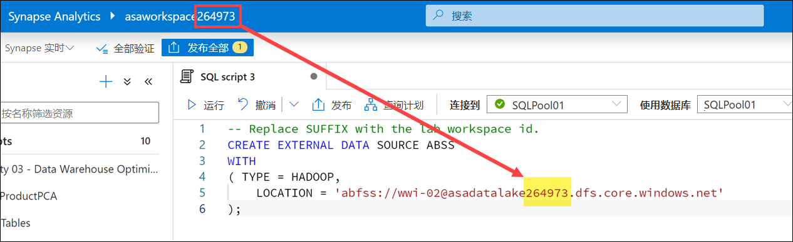

2. 运行脚本以创建外部数据源。

3. 在查询窗口中，将脚本替换为以下代码，以创建外部文件格式和外部数据表。请注意，我们已将 **TransactionId** 定义为 **nvarchar(36)** 字段，而不是 **uniqueidentifier**。这是因为外部表目前不支持 **uniqueidentifier** 列：

    ```sql
    CREATE EXTERNAL FILE FORMAT [ParquetFormat]
    WITH (
        FORMAT_TYPE = PARQUET,
        DATA_COMPRESSION = 'org.apache.hadoop.io.compress.SnappyCodec'
    )
    GO

    CREATE SCHEMA [wwi_external];
    GO

    CREATE EXTERNAL TABLE [wwi_external].Sales
        (
            [TransactionId] [nvarchar](36)  NOT NULL,
            [CustomerId] [int]  NOT NULL,
            [ProductId] [smallint]  NOT NULL,
            [Quantity] [smallint]  NOT NULL,
            [Price] [decimal](9,2)  NOT NULL,
            [TotalAmount] [decimal](9,2)  NOT NULL,
            [TransactionDate] [int]  NOT NULL,
            [ProfitAmount] [decimal](9,2)  NOT NULL,
            [Hour] [tinyint]  NOT NULL,
            [Minute] [tinyint]  NOT NULL,
            [StoreId] [smallint]  NOT NULL
        )
    WITH
        (
            LOCATION = '/sale-small/Year=2019',  
            DATA_SOURCE = ABSS,
            FILE_FORMAT = [ParquetFormat]  
        )  
    GO
    ```

    > **备注：** */sale-small/Year=2019/* 文件夹的 Parquet 文件包含 **4,124,857 行**。

4. 运行该脚本。

5. 在查询窗口中，将脚本替换为以下代码，以将数据加载到 **wwi_staging.SalesHeap** 表中。

    ```sql
    INSERT INTO [wwi_staging].[SaleHeap]
    SELECT *
    FROM [wwi_external].[Sales]
    ```

6. 运行该脚本。这可能需要一段时间才能完成。

7. 在查询窗口中，将脚本替换为以下内容，以查看导入了多少行：

    ```sql
    SELECT COUNT(1) FROM wwi_staging.SaleHeap(nolock)
    ```

8. 运行该脚本。应会看到结果为 4124857。

### 任务 3：配置并运行 COPY 语句

现在让我们看看如何使用 COPY 语句执行相同的加载操作。

1. 在查询窗口中，将脚本替换为以下内容，以截断堆表，并使用 COPY 语句加载数据。正如之前所执行的操作，请确保将 ***SUFFIX*** 替换为唯一后缀：

    ```sql
    TRUNCATE TABLE wwi_staging.SaleHeap;
    GO

    -- Replace SUFFIX with the unique suffix for your resources
    COPY INTO wwi_staging.SaleHeap
    FROM 'https://asadatalakeSUFFIX.dfs.core.windows.net/wwi-02/sale-small/Year=2019'
    WITH (
        FILE_TYPE = 'PARQUET',
        COMPRESSION = 'SNAPPY'
    )
    GO
    ```

2. 运行该脚本。请注意执行类似加载操作所需的脚本很少。

3. 在查询窗口中，将脚本替换为以下内容，以查看导入了多少行：

    ```sql
    SELECT COUNT(1) FROM wwi_staging.SaleHeap(nolock)
    ```

4. 运行该脚本。4124857 行应已再次导入。请注意，两个加载操作在大致相同的时间内复制了相同数量的数据。

### 任务 4：使用 COPY 加载带有非标准行分隔符的文本文件

与 PolyBase 相比，COPY 的一个优点在于它支持自定义列分隔符和行分隔符。

WWI 有一个每晚固定流程，即从合作伙伴分析系统中引入区域销售数据并将文件保存在 Data Lake 中。文本文件使用非标准的列分隔符和行分隔符，其中列由句号分隔，行由逗号分隔：

```
20200421.114892.130282.159488.172105.196533,20200420.109934.108377.122039.101946.100712,20200419.253714.357583.452690.553447.653921
```

数据包含以下字段：**Date**、**NorthAmerica**、**SouthAmerica**、**Europe**、**Africa** 和 **Asia**。他们必须处理此数据，并将其存储在 Synapse Analytics 中。

1. 在查询窗口中，将脚本替换为以下内容，以创建 **DailySalesCounts** 表，并使用 COPY 语句加载数据。正如之前那样，请确保将 ***SUFFIX*** 替换为唯一后缀：

    ```sql
    CREATE TABLE [wwi_staging].DailySalesCounts
        (
            [Date] [int]  NOT NULL,
            [NorthAmerica] [int]  NOT NULL,
            [SouthAmerica] [int]  NOT NULL,
            [Europe] [int]  NOT NULL,
            [Africa] [int]  NOT NULL,
            [Asia] [int]  NOT NULL
        )
    GO

    -- Replace SUFFIX with the unique suffix for your resources
    COPY INTO wwi_staging.DailySalesCounts
    FROM 'https://asadatalakeSUFFIX.dfs.core.windows.net/wwi-02/campaign-analytics/dailycounts.txt'
    WITH (
        FILE_TYPE = 'CSV',
        FIELDTERMINATOR='.',
        ROWTERMINATOR=','
    )
    GO
    ```

    请注意 FIELDTERMINATOR` 和 ROWTERMINATOR 属性，它们使代码能够正确分析文件。

2. 运行该脚本。

3. 在查询窗口中，将脚本替换为以下内容，以查看导入的数据：

    ```sql
    SELECT * FROM [wwi_staging].DailySalesCounts
    ORDER BY [Date] DESC
    ```

4. 运行脚本并查看结果。

5. 尝试查看图表中的结果，并将“**类别列**”设置为“**Date**”：

    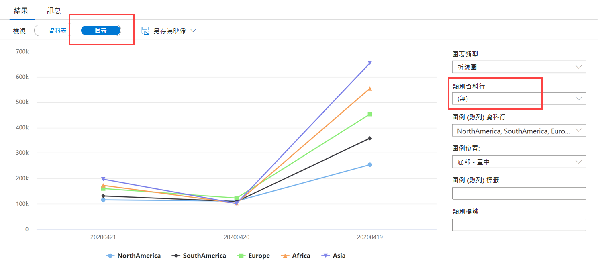

### 任务 5：使用 PolyBase 加载带有非标准行分隔符的文本文件

让我们使用 PolyBase 尝试同样的操作。

1. 在查询窗口中，将脚本替换为以下内容，以创建新的外部文件格式，并使用 PolyBase 加载数据：

    ```sql
    CREATE EXTERNAL FILE FORMAT csv_dailysales
    WITH (
        FORMAT_TYPE = DELIMITEDTEXT,
        FORMAT_OPTIONS (
            FIELD_TERMINATOR = '.',
            DATE_FORMAT = '',
            USE_TYPE_DEFAULT = False
        )
    );
    GO

    CREATE EXTERNAL TABLE [wwi_external].DailySalesCounts
        (
            [Date] [int]  NOT NULL,
            [NorthAmerica] [int]  NOT NULL,
            [SouthAmerica] [int]  NOT NULL,
            [Europe] [int]  NOT NULL,
            [Africa] [int]  NOT NULL,
            [Asia] [int]  NOT NULL
        )
    WITH
        (
            LOCATION = '/campaign-analytics/dailycounts.txt',  
            DATA_SOURCE = ABSS,
            FILE_FORMAT = csv_dailysales
        )  
    GO
    INSERT INTO [wwi_staging].[DailySalesCounts]
    SELECT *
    FROM [wwi_external].[DailySalesCounts]
    ```

2. 运行该脚本。你应该会看到类似如下的错误：

    *未能执行查询。错误: HdfsBridge::recordReaderFillBuffer - Unexpected error encountered filling record reader buffer：HadoopExecutionException：行中的列过多。*

    为什么会这样？[PolyBase 文档](https://docs.microsoft.com/sql/t-sql/statements/create-external-file-format-transact-sql?view=sql-server-ver15#limitations-and-restrictions)说明了以下内容：

    > 带分隔符的文本文件中的行分隔符必须受 Hadoop 的 LineRecordReader 支持。也就是说，它必须是“**\r**”、“**\n**”或“**\r\n**”。这些分隔符不可由用户配置。

    这是 COPY 的灵活性使其优于 PolyBase 的示例。

3. 使此脚本保持打开状态以供下一练习使用。

## 练习 2 - 使用 Azure Synapse 管道执行 PB 级的引入。

Tailwind Traders 需要将大量销售数据引入数据仓库。他们需要一个可以有效加载数据的可重复过程。加载数据时，他们希望对数据移动作业进行优先级排序，以便它们具有优先次序。

你已决定创建一个概念证明数据管道来导入大型 Parquet 文件，从而遵循最佳做法来提高加载性能。

在将数据移动到数据仓库，协调从一个或多个数据源的移动，以及有时还需要进行某种级别的转换时，通常需要进行某种级别的编排。转换步骤可以发生在提取-转换-加载 (ETL) 期间，或者在提取-加载-转换 (ELT) 数据移动之后。任何新型数据平台都必须为所有典型数据整理操作（例如提取、分析、联接、标准化、扩充、清理、合并和筛选）提供无缝体验。Azure Synapse Analytics 提供两类重要的功能 - 数据流和数据编排（作为管道实现）。

> 在本练习中，我们将重点关注编排方面。下一实验室将更多地关注转换（数据流）管道。

### 任务 1：配置工作负载管理分类

加载大量数据时，最好一次只运行一个加载作业，以实现最佳性能。如果这不可行，请将同时运行的负载的数量降至最低。如果预期的加载作业较大，可以考虑在加载前纵向扩展专用 SQL 池。

请确保为管道会话分配足够的内存。为此，请提高用户的资源类，该用户有权将此表中的索引重建为建议的最小值。

若要使用适当的计算资源运行负载，请创建指定运行负载的加载用户。将每个加载用户分配给一个特定的资源类或工作负载组。若要运行负载，请以某个加载用户的身份登录，然后运行该负载。该负载使用用户的资源类运行。

1. 在上一练习中使用的 SQL 脚本查询窗口中，将脚本替换为以下内容以创建：
    - **BigDataLoad**，它是一个工作负载组，通过保留至少 50% 的资源（上限为 100%）来使用工作负载隔离
    - **HeavyLoader**，它是一个新的工作负载分类器，将 **asa.sql.import01** 用户分配给 **BigDataLoad** 工作负载组。
    
    最后，我们选择从 **sys.workload_management_workload_classifiers** 查看所有分类器，包括我们刚创建的分类器：

    ```sql
    -- Drop objects if they exist
    IF EXISTS (SELECT * FROM sys.workload_management_workload_classifiers WHERE [name] = 'HeavyLoader')
    BEGIN
        DROP WORKLOAD CLASSIFIER HeavyLoader
    END;
    
    IF EXISTS (SELECT * FROM sys.workload_management_workload_groups WHERE name = 'BigDataLoad')
    BEGIN
        DROP WORKLOAD GROUP BigDataLoad
    END;
    
    --Create workload group
    CREATE WORKLOAD GROUP BigDataLoad WITH
      (
          MIN_PERCENTAGE_RESOURCE = 50, -- integer value
          REQUEST_MIN_RESOURCE_GRANT_PERCENT = 25, --  (guaranteed min 4 concurrency)
          CAP_PERCENTAGE_RESOURCE = 100
      );
    
    -- Create workload classifier
    CREATE WORKLOAD Classifier HeavyLoader WITH
    (
        Workload_Group ='BigDataLoad',
        MemberName='asa.sql.import01',
        IMPORTANCE = HIGH
    );
    
    -- View classifiers
    SELECT * FROM sys.workload_management_workload_classifiers
    ```

2. 运行脚本，如有必要，可将结果切换到“**表**”视图。应会在查询结果中看到新的 **HeavyLoader** 分类器：

    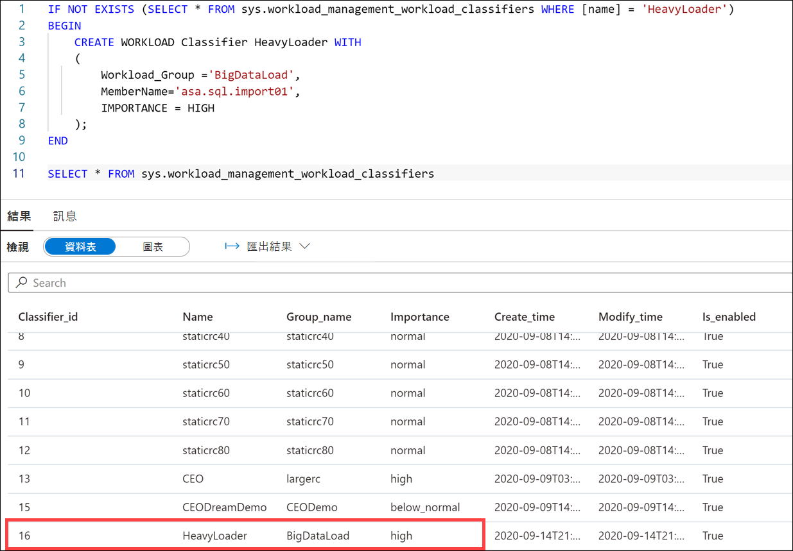

3. 导航到“**管理**”中心。

    

4. 在左侧菜单中选择“**链接服务**”，然后选择 **sqlpool01_import01** 链接服务（如果未列出，请使用右上角的 **&#8635;** 按钮刷新视图）。

    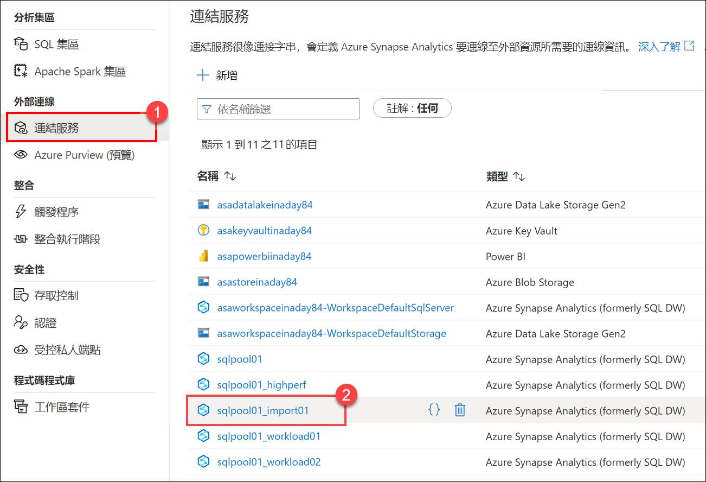

5. 请注意，专用 SQL 池连接的用户名是你添加到 **HeavyLoader** 分类器的 **asa.sql.import01** 用户。我们将在新管道中使用此服务来保留数据加载活动的资源。

    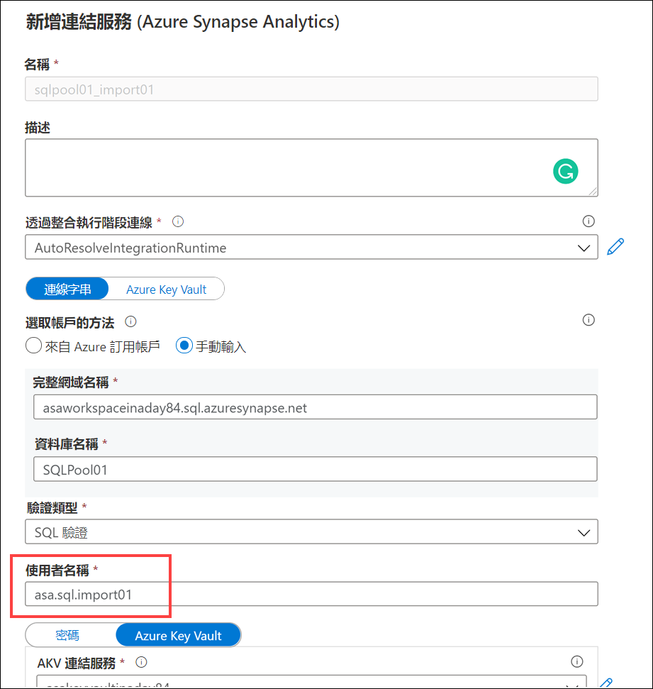

6. 选择“**取消**”以关闭对话，并在出现提示时选择“**放弃更改**”。

### 任务 2：通过复制活动创建管道

1. 导航到“**集成**”中心。

    

2. 在“**+**”菜单中，选择“**管道**”以创建新的管道。

    

3. 在新管道的“**属性**”窗格中，将管道的“**名称**”设置为 **`Copy December Sales`**。

    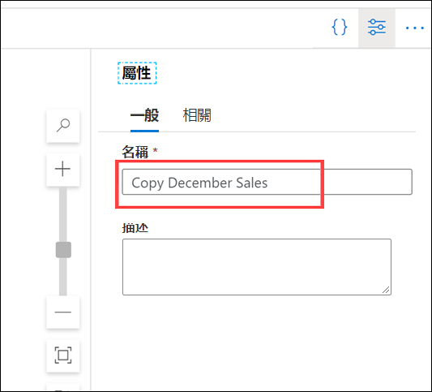

    > **提示**：设置名称后，隐藏“**属性**”窗格。

4. 展开“活动”列表中的“**移动和转换**”，然后将“**复制数据**”活动拖放到管道画布上。

    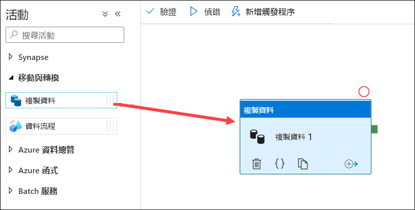

5. 在画布上选择“**复制数据**”活动。然后，在画布下方的“**常规**”选项卡上，将活动“**名称**”设置为 **`Copy Sales`**。

    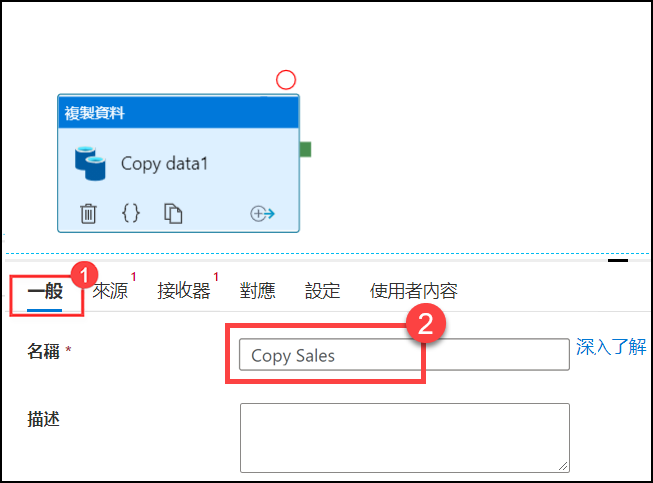

6. 选择“**源**”选项卡，然后选择“**+ 新建**”以创建新的源数据集。

    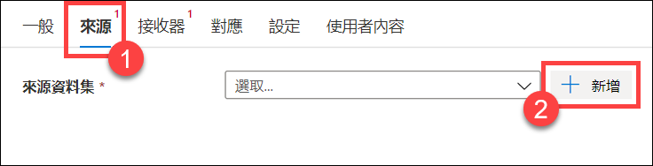

7. 选择“**Azure Data Lake Storage Gen2**”数据存储，然后选择“**继续**”。

    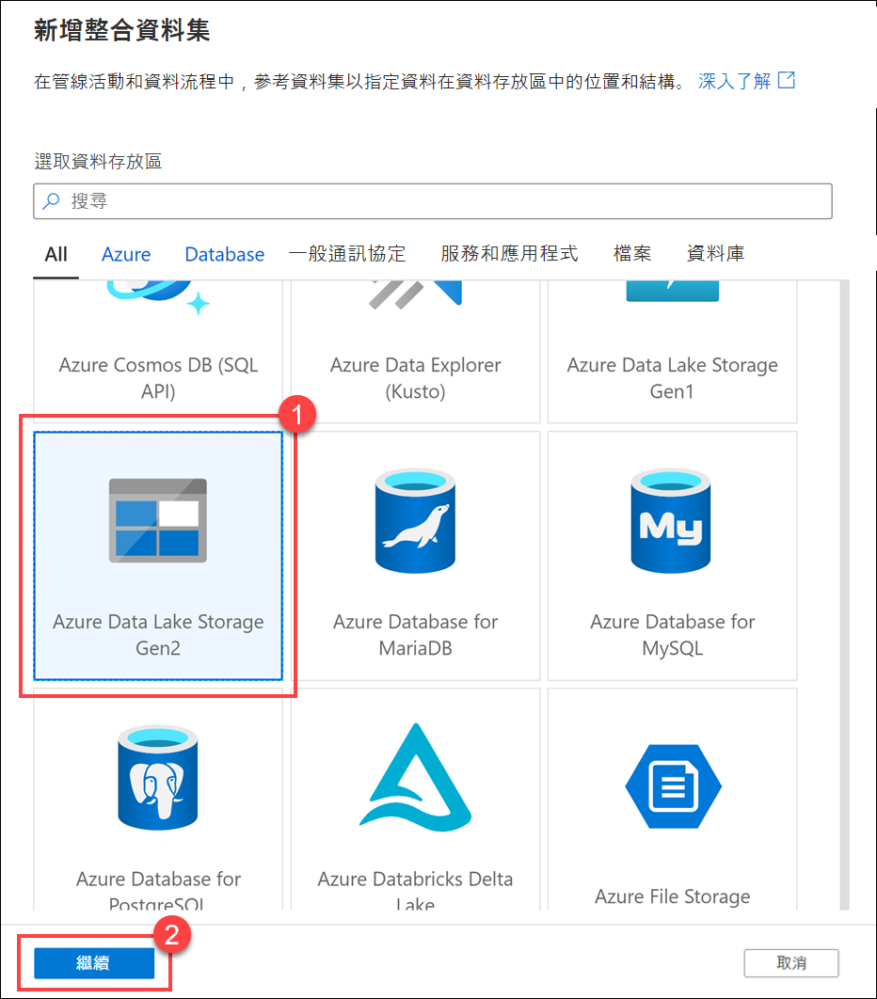

8. 选择“**Parquet**”格式，然后选择“**继续**”。

    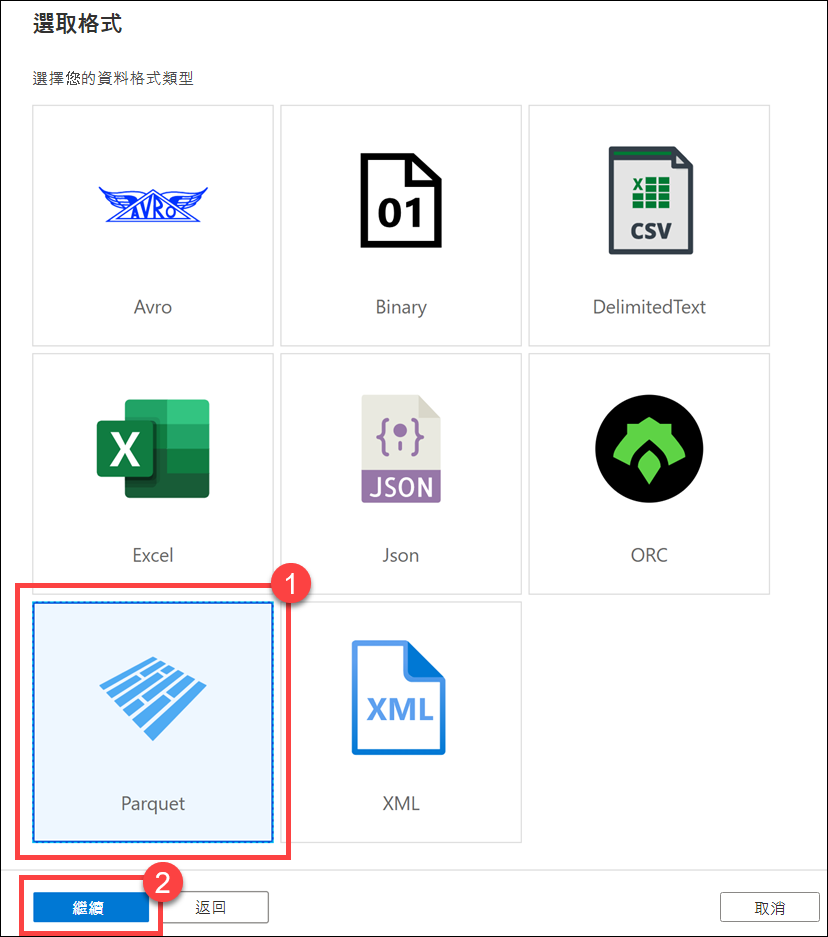

9. 在“**设置属性**”窗格中：
    1. 将“名称”设置为 **`asal400_december_sales`**。
    2. 选择“**asadatalake*xxxxxxx***”链接服务。
    3. 浏览到 **wwi-02/campaign-analytics/sale-20161230-snappy.parquet** 文件
    4. 选择“**从示例文件**”进行架构导入。
    5. 在“**选择文件**”字段中浏览到 **C:\dp-203\data-engineering-ilt-deployment\Allfiles\samplefiles\sale-small-20100102-snappy.parquet**。
    6. 选择“**确定**”。

    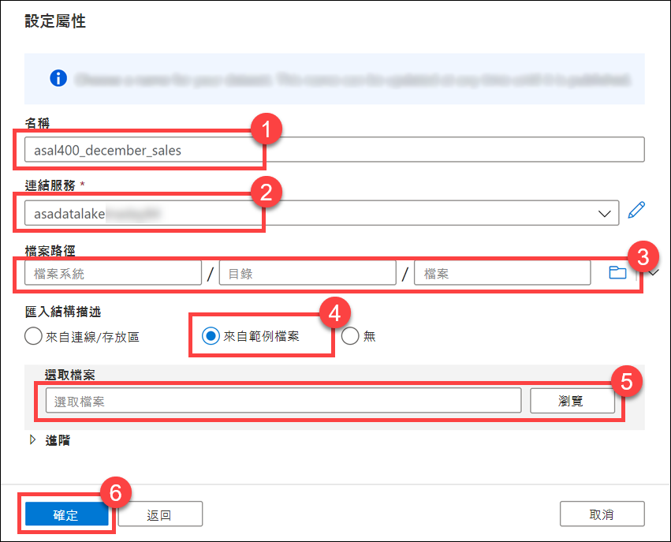

    我们已下载 Parquet 示例文件，该文件具有完全相同的架构，但更小。这是因为我们要复制的文件太大，而无法自动推断复制活动源设置中的架构。

10. 选择“**接收器**”选项卡，然后选择“**+ 新建**”以创建新的接收器数据集。

    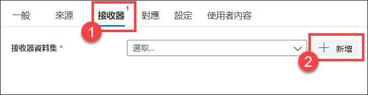

11. 选择“**Azure Synapse Analytics**”数据存储，然后选择“**继续**”。

    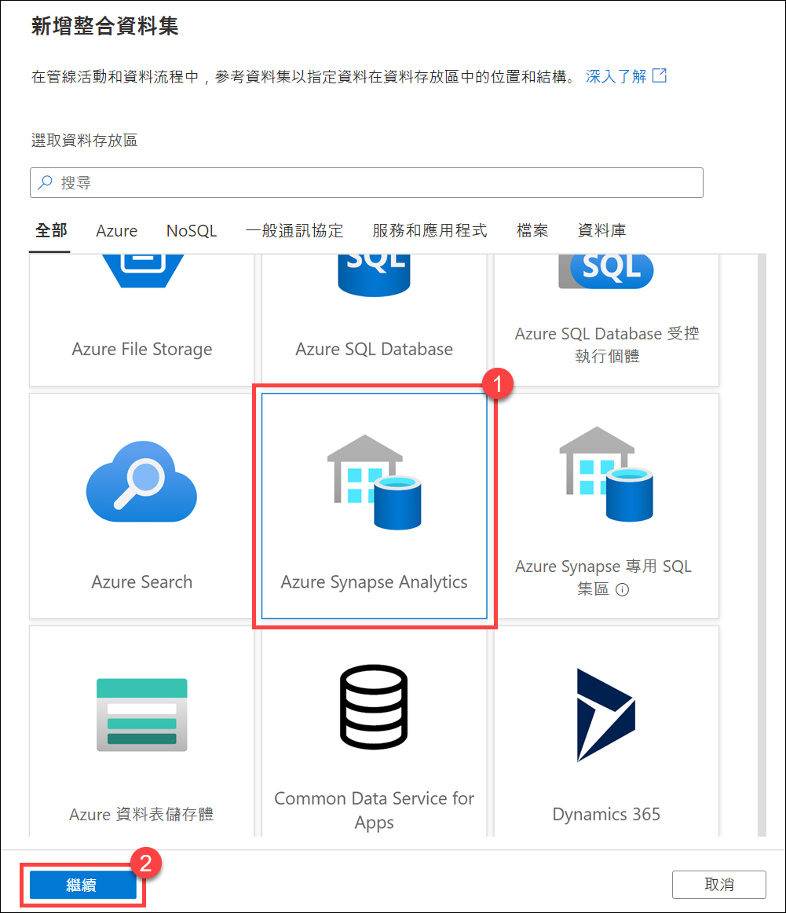

12. 在“**设置属性**”窗格中：
    1. 将“**名称**”设置为 **`asal400_saleheap_asa`**
    2. 选择 **sqlpool01_import01** 链接服务。
    3. 选择 **wwi_perf.Sale_Heap** 表
    4. 选择“**确定**”。

    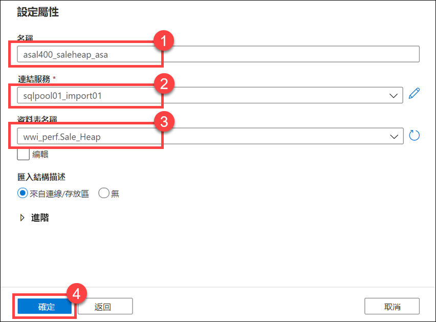

13. 在“**接收器**”选项卡中，选择“**复制命令**”复制方法，并在预复制脚本中输入以下代码，以在导入前清除表：

    ```
    TRUNCATE TABLE wwi_perf.Sale_Heap
    ```

    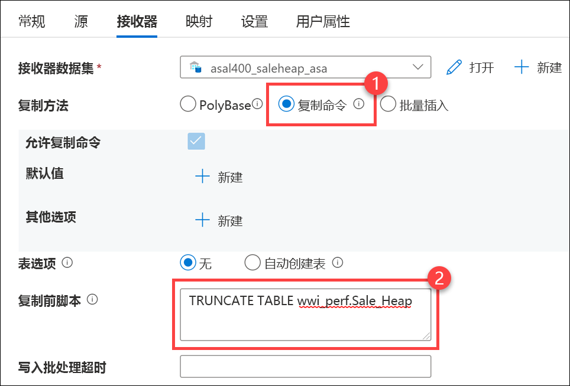

    加载数据的最快且最可缩放的方式是通过 PolyBase 或 COPY 语句，并且使用 COPY 语句可更灵活地将高吞吐量数据引入到 SQL 池。

14. 选择“**映射**”选项卡，然后选择“**导入架构**”，为每个源和目标字段创建映射。在源列中选择“**TransactionDate**”，将其映射到目标列 **TransactionDateId**。

    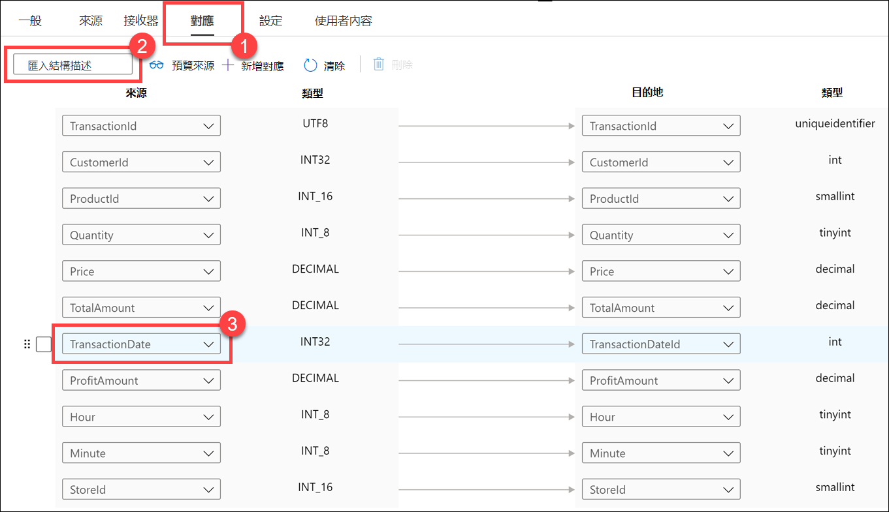

15. 选择“**设置**”选项卡，并将“**数据集成单元**”设置为 **8**。这是必需的，因为源 Parquet 文件很大。

    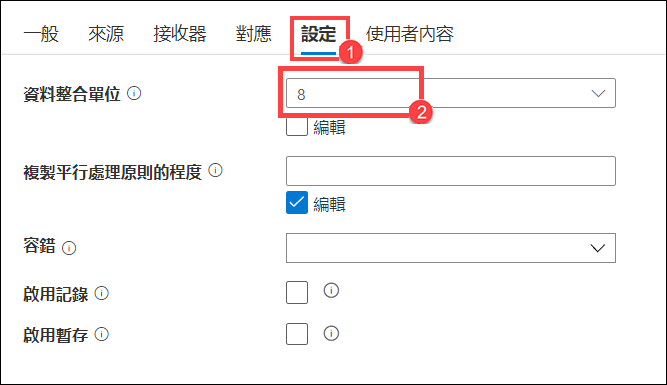

16. 依次选择“**全部发布**”和“**发布**”，以保存新资源。

    

17. 依次选择“**添加触发器**”、“**立即触发**”。然后在“**管道运行**”窗格中选择“**确定**”以启动管道。

    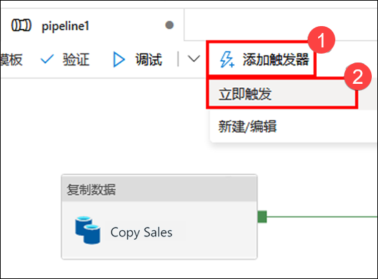

18. 导航到“**监视**”中心。

    

19. 选择“**管道运行**”。可以在这里看到管道运行的状态。请注意，可能需要刷新视图。管道运行完成后，可以查询 **wwi_perf.Sale_Heap** 表以查看导入的数据。

    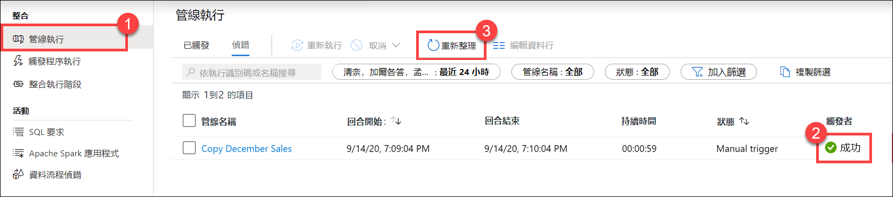

## 重要说明：暂停 SQL 池

完成以下步骤，释放不再需要的资源。

1. 在 Synapse Studio 中，选择“**管理**”中心。
2. 在左侧菜单中，选择“**SQL 池**”。将鼠标悬停在“**SQLPool01**”专用 SQL 池上，并选择 **||**。

    

3. 出现提示时，选择“**暂停**”。
