---
lab:
    title: '使用 Azure 数据工厂或 Azure Synapse 管道转换数据'
    module: '模块 6'
---

# 实验室 6 - 使用 Azure 数据工厂或 Azure Synapse 管道转换数据

本实验室介绍如何执行以下操作：生成数据集成管道以从多个数据源引入、使用映射数据流和笔记本转换数据、将数据移动到一个或多个数据接收器中。

完成本实验室后，你将能够：

- 使用 Azure Synapse 管道大规模执行无代码转换
- 创建数据管道来导入格式错乱的 CSV 文件
- 创建映射数据流

## 实验室设置和先决条件

开始该实验室之前，必须先完成“实验室 5：将数据引入和加载到数据仓库中”。

本实验室使用你在上一个实验室中创建的专用 SQL 池。你应该已在上一个实验室结束时暂停了 SQL 池，因此请按照以下说明恢复它：

1. 打开 Synapse Studio (<https://web.azuresynapse.net/>)。
2. 选择“**管理**”中心。
3. 在左侧菜单中，选择“**SQL 池**”。如果 **SQLPool01** 专用 SQL 池已暂停，请将鼠标悬停在其名称上并选择“**&#9655;**”。

    

4. 出现提示时，选择“**恢复**”。恢复池可能需要一到两分钟。
5. 恢复专用 SQL 池后，请继续下一个练习。

> **重要说明：** 启动后，专用 SQL 池会消耗 Azure 订阅中的额度，直到暂停为止。如果你要离开该实验室休息一下，或者决定不完成该实验室；请按照实验结尾处的说明暂停 SQL 池！

## 练习 1 - 使用 Azure Synapse 管道大规模执行无代码转换

Tailwind Traders 希望为数据工程任务提供无代码选项。其动机是希望使了解数据但不具有太多开发经验的初级工程师能够构建和维护数据转换操作。此要求的另一个推动因素是通过依赖固定到特定版本的库来减少由复杂代码引起的脆弱性、取消代码测试要求，以及提高长期维护的便利性。

他们的另一个要求是在数据湖和专用 SQL 池中维护转换后的数据。通过同时在数据湖和专用 SQL 池中维护数据，他们能够在数据集中灵活保留更多字段（与事实数据表和维度表中存储的字段相比），并且使他们能够在专用 SQL 池处于暂停状态时访问数据，从而优化成本。

考虑到这些要求，你建议构建映射数据流。

映射数据流是管道活动，通过无代码体验提供一种直观方式来指定数据转换方式。此功能提供数据清理、转换、聚合、转化、联接、数据复制操作等。

其他优势

- 通过执行 Spark 实现云规模
- 提供轻松构建可复原数据流的引导式体验
- 可根据用户需要灵活转换数据
- 从单一控制平面监视和管理数据流

### 任务 1：创建 SQL 表

我们将要构建的映射数据流会将用户购买数据写入到专用 SQL 池。Tailwind Traders 还没有存储此类数据的表。第一步，我们将执行 SQL 脚本来创建此表。

1. 在 Synapse Analytics Studio 中，导航到“**开发**”中心。

    

2. 在“**+**”菜单中，选择“**SQL 脚本**”。

    

3. 在工具栏菜单中，连接到“**SQLPool01**”数据库。

    

4. 在查询窗口中，将脚本替换为以下代码，以创建新表，该表将用户偏好产品（存储在 Azure Cosmos DB 中）与电商网站中每位用户经常购买的产品（以 JSON 文件格式存储在 Data Lake 中）联接起来：

    ```sql
    CREATE TABLE [wwi].[UserTopProductPurchases]
    (
        [UserId] [int]  NOT NULL,
        [ProductId] [int]  NOT NULL,
        [ItemsPurchasedLast12Months] [int]  NULL,
        [IsTopProduct] [bit]  NOT NULL,
        [IsPreferredProduct] [bit]  NOT NULL
    )
    WITH
    (
        DISTRIBUTION = HASH ( [UserId] ),
        CLUSTERED COLUMNSTORE INDEX
    )
    ```

5. 选择工具栏菜单上的“**运行**”来运行脚本（可能需要等待 SQL 池恢复）。

    

6. 在查询窗口中，将脚本替换为以下内容，为活动分析 CSV 文件创建新表：

    ```sql
    CREATE TABLE [wwi].[CampaignAnalytics]
    (
        [Region] [nvarchar](50)  NOT NULL,
        [Country] [nvarchar](30)  NOT NULL,
        [ProductCategory] [nvarchar](50)  NOT NULL,
        [CampaignName] [nvarchar](500)  NOT NULL,
        [Revenue] [decimal](10,2)  NULL,
        [RevenueTarget] [decimal](10,2)  NULL,
        [City] [nvarchar](50)  NULL,
        [State] [nvarchar](25)  NULL
    )
    WITH
    (
        DISTRIBUTION = HASH ( [Region] ),
        CLUSTERED COLUMNSTORE INDEX
    )
    ```

7. 运行脚本以创建表。

### 任务 2：创建链接服务

Azure Cosmos DB 是可以在映射数据流中使用的一种数据源。Tailwind Traders 还未创建链接服务。请按照本节中的步骤创建一个。

> **备注**：如果已创建 Cosmos DB 链接服务，可跳过此部分。

1. 导航到“**管理**”中心。

    

2. 打开“**链接服务**”，然后选择“**+ 新建**”以创建新的链接服务。在选项列表中选择“**Azure Cosmos DB (SQL API)**”，然后选择“**继续**”。

    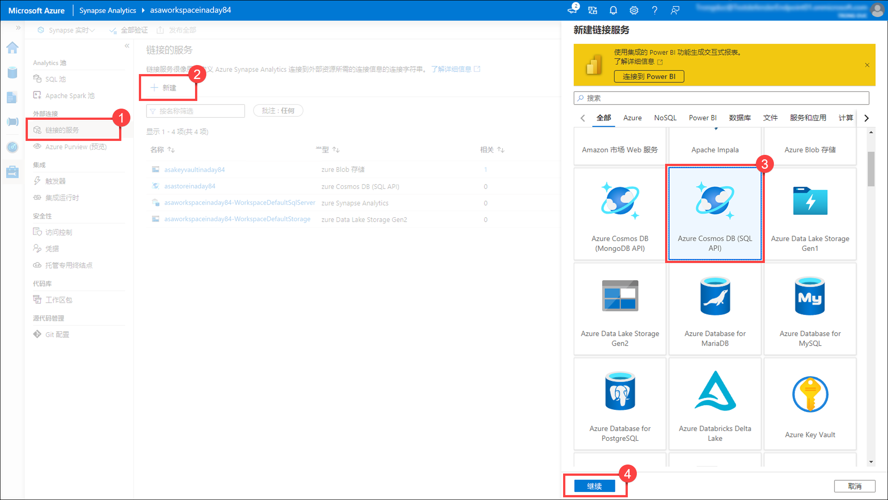

3. 将链接服务命名为`asacosmosdb01`，然后选择“**asacosmosdb*xxxxxxx***”Cosmos DB 帐户名和 **CustomerProfile** 数据库。单击“**创建**”前，选择“**测试连接**”以确保成功。

    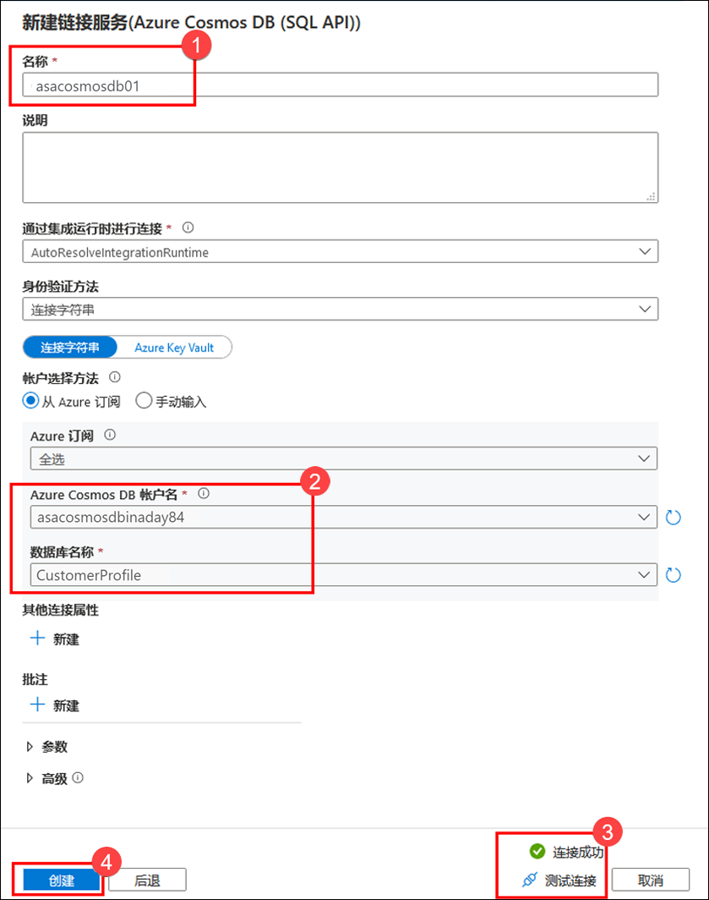

### 任务 3：创建数据集

用户配置文件数据来自两个不同的数据源，我们现在将创建它们：来自电商系统的客户配置文件数据存储在 Data Lake 内的 JSON 文件中，提供每位网站访问者（客户）在过去 12 个月经常购买的产品。用户配置文件数据（包含产品偏好和产品评论等）在 Cosmos DB 中存储为 JSON 文档。

在本节中，你将为 SQL 表创建数据集，该表将作为稍后在此实验室中创建的数据管道的数据接收器。

1. 导航到“**数据**”中心。

    

2. 在“**+**”菜单上，选择“**集成数据集**”以创建一个新的数据集。

    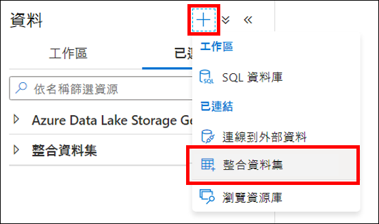

3. 选择“**Azure Cosmos DB (SQL API)**”，然后单击“**继续**”。

    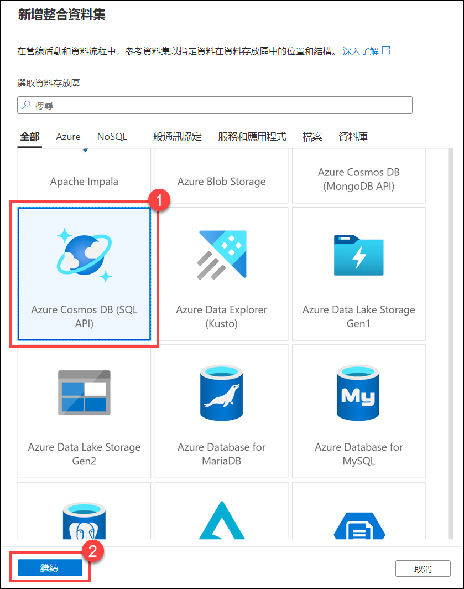

4. 如下所示配置数据集，然后选择“**确定**”：

    - **名称**：输入`asal400_customerprofile_cosmosdb`。
    - **链接服务**：选择“**asacosmosdb01**”。
    - **集合**：选择“**OnlineUserProfile01**”。

        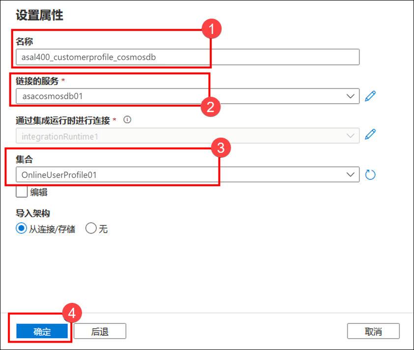

5. 创建数据集后，选择“**连接**”选项卡下的“**预览数据**”。

    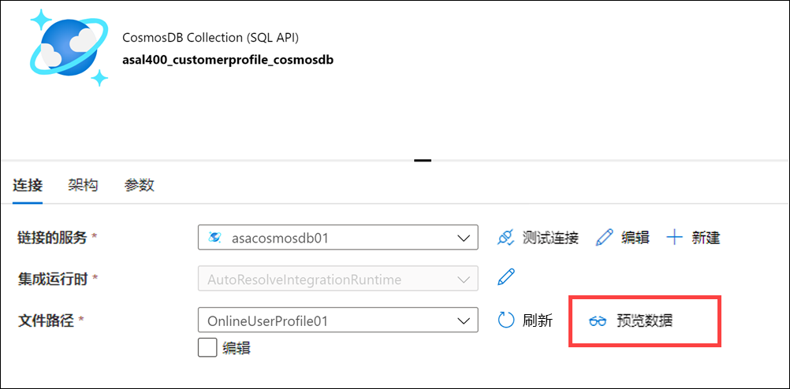

6. 预览数据查询选中的 Azure Cosmos DB 集合，并返回其中的文档示例。文档以 JSON 格式存储，并包含“**userId**”、“**cartId**”、“**preferredProducts**”（一些可能为空的产品 ID）和“**productReviews**”（一些可能为空的编写的产品评论）字段。

    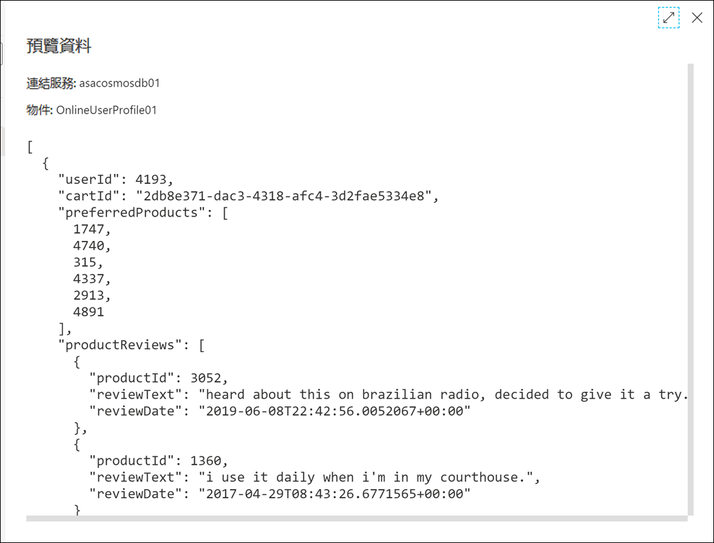

7. 关闭预览。然后，在“**数据**”中心的“**+**”菜单中，选择“**集成数据集**”，创建所需的第二个源数据集。

    

8. 选择“**Azure Data Lake Storage Gen2**”，然后单击“**继续**”。

    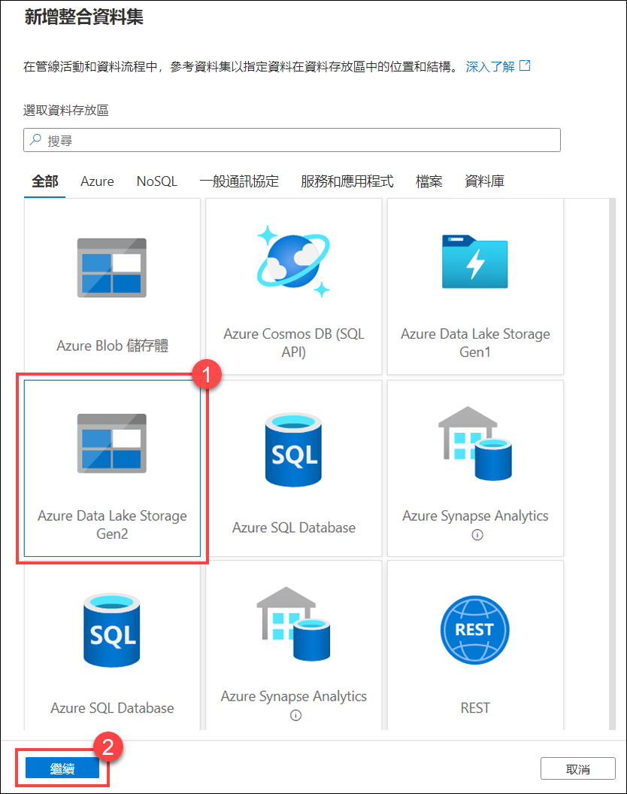

9. 选择“**JSON**”格式，然后选择“**继续**”。

    

10. 如下所示配置数据集，然后选择“**确定**”：

    - **名称**：输入`asal400_ecommerce_userprofiles_source`。
    - **链接服务**：选择“**asadatalake*xxxxxxx***”链接服务。
    - **文件路径**：浏览到路径“**wwi-02/online-user-profiles-02**”。
    - **导入架构**：选择“**从连接/存储中**”。

    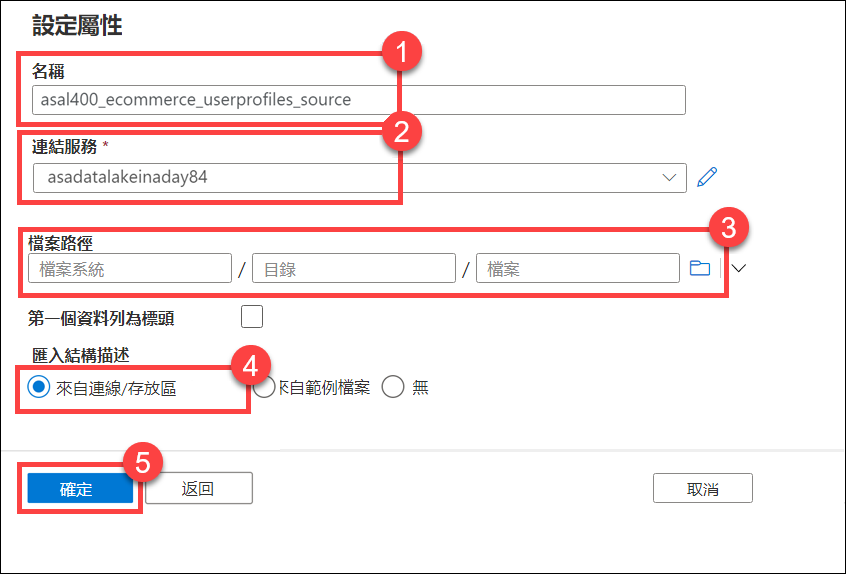

11. 在“**数据**”中心的“**+**”菜单中，选择“**集成数据集**”以创建第三个数据集，该数据集引用活动分析的目标表。

    

12. 选择“**Azure Synapse Analytics**”，然后选择“**继续**”。

    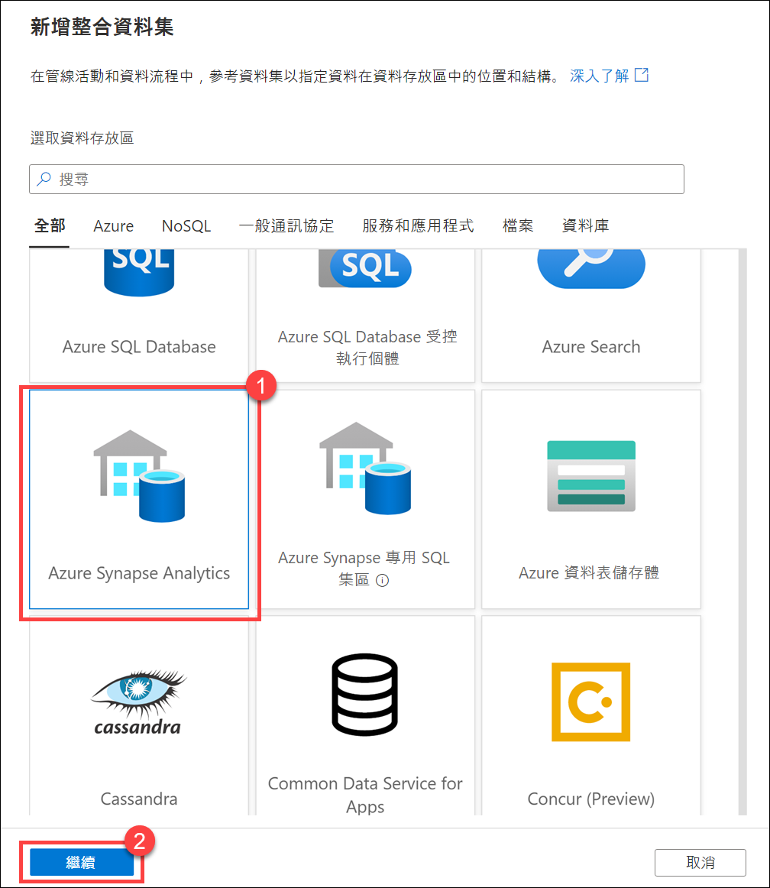

13. 如下所示配置数据集，然后选择“**确定**”：

    - **名称**：输入`asal400_wwi_campaign_analytics_asa`。
    - **链接服务**：选择“**SqlPool01**”。
    - **表名称**：选择“**wwi.CampaignAnalytics**”。
    - **导入架构**：选择“**从连接/存储中**”。

    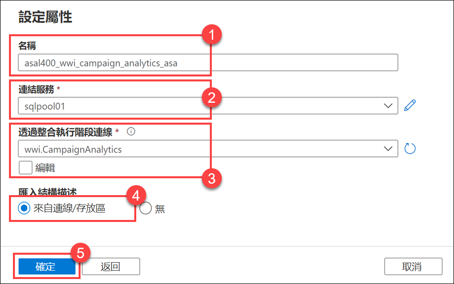

14. 在“**数据**”中心的“**+**”菜单中，选择“**集成数据集**”以创建第四个数据集，该数据集引用排名靠前的产品购买的目标表。

    

15. 选择“**Azure Synapse Analytics**”，然后选择“**继续**”。

    

16. 如下所示配置数据集，然后选择“**确定**”：

    - **名称**：输入`asal400_wwi_usertopproductpurchases_asa`。
    - **链接服务**：选择“**SqlPool01**”。
    - **表名称**：选择“**wwi.UserTopProductPurchases**”。
    - **导入架构**：选择“**从连接/存储中**”。

    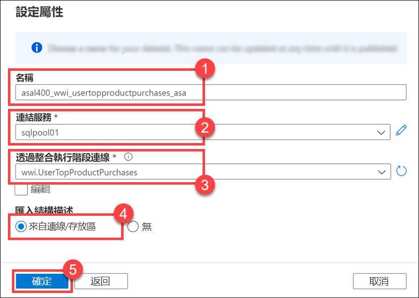

### 任务 4：创建活动分析数据集

你的组织收到一个格式错乱的 CSV 文件，其中包含营销活动数据。该文件已被上传到数据湖，现在必须将其导入到数据仓库。


问题包括收入货币数据中的无效字符和未对齐的列。

1. 在“**数据**”中心的“**+**”菜单上，选择“**集成数据集**”以创建一个新的数据集。

    

2. 选择“**Azure Data Lake Storage Gen2**”，然后选择“**继续**”。

    

3. 选择“**DelimitedText**”格式，然后选择“**继续**”。

    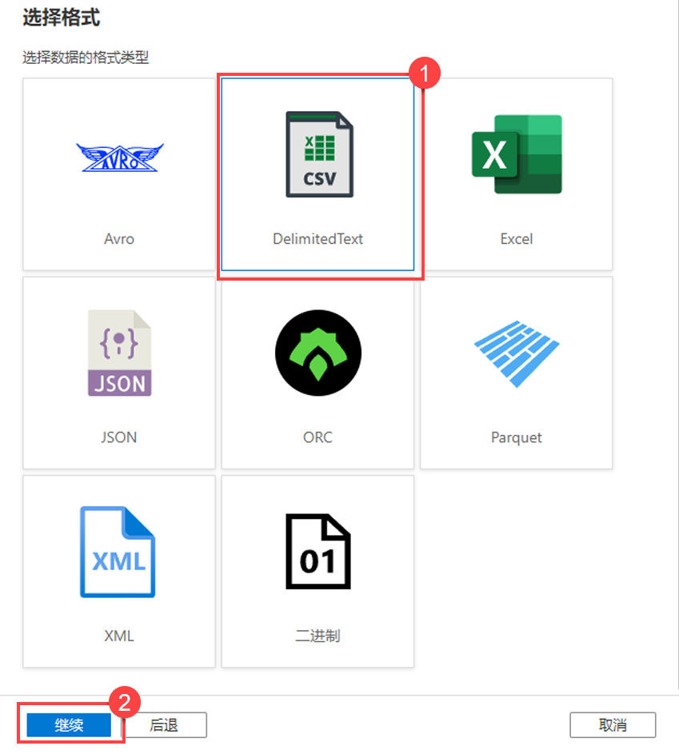

4. 如下所示配置数据集，然后选择“**确定**”：

    - **名称**：输入`asal400_campaign_analytics_source`。
    - **链接服务**：选择“**asadatalake*xxxxxxx***”链接服务。
    - **文件路径**：浏览到“**wwi-02/campaign-analytics/campaignanalytics.csv**”。
    - **第一行作为标题**：保留未选中状态（我们将跳过标题，因为标题中的列数与数据行中的列数不匹配）。
    - **导入架构**：选择“**从连接/存储中**”。

    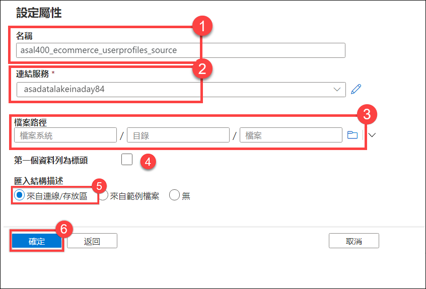

5. 创建数据集之后，在其“**连接**”选项卡上查看默认设置。它们应符合以下配置：

    - **压缩类型**：无。
    - **列分隔符**：逗号 (,)
    - **行分隔符**：默认（\r、\n、或 \r\n）
    - **编码**：默认值 (UTF-8)
    - **转义字符**：反斜杠 (/)
    - **引号字符**：双引号 (")
    - **第一行作为标题**：*未选中*
    - **NULL 值**：*空*

    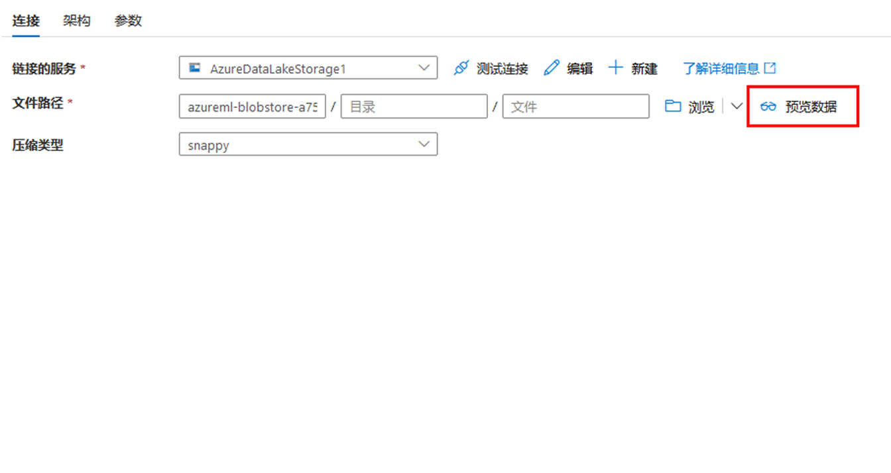

6. 选择“**预览数据**”(如果“**属性**”窗格挡住视线，请将其关闭)。

    预览会显示 CSV 文件的示例。开始此任务时会显示一些问题。注意，由于我们没有将第一行设置为标题，因此标题列将显示为第一行。另外还要注意，不会出现城市和州的值。这是因为标题行中的列数与文件的其余部分不匹配。当我们在下一个练习中创建数据流时，将排除第一行。

    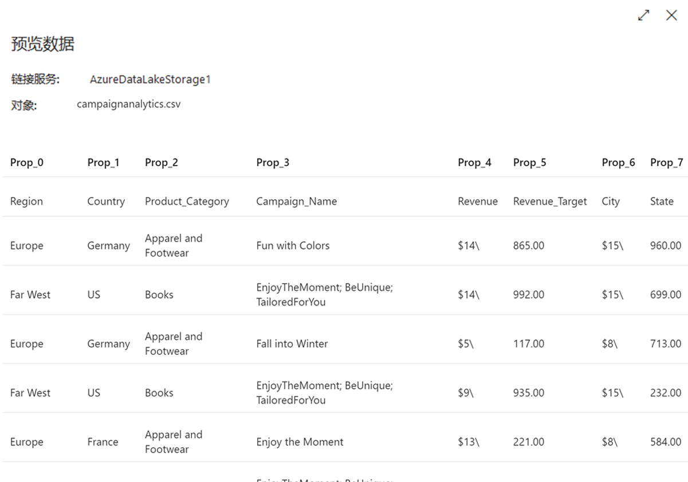

7. 关闭预览，然后选择“**全部发布**”，并单击“**发布**”以保存新资源。

    

### 任务 5：创建活动分析数据流

1. 导航到“**开发**”中心。

    

2. 在“**+**”菜单中，选择“**数据流**”以创建新的数据流（若出现提示，请关闭它。）

    

3. 在新数据流的“**属性**”边栏选项卡的“**常规**”设置中，将“**名称**”更改为`asal400_lab2_writecampaignanalyticstoasa`。

    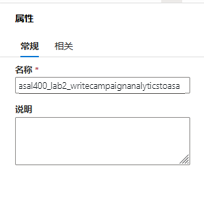

4. 在数据流画布上选择“**添加源**”(同样，如果出现提示，请关闭它)。

    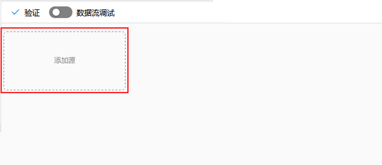

5. 在“**源设置**”下配置以下各项：

    - **输出流名称**：输入 `CampaignAnalytics`。
    - **源类型**：选择“**集成数据集**”。
    - **数据集**：选择“**asal400_campaign_analytics_source**”。
    - **选项**：选择“**允许架构偏差**”并保持其他选项为未选中状态。
    - **跳过行数**：输入 `1`。这使我们将跳过标题行（导致比 CSV 文件中的其他行少两列），从而截断最后两列数据。
    - **采样**：选择“**禁用**”。

    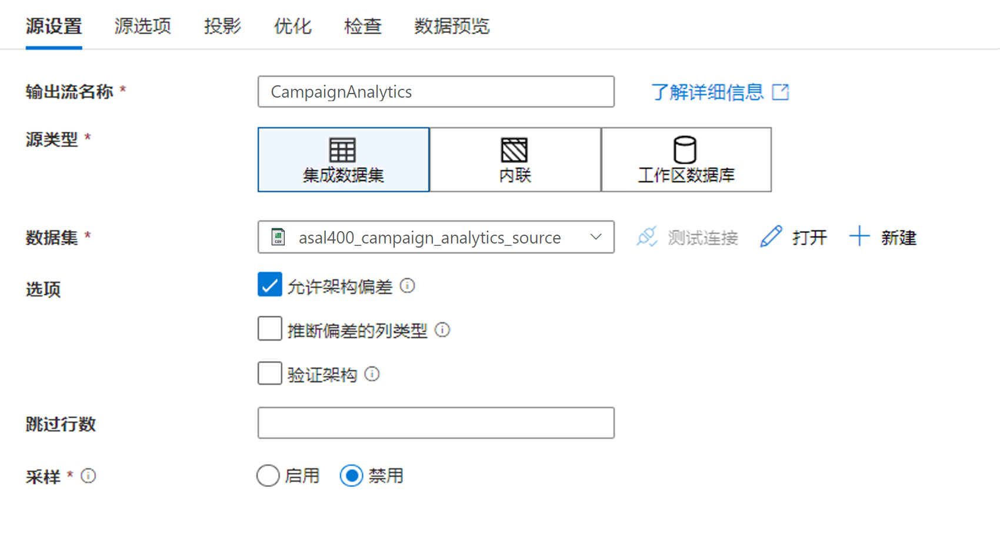

    在创建数据流时，可以通过打开调试来启用某些功能，例如预览数据和导入架构（投影）。由于启用此选项需要花费大量时间，为了尽量减少实验室环境中的资源消耗，我们将跳过这些功能。
    
6. 数据源具有需要设置的架构。为此，请选择设计画布上方的“**脚本**”。

    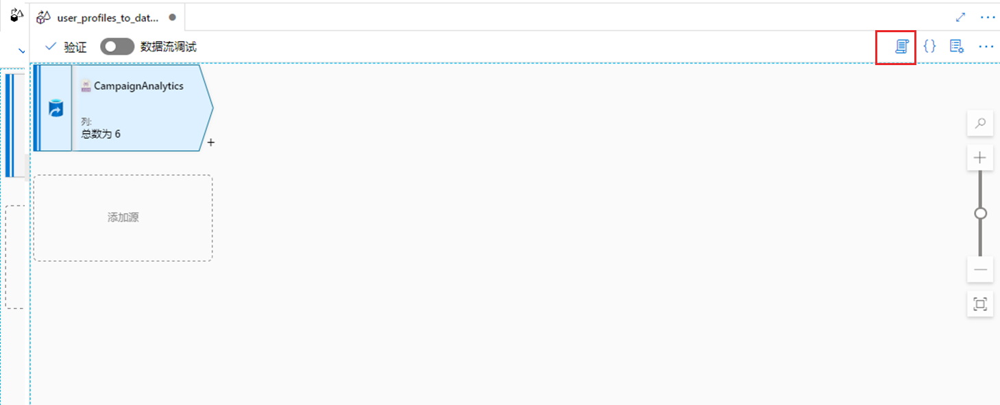

7. 将脚本替换为以下内容，以提供列映射，然后选择“**确定**”：

    ```json
    source(output(
            {_col0_} as string,
            {_col1_} as string,
            {_col2_} as string,
            {_col3_} as string,
            {_col4_} as string,
            {_col5_} as double,
            {_col6_} as string,
            {_col7_} as double,
            {_col8_} as string,
            {_col9_} as string
        ),
        allowSchemaDrift: true,
        validateSchema: false,
        ignoreNoFilesFound: false,
        skipLines: 1) ~> CampaignAnalytics
    ```

8. 选择“**CampaignAnalytics**”数据源，然后选择“**投影**”。投影应显示以下架构：

    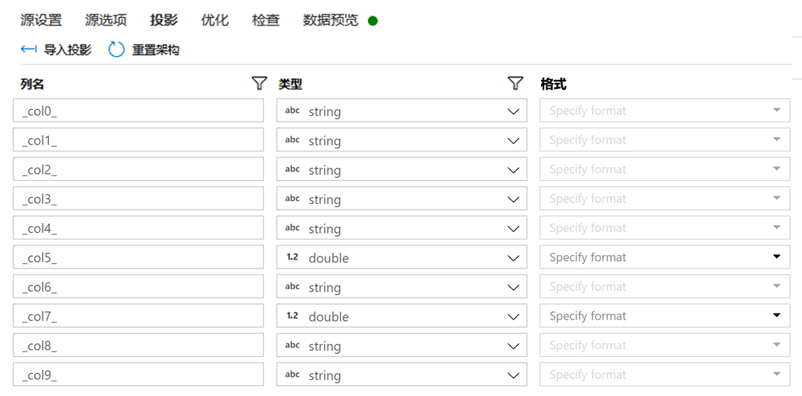

9. 选择“**CampaignAnalytics**”步骤右侧的“**+**”，然后选择“**选择**”架构修饰符。

    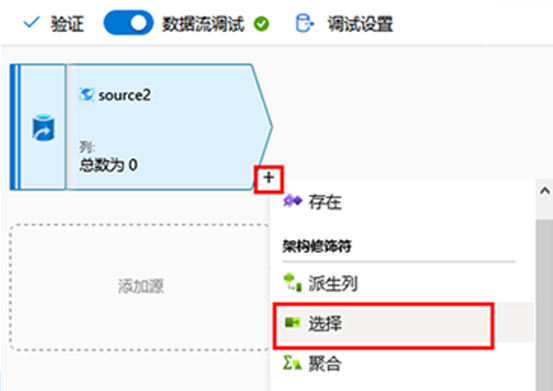

10. 在“**选择设置**”下配置以下各项：

    - **输出流名称**：输入 `MapCampaignAnalytics`。
    - **传入流**：选择“**CampaignAnalytics**”。
    - **选项**：选中这两个选项。
    - **输入列**：确保未选中“**自动映射**”，然后在“**命名为**”字段中提供以下值：
      - `Region`
      - `Country`
      - `ProductCategory`
      - `CampaignName`
      - `RevenuePart1`
      - `Revenue`
      - `RevenueTargetPart1`
      - `RevenueTarget`
      - `City`
      - `State`

    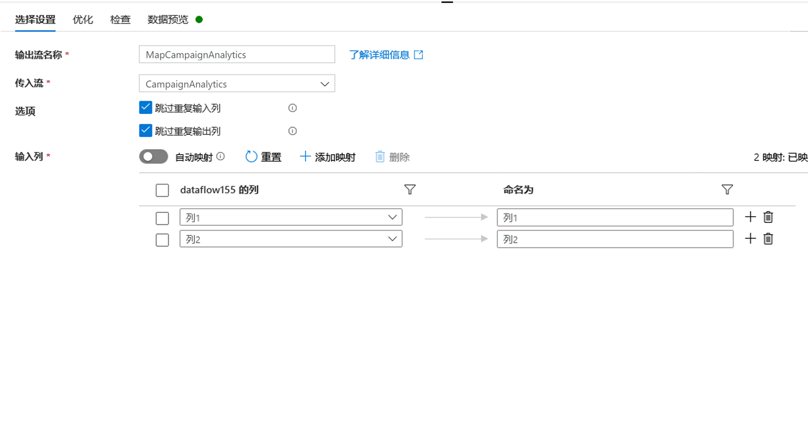

11. 选择“**MapCampaignAnalytics**”步骤右侧的“**+**”，然后选择“**派生列**”架构修饰符。

    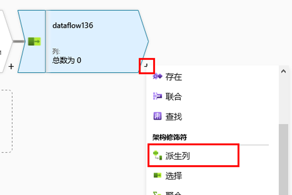

12. 在“**派生列的设置**”下配置以下各项：

    - **输出流名称**：输入 `ConvertColumnTypesAndValues`。
    - **传入流**：选择“**MapCampaignAnalytics**”。
    - **列**：提供以下信息：

        | 列 | 表达式 |
        | --- | --- |
        | Revenue | `toDecimal(replace(concat(toString(RevenuePart1), toString(Revenue)), '\\', ''), 10, 2, '$###,###.##')` |
        | RevenueTarget | `toDecimal(replace(concat(toString(RevenueTargetPart1), toString(RevenueTarget)), '\\', ''), 10, 2, '$###,###.##')` |

    > **备注**：若要插入第二列，请选择“列”列表上方的“**+ 添加**”，然后选择“**添加列**”。

    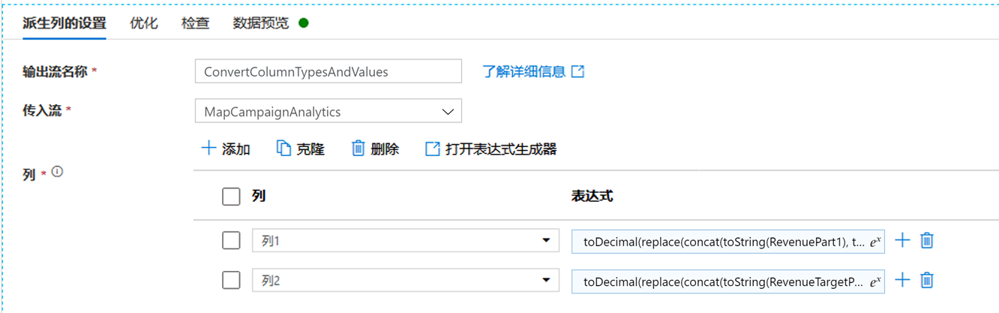

    定义的表达式将连接和清理“**RevenuePart1**”值和“**Revenue**”值以及“**RevenueTargetPart1**”值和“**RevenueTarget**”值。

13. 选择“**ConvertColumnTypesAndValues**”步骤右侧的“**+**”，然后在上下文菜单中选择“**选择**”架构修饰符。

    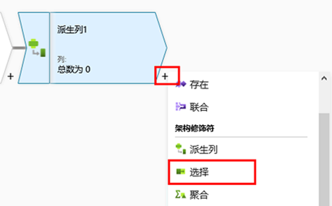

14. 在“**选择设置**”下配置以下各项：

    - **输出流名称**：输入 `SelectCampaignAnalyticsColumns`。
    - **传入流**：选择“**ConvertColumnTypesAndValues**”。
    - **选项**：选中这两个选项。
    - **输入列**：确保未选中“**自动映射**”，然后**删除** “**RevenuePart1**”和“**RevenueTargetPart1**”。我们不再需要这些字段。

    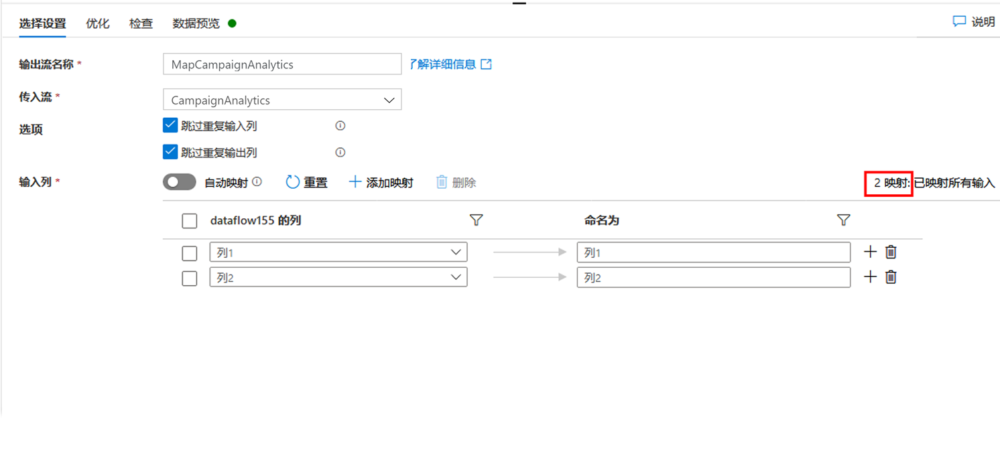

15. 选择“**SelectCampaignAnalyticsColumns**”步骤右侧的“**+**”，然后选择“**接收器**”目标。

    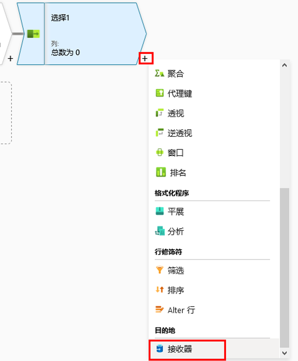

16. 在“**接收器**”下配置以下各项：

    - **输出流名称**：输入 `CampaignAnalyticsASA`。
    - **传入流**：选择“**SelectCampaignAnalyticsColumns**”。
    - **接收器类型**：选择“**集成数据集**”。
    - **数据集**：选择“**asal400_wwi_campaign_analytics_asa**”。
    - **选项**：选中“**允许架构偏差**”，并取消选中“**验证架构**”。

    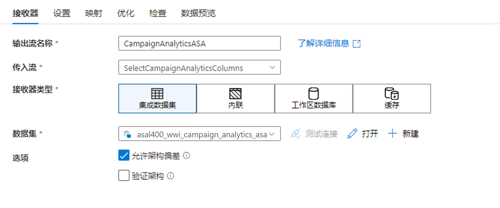

17. 在“**设置**”选项卡上，配置以下选项：

    - **更新方法**：选中“**允许插入**”，并将其余选项保持未选中状态。
    - **表操作**：选择“**截断表**”。
    - **启用暂存**：取消选中此选项。示例 CSV 文件很小，无需选择暂存选项。

    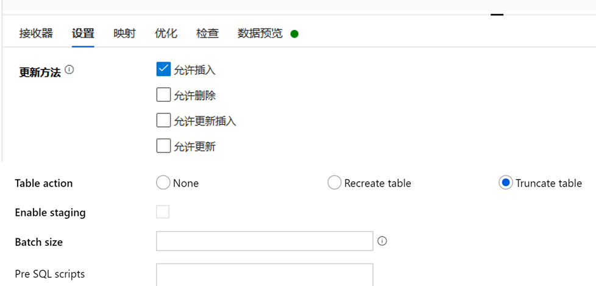

18. 完成的数据流应如下所示：

    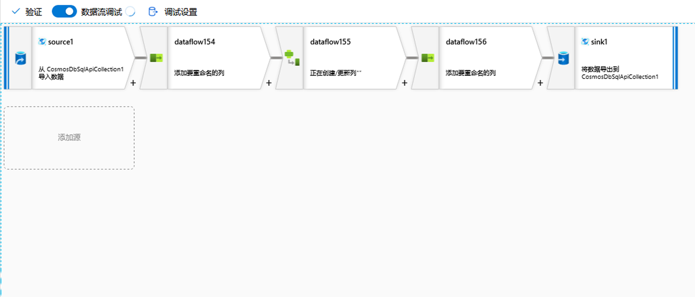

19. 依次选择“**全部发布**”和“**发布**”，以保存新数据流。

    

### 任务 6：创建活动分析数据管道

为了运行新的数据流，需要创建新管道并为其添加数据流活动。

1. 导航到“**集成**”中心。

    

2. 在“**+**”菜单中，选择“**管道**”以创建新的管道。

    

3. 在新管道的“**属性**”边栏选项卡的“**常规**”设置中，输入以下**名称**：`Write Campaign Analytics to ASA`。

4. 展开“活动”列表中的“**移动和转换**”，然后将“**数据流**”活动拖放到管道画布上。

    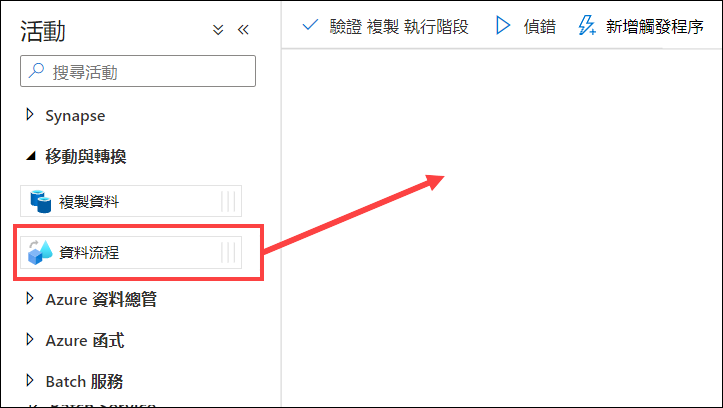

5. 在数据流的“**常规**”选项卡上（位于管道画布下方），将“**名称**”设置为`asal400_lab2_writecampaignanalyticstoasa`。

    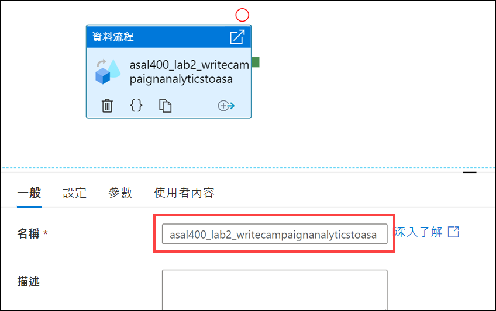

6. 选择“**设置**”选项卡；然后，在“**数据流**”列表中，选择“**asal400_lab2_writecampaignanalyticstoasa**”。

    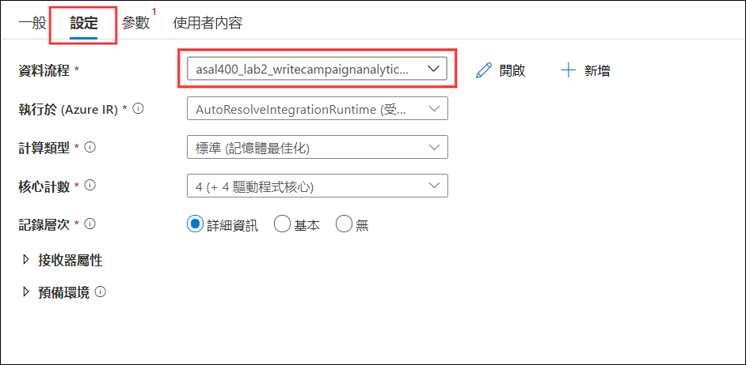

8. 选择“**全部发布**”以保存新管道，然后选择“**发布**”。

    

### 任务 7：运行活动分析数据管道

1. 选择“**添加触发器**”，然后在管道画布顶部的工具栏中选择“**立即触发**”。

    

2. 在“**管道运行**”窗格中，选择“**确定**”以启动管道运行。

    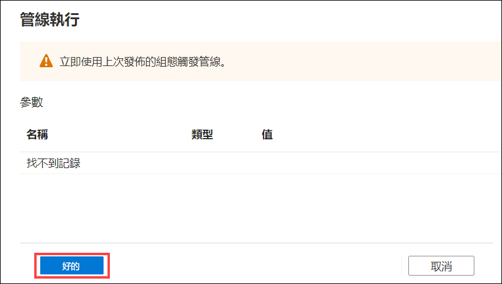

3. 导航到“**监视**”中心。

    

4. 等待管道运行成功完成，这将需要一些时间。可能需要刷新视图。

    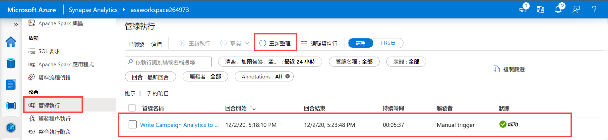

### 任务 8：查看活动分析表的内容

管道运行现已完成，让我们查看 SQL 表以验证数据是否成功复制。

1. 导航到“**数据**”中心。

    

2. 展开“**工作区**”部分下面的“**SqlPool01**”数据库，然后展开“**表**”（可能需要刷新才能看到新表）。

3. 右键单击“**wwi.CampaignAnalytics**”表，然后选择“**新建 SQL 脚本**”和“**选择前 100 行**”。 

    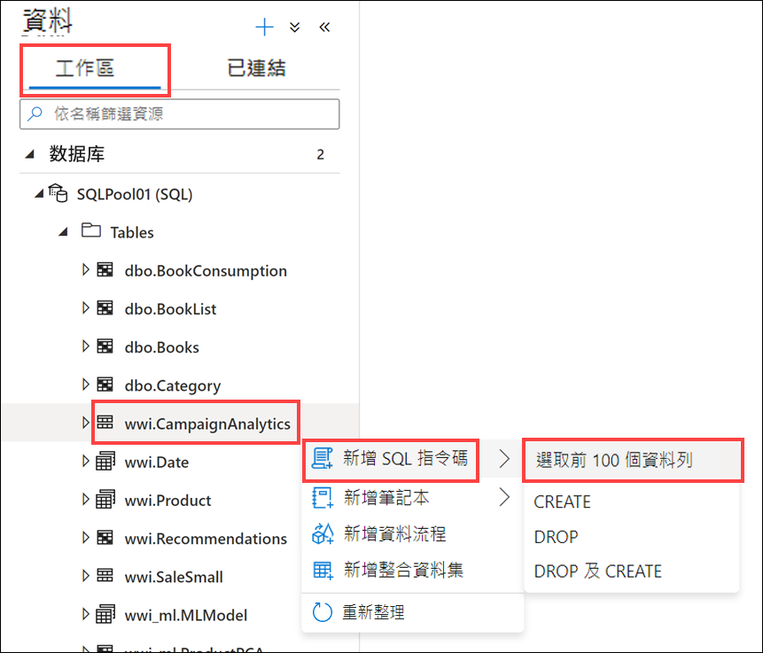

4. 正确转换的数据应该显示在查询结果中。

    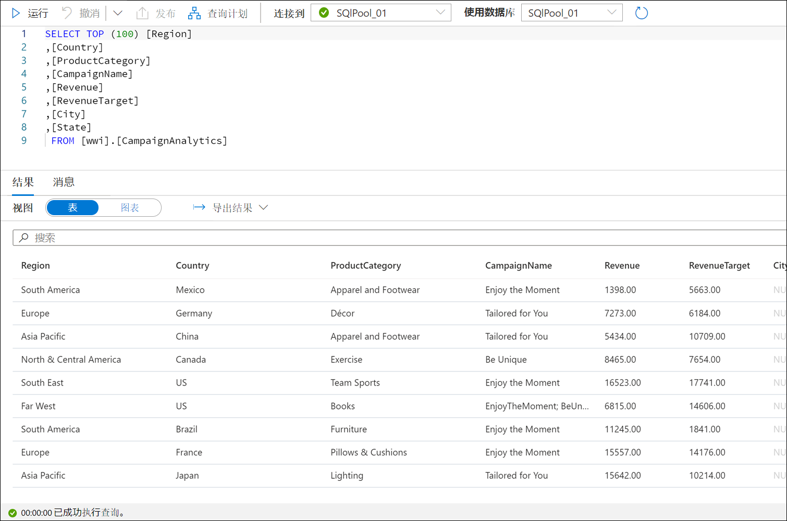

5. 如下所示修改查询，并运行脚本：

    ```sql
    SELECT ProductCategory
    ,SUM(Revenue) AS TotalRevenue
    ,SUM(RevenueTarget) AS TotalRevenueTarget
    ,(SUM(RevenueTarget) - SUM(Revenue)) AS Delta
    FROM [wwi].[CampaignAnalytics]
    GROUP BY ProductCategory
    ```

6. 在查询结果中，选择“**图表**”视图。按照定义配置列：

    - **图表类型**：列。
    - **类别列**：ProductCategory。
    - **图例（系列）列**：TotalRevenue、TotalRevenueTarget 和 Delta。

    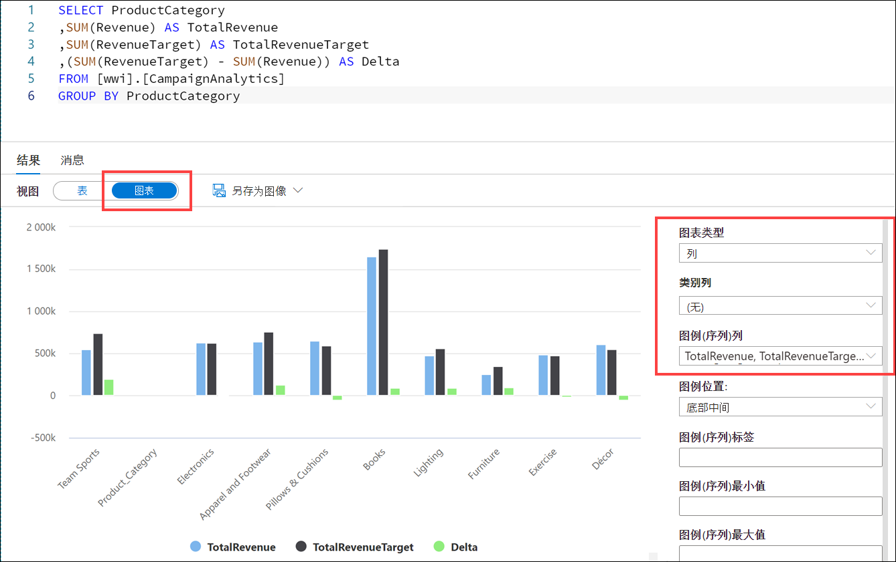

## 练习 2 - 为经常购买的产品创建映射数据流

Tailwind Traders 需要将经常购买的产品（从电商系统以 JSON 文件导入）与用户偏好产品（来自在 Azure Cosmos DB 中以 JSON 文档存储的配置文件数据）组合在一起。他们希望将组合后的数据存储在专用 SQL 池和数据湖中，供进一步分析和报告。

为此，你将构建一个映射数据流用于执行以下任务：

- 为 JSON 数据添加两个 ADLS Gen2 数据源
- 平展这两组文件的层次结构
- 执行数据转换和类型转化
- 联接这两个数据源
- 基于条件逻辑在联接的数据集上创建新字段
- 筛选必需字段的 NULL 记录
- 写入专用 SQL 池
- 同时写入数据湖

### 任务 1：创建映射数据流

1. 在 Synapse Analytics Studio 中，导航到“**开发**”中心。

    

2. 在“**+**”菜单中，选择“**数据流**”以创建新的数据流。

    

3. 在新数据流的“**属性**”窗格的“**常规**”部分，将“**名称**”更新为：`write_user_profile_to_asa`。

    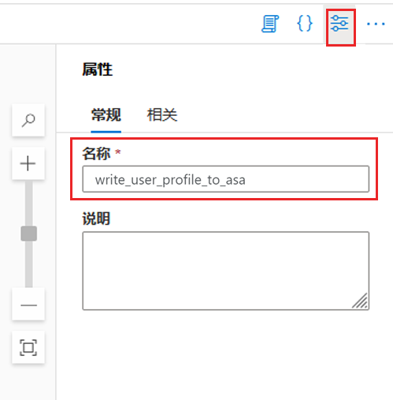

4. 选择“**属性**”按钮以隐藏窗格。

    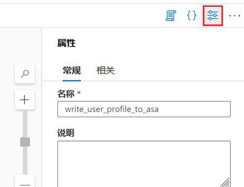

5. 在数据流画布上选择“**添加源**”。

    

6. 在“**源设置**”下配置以下各项：

    - **输出流名称**：输入 `EcommerceUserProfiles`。
    - **源类型**：选择“**集成数据集**”。
    - **数据集**：选择“**asal400_ecommerce_userprofiles_source**”。

        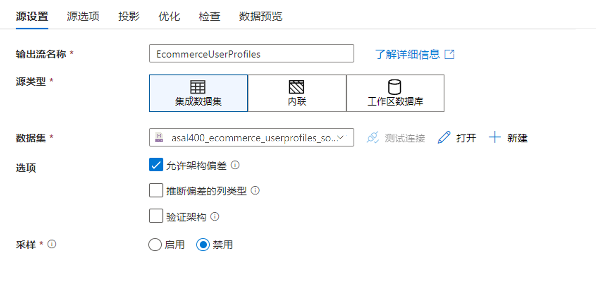

7. 选择“**源选项**”选项卡，然后配置以下各项：

    - **通配符路径**：输入`online-user-profiles-02/*.json`
    - **JSON 设置**：展开此部分，然后选择“**文档数组**”设置。这表示每个文件都包含 JSON 文档数组。

        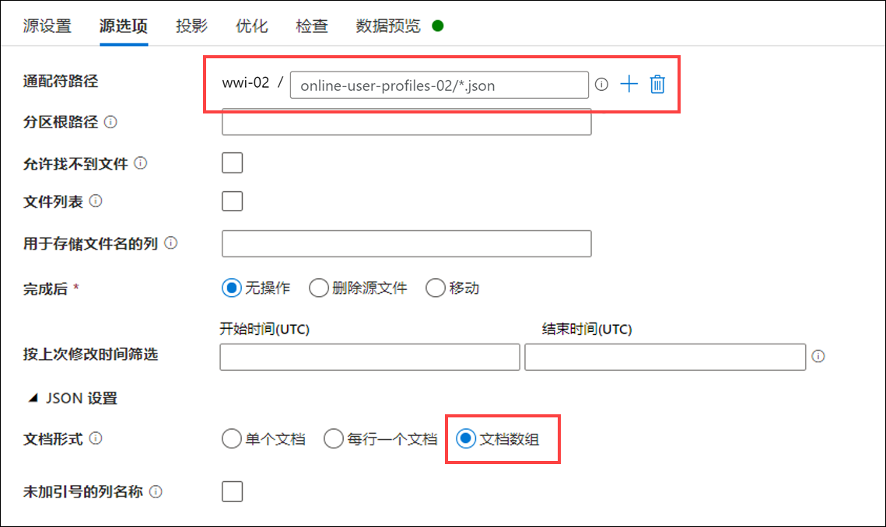

8. 选择“**EcommerceUserProfiles**”源右侧的“**+**”，然后选择“**派生列**”架构修饰符。

    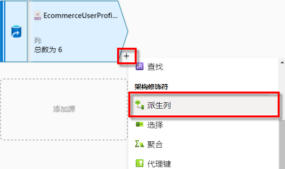

9. 在“**派生列的设置**”下配置以下各项：

    - **输出流名称**：输入 `userId`。
    - **传入流**：选择“**EcommerceUserProfiles**”。
    - **列**：提供以下信息：

        | 列 | 表达式 |
        | --- | --- |
        | visitorId | `toInteger(visitorId)` |

        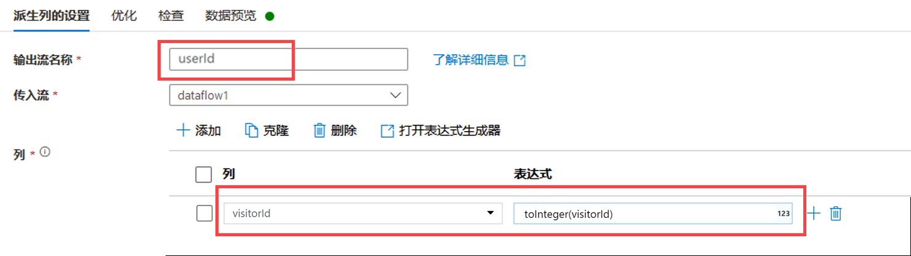

        该表达式将 **visitorId** 列值转换为整数数据类型。

10. 选择“**userId**”步骤右侧的“**+**”，然后选择“**平展**”格式化程序。

    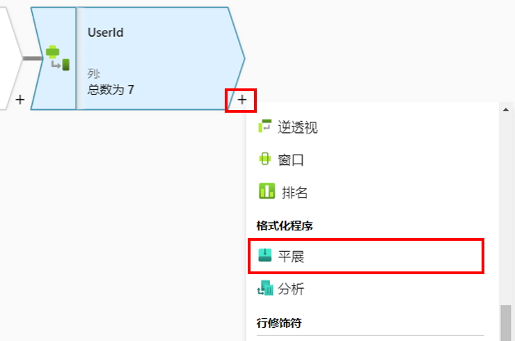

11. 在“**平展设置**”下配置以下各项：

    - **输出流名称**：输入 `UserTopProducts`。
    - **传入流**：选择“**userId**”。
    - **展开**: 选择“**[] topProductPurchases**”。
    - **输入列**：提供以下信息：

        | userId 的列 | 命名为 |
        | --- | --- |
        | visitorId | `visitorId` |
        | topProductPurchases.productId | `productId` |
        | 中的机器人 topProductPurchases.itemsPurchasedLast12Months | `itemsPurchasedLast12Months` |

        > 选择“**+ 添加映射**”，然后选择“**固定映射**”以添加每个新的列映射。

        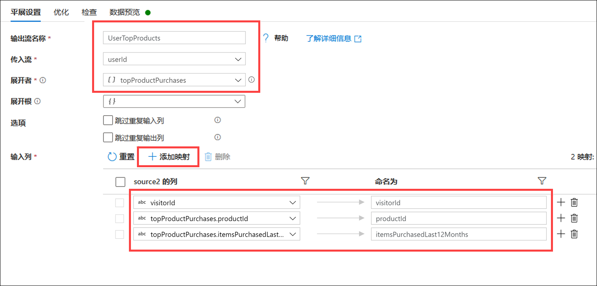

    这些设置提供了数据的平展表示。

12. 用户界面通过生成脚本定义映射。若要查看脚本，请选择工具栏中的“**脚本**”按钮。

    

    验证脚本是否如以下所示，然后选择“**取消**”以返回图形 UI（如果不是，则修改脚本）：

    ```
    source(output(
            visitorId as string,
            topProductPurchases as (productId as string, itemsPurchasedLast12Months as string)[]
        ),
        allowSchemaDrift: true,
        validateSchema: false,
        ignoreNoFilesFound: false,
        documentForm: 'arrayOfDocuments',
        wildcardPaths:['online-user-profiles-02/*.json']) ~> EcommerceUserProfiles
    EcommerceUserProfiles derive(visitorId = toInteger(visitorId)) ~> userId
    userId foldDown(unroll(topProductPurchases),
        mapColumn(
            visitorId,
            productId = topProductPurchases.productId,
            itemsPurchasedLast12Months = topProductPurchases.itemsPurchasedLast12Months
        ),
        skipDuplicateMapInputs: false,
        skipDuplicateMapOutputs: false) ~> UserTopProducts
    ```

13. 选择“**UserTopProducts**”步骤右侧的“**+**”，然后在上下文菜单中选择“**派生列**”架构修饰符。

    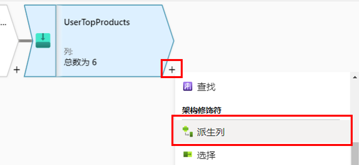

14. 在“**派生列的设置**”下配置以下各项：

    - **输出流名称**：输入 `DeriveProductColumns`。
    - **传入流**：选择“**UserTopProducts**”。
    - **列**：提供以下信息：

        | 列 | 表达式 |
        | --- | --- |
        | productId | `toInteger(productId)` |
        | itemsPurchasedLast12Months | `toInteger(itemsPurchasedLast12Months)`|

        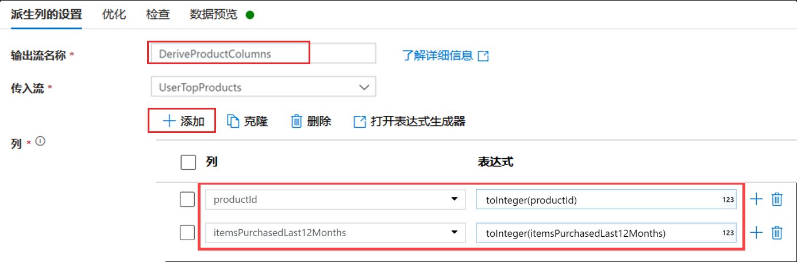

        > **备注**：若要向派生列的设置添加一列，请选择第一列右侧的“**+**”，然后选择“**添加列**”。

        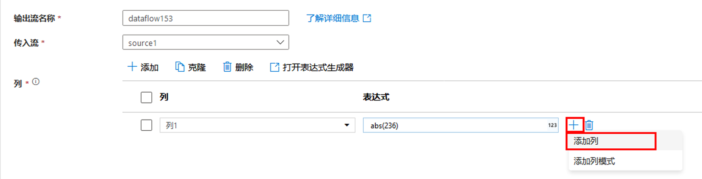

        这些表达式将“**productid**”和“**itemsPurchasedLast12Months**”列值转换为整数。

15. 在“**EcommerceUserProfiles**”源下面的数据流画布上选择“**添加源**”。

    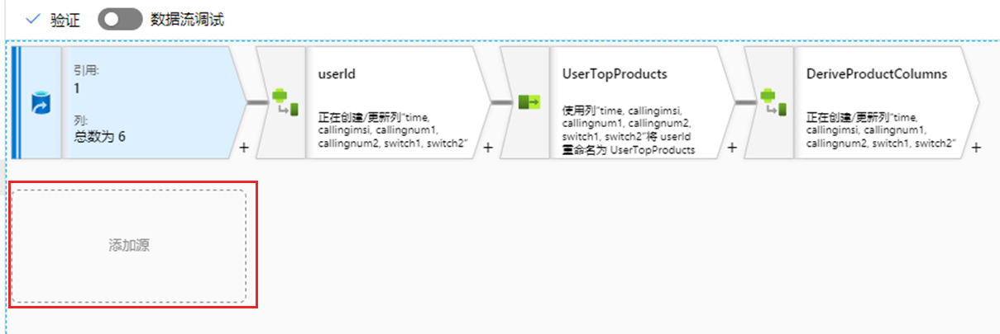

16. 在“**源设置**”下配置以下各项：

    - **输出流名称**：输入 `UserProfiles`。
    - **源类型**：选择“**集成数据集**”。
    - **数据集**：选择“**asal400_customerprofile_cosmosdb**”。

        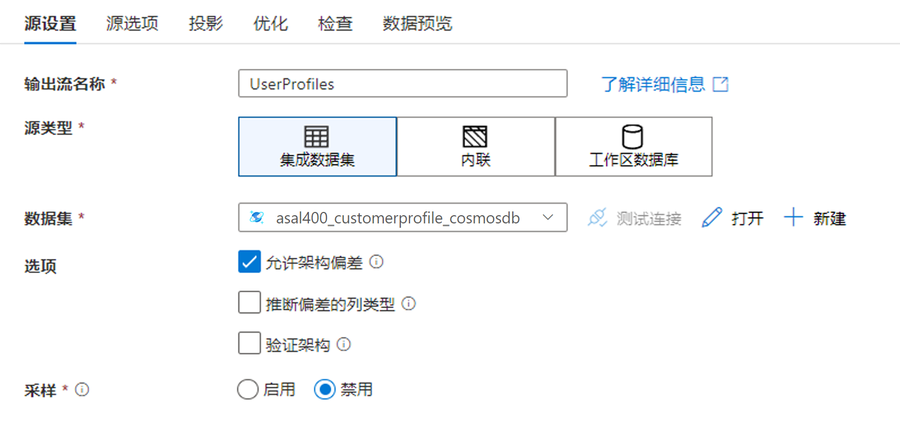

17. 由于我们不打算使用数据流调试程序，因此需要输入数据流的脚本视图以更新源投影。选择画布上方工具栏中的“**脚本**”。

    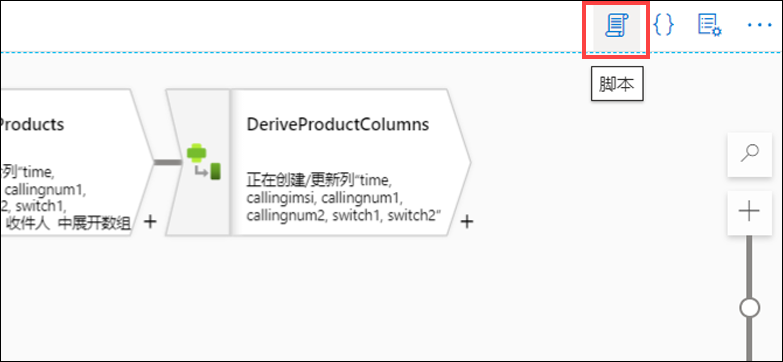

18. 在脚本中找到“**UserProfiles**”源，如下所示：

    ```
    source(output(
        userId as string,
        cartId as string,
        preferredProducts as string[],
        productReviews as (productId as string, reviewText as string, reviewDate as string)[]
    ),
    allowSchemaDrift: true,
    validateSchema: false,
    format: 'document') ~> UserProfiles
    ```

19. 如下所示修改脚本块，将 **preferredProducts** 设置为 **integer[]** 数组，并确保 **productReviews** 数组中的数据类型定义正确。然后，选择“**确定**”，以应用脚本更改。

    ```
    source(output(
            cartId as string,
            preferredProducts as integer[],
            productReviews as (productId as integer, reviewDate as string, reviewText as string)[],
            userId as integer
        ),
        allowSchemaDrift: true,
        validateSchema: false,
        ignoreNoFilesFound: false,
        format: 'document') ~> UserProfiles
    ```

20. 选择“**UserProfiles**”源右侧的“**+**”，然后选择“**平展**”格式化程序。

    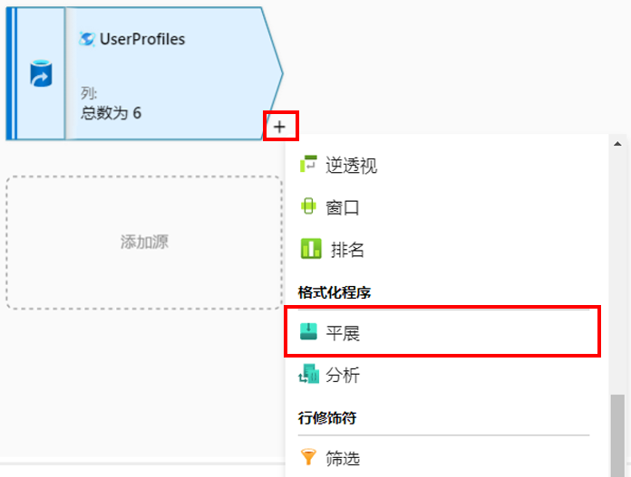

21. 在“**平展设置**”下配置以下各项：

    - **输出流名称**：输入 `UserPreferredProducts`。
    - **传入流**：选择“**UserProfiles**”。
    - **展开**: 选择“**[] preferredProducts**”。
    - **输入列**：提供以下信息。请务必**删除**“**cartId**”和“**[] productReviews**”：

        | UserProfiles 的列 | 命名为 |
        | --- | --- |
        | [] preferredProducts | `preferredProductId` |
        | userId | `userId` |


        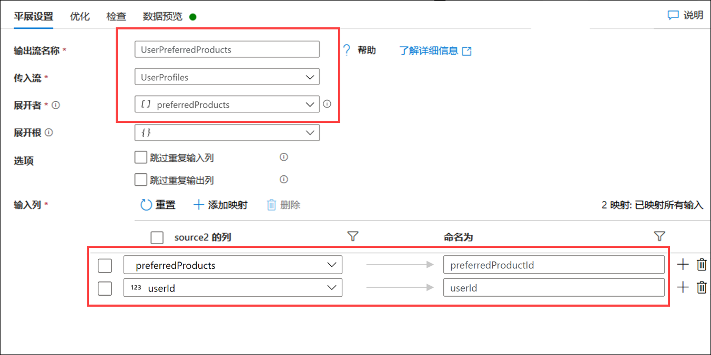

22. 现在我们来联接这两个数据源。选择“**DeriveProductColumns**”步骤右侧的“**+**”，然后选择“**联接**”选项。

    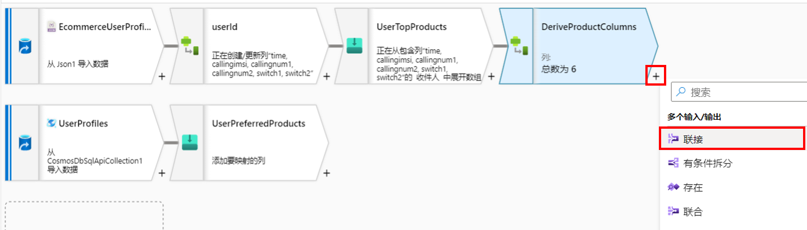

23. 在“**联接设置**”下配置以下各项：

    - **输出流名称**：输入 `JoinTopProductsWithPreferredProducts`。
    - **左流**：选择“**DeriveProductColumns**”。
    - **右流**：选择“**UserPreferredProducts**”。
    - **联接类型**：选择“**完全外部**”。
    - **联接条件**：提供以下信息：

        | 左：DeriveProductColumns 的列 | 右：UserPreferredProducts 的列 |
        | --- | --- |
        | visitorId | userId |

        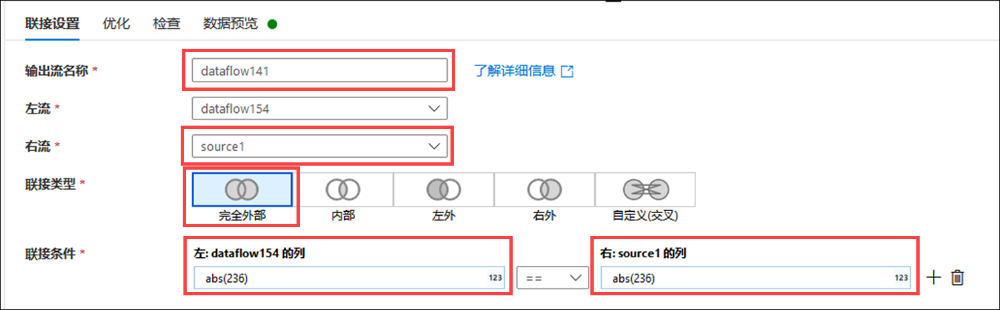

24. 选择“**优化**”并配置以下各项：

    - **广播**：选择“**修复**”。
    - **广播选项**：选中“**左:‘DeriveProductColumns’**”。
    - **分区选项**：选择“**设置分区**”。
    - **分区类型**：选择“**哈希**”。
    - **分区数**：输入 `30`。
    - **列**：选择“**productId**”。

        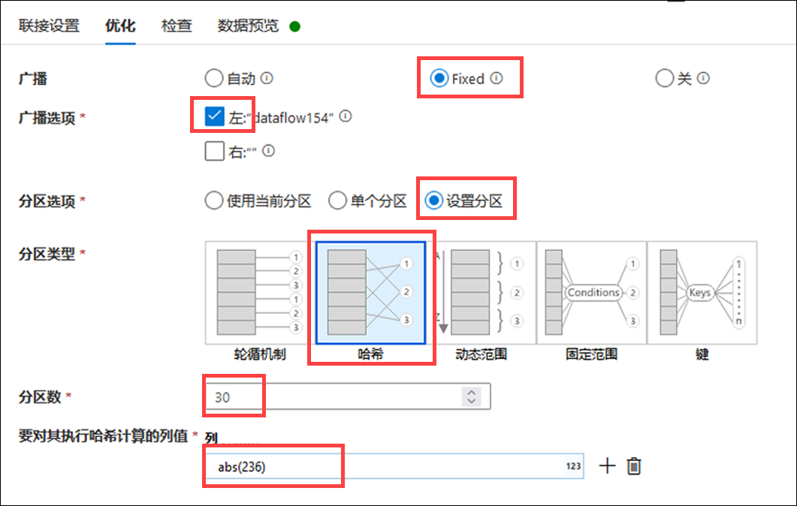

25. 选择“**检查**”选项卡以查看联接映射，其中包括列馈送源，以及该列是否在联接中使用。

    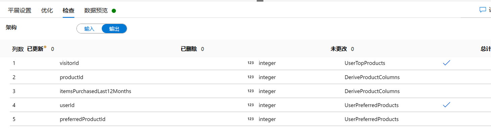

26. 选择“**JoinTopProductsWithPreferredProducts**”步骤右侧的“**+**”，然后选择“**派生列**”架构修饰符。

    

27. 在“**派生列的设置**”下配置以下各项：

    - **输出流名称**：输入 `DerivedColumnsForMerge`。
    - **传入流**：选择“**JoinTopProductsWithPreferredProducts**”。
    - **列**：提供以下信息（***键入前两个*列名称**）：

        | 列 | 表达式 |
        | --- | --- |
        | `isTopProduct` | `toBoolean(iif(isNull(productId), 'false', 'true'))` |
        | `isPreferredProduct` | `toBoolean(iif(isNull(preferredProductId), 'false', 'true'))` |
        | productId | `iif(isNull(productId), preferredProductId, productId)` | 
        | userId | `iif(isNull(userId), visitorId, userId)` | 

        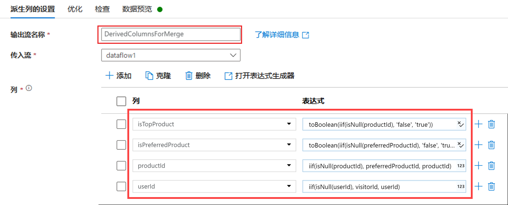

        当管道运行时，派生列设置将提供以下结果：

        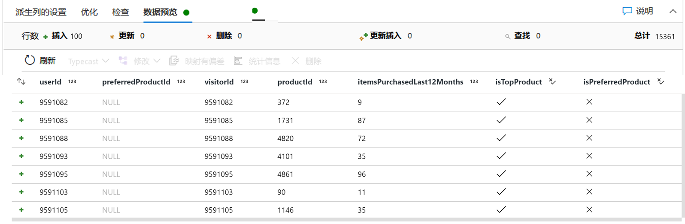

28. 选择“**DerivedColumnsForMerge**”步骤右侧的“**+**”，然后选择“**筛选**”行修饰符。

    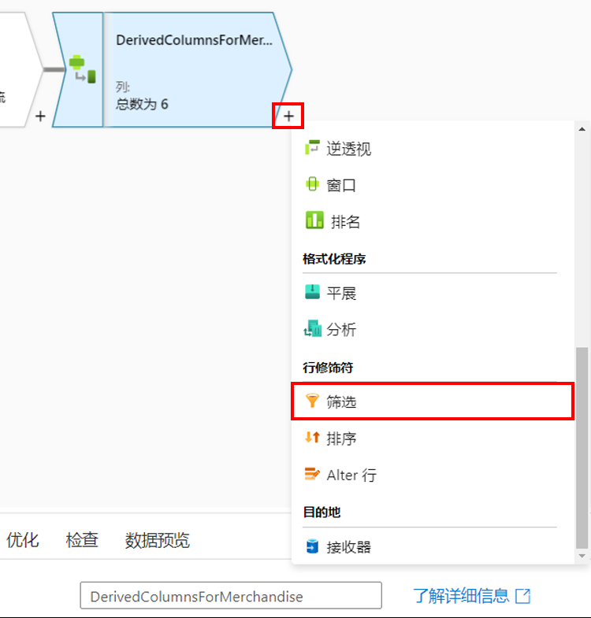

    我们将添加筛选步骤，以删除“**ProductId**”为 NULL 的所有记录。数据集有小部分无效记录，在加载到“**UserTopProductPurchases**”专用 SQL 池表时，值为 NULL 的“**ProductId**”将导致错误。

29. 将“**筛选依据**”表达式设置为 `!isNull(productId)`。

    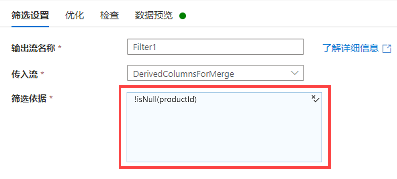

30. 选择“**Filter1**”步骤右侧的“**+**”，然后在上下文菜单中选择“**接收器**”目标。

    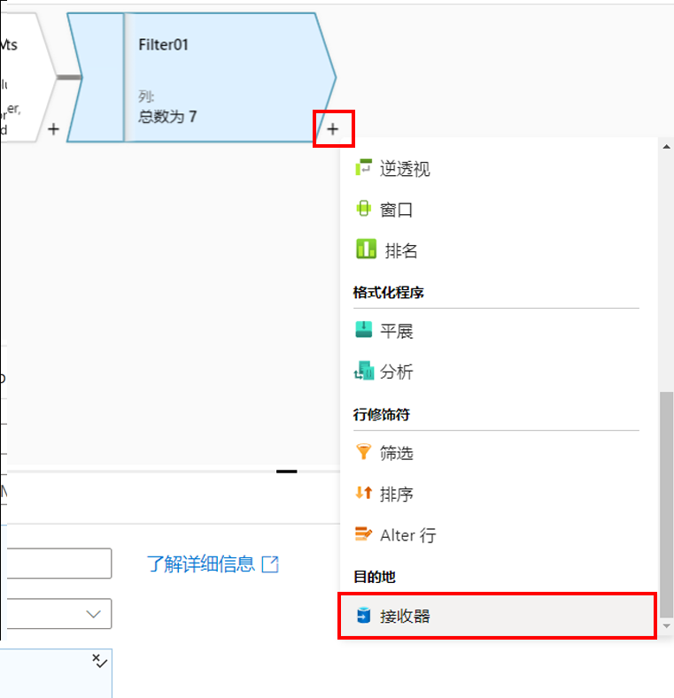

31. 在“**接收器**”下配置以下各项：

    - **输出流名称**：输入 `UserTopProductPurchasesASA`。
    - **传入流**：选择“**Filter1**”。
    - **接收器类型**：选择“**集成数据集**”。
    - **数据集**：选择“**asal400_wwi_usertopproductpurchases_asa**”。
    - **选项**：选中“**允许架构偏差**”，并取消选中“**验证架构**”。

    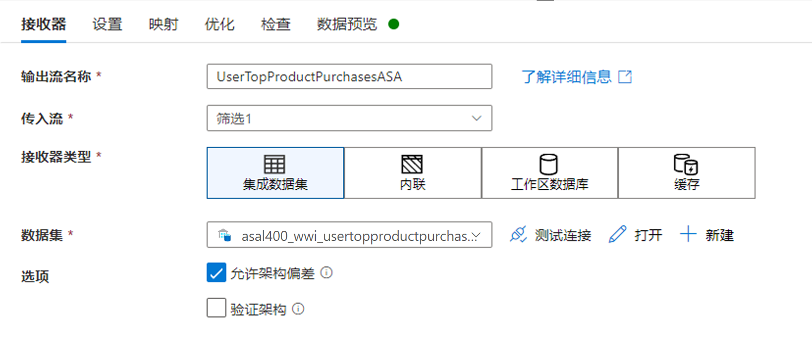

32. 选择“**设置**”，然后配置以下各项：

    - **更新方法**：选中“**允许插入**”，并将其余选项保持未选中状态。
    - **表操作**：选择“**截断表**”。
    - **启用暂存**：选中此选项。由于我们将导入大量数据，因此需要启用暂存来提高性能。

        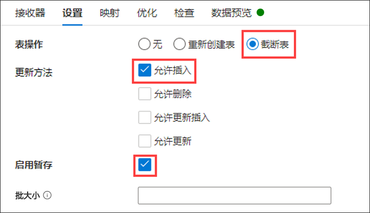

33. 选择“**映射**”，然后配置以下各项：

    - **自动映射**：取消选择此选项。
    - **列**：提供以下信息：

        | 输入列 | 输出列 |
        | --- | --- |
        | userId | UserId |
        | productId | ProductId |
        | itemsPurchasedLast12Months | ItemsPurchasedLast12Months |
        | isTopProduct | IsTopProduct |
        | isPreferredProduct | IsPreferredProduct |

        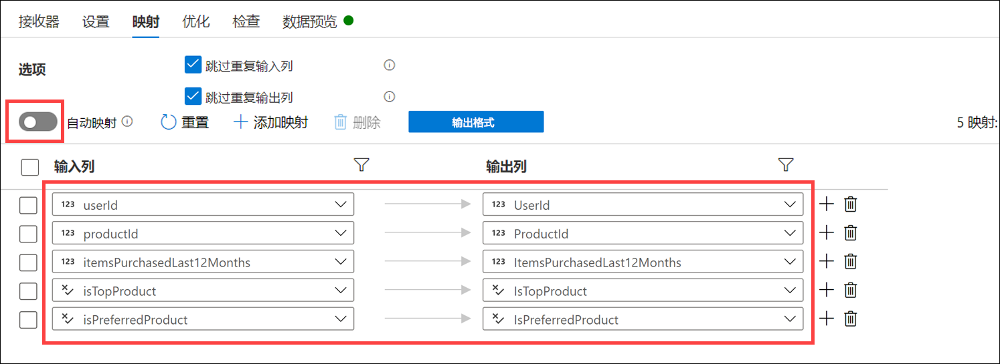

34. 选择“**Filter1**”步骤右侧的“**+**”，然后在上下文菜单中选择“**接收器**”目标以添加第二个接收器。

    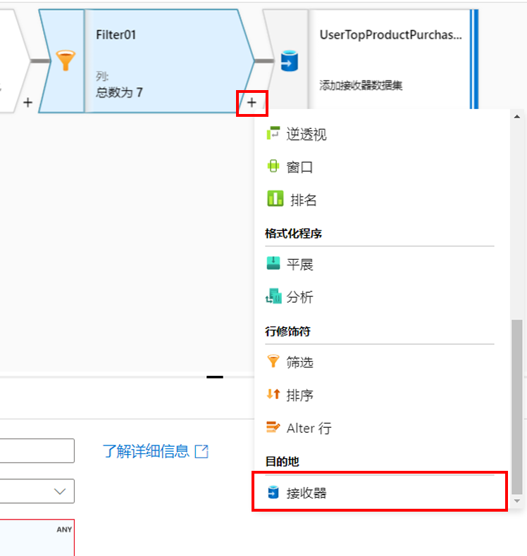

35. 在“**接收器**”下配置以下各项：

    - **输出流名称**：输入 `DataLake`。
    - **传入流**：选择“**Filter1**”。
    - **接收器类型**：选择“**内联**”。
    - **内联数据集类型**：选择“**Delta**”。
    - **链接服务**：选择“**asaworkspace*xxxxxxx*-WorkspaceDefaultStorage**”。
    - **选项**：选中“**允许架构偏差**”，并取消选中“**验证架构**”。

        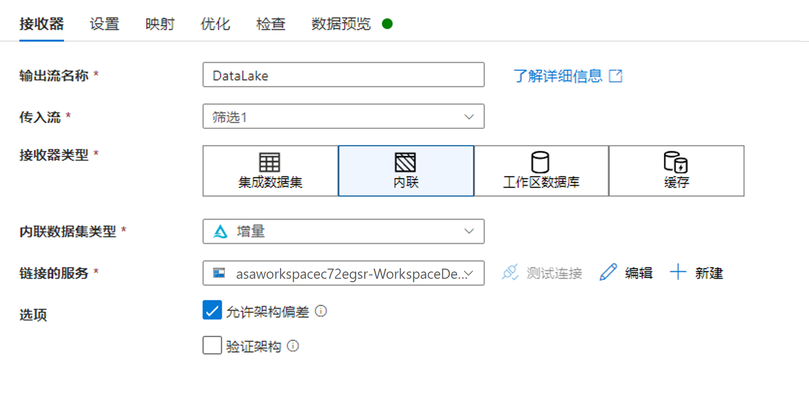

36. 选择“**设置**”，然后配置以下各项：

    - **文件夹路径**：输入 `wwi-02` / `top-products`（由于“**top-products**”文件还不存在，请复制这两个值并将它们粘贴到字段中）。
    - **压缩类型**：选择“**snappy**”。
    - **压缩级别**：选择“**Fastest**”。
    - **清空**：输入 `0`。
    - **表操作**：选择“**截断**”。
    - **更新方法**：选中“**允许插入**”，并将其余选项保持未选中状态。
    - **合并架构（在 Delta 选项下）**：未选中。

        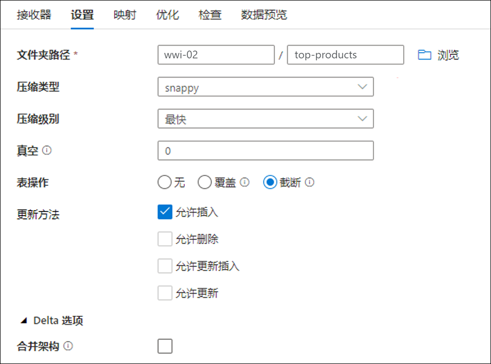

37. 选择“**映射**”，然后配置以下各项：

    - **自动映射**：取消选中此选项。
    - **列**：定义以下列映射：

        | 输入列 | 输出列 |
        | --- | --- |
        | visitorId | visitorId |
        | productId | productId |
        | itemsPurchasedLast12Months | itemsPurchasedLast12Months |
        | preferredProductId | preferredProductId |
        | userId | userId |
        | isTopProduct | isTopProduct |
        | isPreferredProduct | isPreferredProduct |

        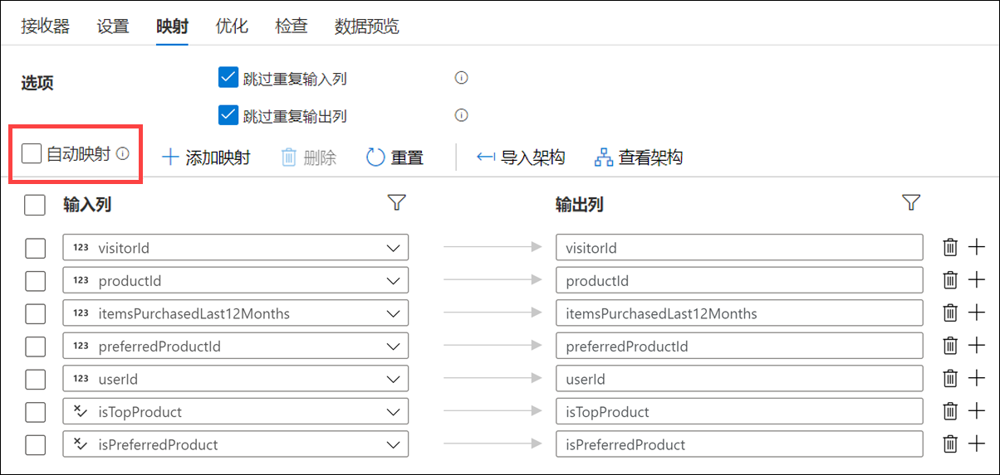

        > 请注意，与 SQL 池接收器相比，我们已选择为 Data Lake 接收器增加两个字段（“**visitorId**”和“**preferredProductId**”）。这是因为我们没有坚持固定目标架构（如 SQL 表），而且我们希望在 Data Lake 中保留尽可能多的原始数据。

38. 确认已完成的数据流如下所示：

    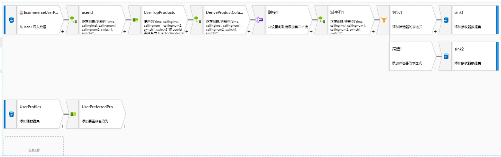

39. 依次选择“**全部发布**”和“**发布**”，以保存新数据流。

    

## 练习 3 - 协调 Azure Synapse 管道中的数据移动和转换

Tailwind Traders 熟悉 Azure 数据工厂 (ADF) 管道，并且想知道 Azure Synapse Analytics 是否可以与 ADF 集成或者是否具有类似的功能。他们希望在整个数据目录中（包括数据仓库的内部和外部）协调数据引入、转换和加载活动。

你建议使用包括 90 多个内置连接器的 Synapse Pipelines。它可以通过手动执行管道或通过协调加载数据，支持常见加载模式，能够完全平行地加载到数据湖或 SQL 表中，并且与 ADF 共享代码基。

通过使用 Synapse Pipelines，Tailwind Traders 可以体验与 ADF 相同且熟悉的界面，且无需使用 Azure Synapse Analytics 之外的协调服务。

### 任务 1：创建管道

首先执行新的映射数据流。为了运行新的数据流，我们需要创建新管道并为其添加数据流活动。

1. 导航到“**集成**”中心。

    

2. 在“**+**”菜单中，选择“**管道**”。

    

3. 在新数据流的“**属性**”窗格的“**常规**”部分，将“**名称**”更新为 `Write User Profile Data to ASA`。

    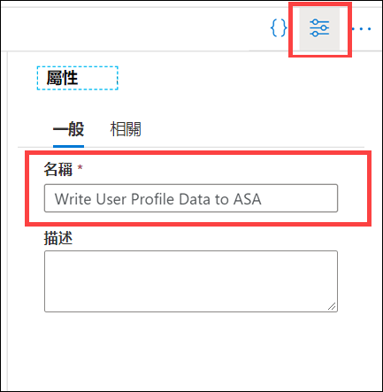

4. 选择“**属性**”按钮以隐藏窗格。

    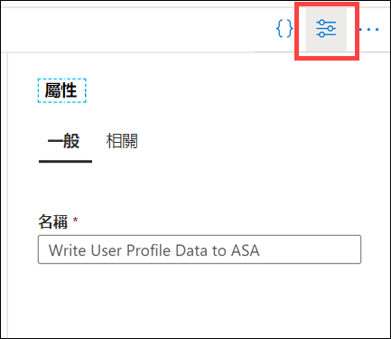

5. 展开“活动”列表中的“**移动和转换**”，然后将“**数据流**”活动拖放到管道画布上。

    

6. 在管道画布下的“**常规**”选项卡下，将名称设置为 `write_user_profile_to_asa`。

    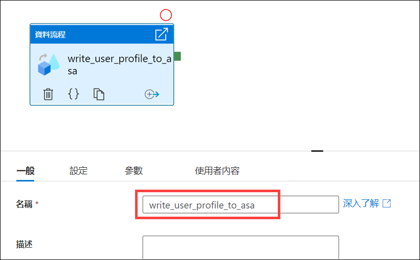

7. 在**设置**选项卡上，选择“**write_user_profile_to_asa**”数据流，确保已选中“**AutoResolveIntegrationRuntime**”。选择“**基本(常规用途)**”计算类型，并将核心数设置为“**4 (+ 4 个驱动程序核心)**”。

8. 选择“**暂存**”，然后配置以下各项：

    - **暂存链接服务**：选择“**asadatalakexxxxxxx**”链接服务。
    - **暂存存储文件夹**：输入 `staging` / `userprofiles`（“**userprofiles**”文件夹将在第一个管道运行期间自动创建）。

        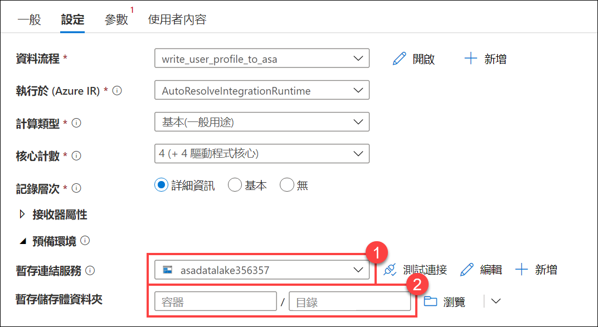

        当有大量数据要移入或移出 Azure Synapse Analytics 时，建议使用 PolyBase 下的暂存选项。你将需要尝试在生产环境中启用和禁用数据流上的暂存，以评估性能差异。

9. 依次选择“**全部发布**”和“**发布**”，以保存管道。

    

### 任务 2：触发、监视和分析用户配置文件数据管道

Tailwind Traders 想监视所有管道运行，并查看统计信息以进行性能调优和故障排除。

你已决定向 Tailwind Traders 展示如何手动触发、监视和分析管道运行。

1. 在管道顶部，依次选择“**添加触发器**”、“**立即触发**”。

    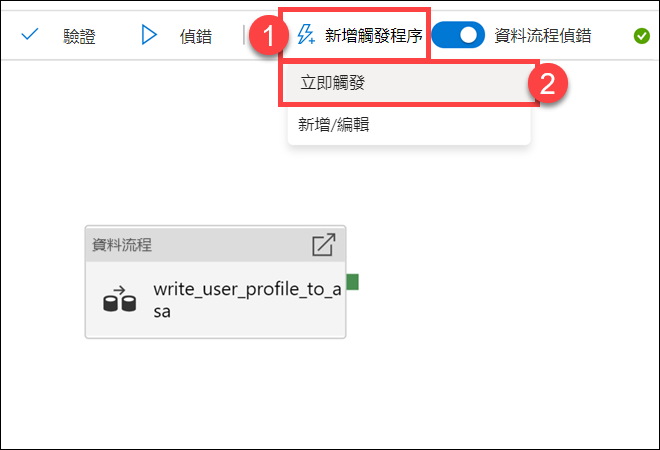

2. 此管道没有参数，因此选择“**确定**”以运行触发器。

    

3. 导航到“**监视**”中心。

    

4. 选择“**管道运行**”，并等待管道运行成功完成，这可能需要一些时间。可能需要刷新视图。

    

5. 选择管道的名称以查看管道的活动运行。

    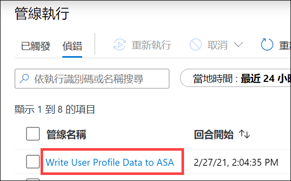

6. 将鼠标悬停在“**活动运行**”列表中的数据流活动名称上，然后选择“**数据流详细信息**”图标。

    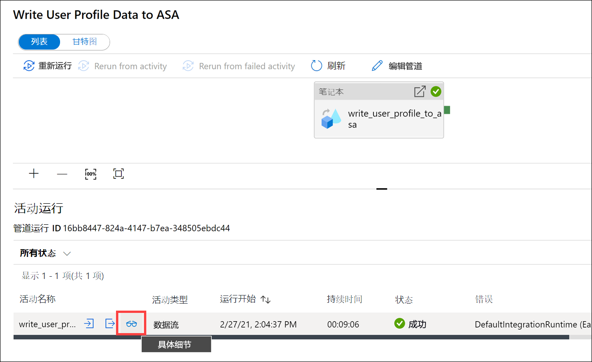

7. 数据流详细信息显示数据流步骤和处理详细信息。在以下示例中（可能与你的结果不同），处理 SQL 池接收器的时间大约为 44 秒，处理 Data Lake 接收器的时间大约为 12 秒 。这两个的 **Filter1** 输出大约是 100 万行。可以看到完成哪些活动花费的时间最长。群集启动时间至少占用总管道运行时间 2.5 分钟。

    

8. 选择“**UserTopProductPurchasesASA**”接收器，查看其详细信息。在以下示例中(可能与你的结果不同)，可以看到总共 30 个分区计算了 1,622,203 行。在将数据写入 SQL 表之前，在 ADLS Gen2 中暂存数据大约需要 8 秒。在本例中，总的接收器处理时间大约为 44 秒 (4)。很明显，我们有一个比其他分区大得多*的热分区*。如果我们需要从此管道中挤出额外的性能，则可以重新评估数据分区，以更均匀地分布分区，从而更好地促进并行数据加载和筛选。我们也可以尝试禁用暂存，以查看处理时间是否有差异。最后，专用 SQL 池的大小会影响将数据引入到接收器所需的时间。

    

## 重要说明：暂停 SQL 池

完成以下步骤，释放不再需要的资源。

1. 在 Synapse Studio 中，选择“**管理**”中心。
2. 在左侧菜单中，选择“**SQL 池**”。将鼠标悬停在“**SQLPool01**”专用 SQL 池上，并选择 **||**。

    

3. 出现提示时，选择“**暂停**”。
