---
lab:
    title: '将笔记本中的数据与 Azure 数据工厂或 Azure Synapse 管道集成'
    module: '模块 7'
---

# 实验室 7 - 将笔记本中的数据与 Azure 数据工厂或 Azure Synapse 管道集成

你将学习如何创建链接服务，以及如何协调 Azure Synapse 管道中的数据移动和转换。

完成本实验室后，你将能够：

- 协调 Azure Synapse 管道中的数据移动和转换

## 实验室设置和先决条件

开始该实验室之前，应先完成“实验室 6：使用 Azure 数据工厂或 Azure Synapse 管道转换数据”。

> **备注**：如果你尚***未***完成实验室 6，但是<u>已经</u>完成了本课程的实验室设置，则可以完成这些步骤来创建所需的链接服务和数据集。
>
> 1. 在 Synapse Studio 的“**管理**”中心，使用以下设置为 **Azure Cosmos DB (SQL API)** 添加新的**链接服务**：
>       - **名称**：asacosmosdb01
>       - **Cosmos DB 帐户名**：asacosmosdb*xxxxxxx*
>       - **数据库名称**：CustomerProfile
> 2. 在“**数据**”中心上，创建以下**集成数据集**：
>       - asal400_customerprofile_cosmosdb：
>           - **源**：Azure Cosmos DB (SQL API)
>           - **名称**：asal400_customerprofile_cosmosdb
>           - **链接服务**：asacosmosdb01
>           - **集合**： OnlineUserProfile01
>       - asal400_ecommerce_userprofiles_source
>           - **源**：Azure Data Lake Storage Gen2
>           - **格式**：JSON
>           - **名称**：asal400_ecommerce_userprofiles_source
>           - **链接服务**：asadatalake*xxxxxxx*
>           - **文件路径**：wwi-02/online-user-profiles-02
>           - **导入架构**：从连接/存储

## 练习 1 - 创建映射数据流和管道

在本练习中，你将创建一个映射数据流，将用户配置文件数据复制到 Data Lake，然后创建管道，来协调执行数据流，以及稍后在本实验室中创建的 Spark 笔记本。

### 任务 1：创建映射数据流

1. 打开 Synapse Studio (<https://web.azuresynapse.net/>)。
2. 导航到“**开发**”中心。

    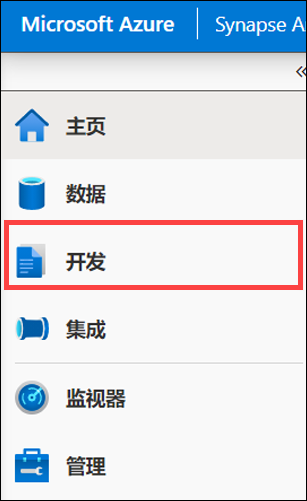

3. 在“**+**”菜单中，选择“**数据流**”以创建新的数据流。

    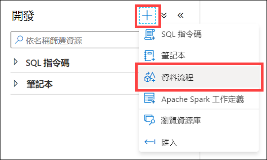

4. 在新数据流的“**属性**”边栏选项卡的“**常规**”设置中，将“**名称**”更新为 `user_profiles_to_datalake`。请确保名称完全匹配。

    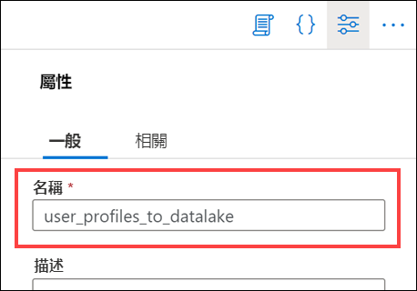

5. 选择位于数据流属性上方右上角的“**{} 代码**”按钮。

    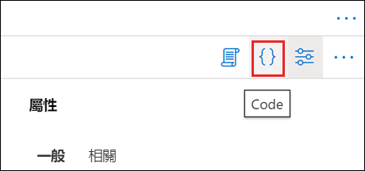

6. 将现有代码替换为以下代码，将第 25 行的“**asadatalake*SUFFIX***”接收器引用名中的“***SUFFIX***”更改为本实验室中你的 Azure 资源的唯一后缀：

    ```
    {
        "name": "user_profiles_to_datalake",
        "properties": {
            "type": "MappingDataFlow",
            "typeProperties": {
                "sources": [
                    {
                        "dataset": {
                            "referenceName": "asal400_ecommerce_userprofiles_source",
                            "type": "DatasetReference"
                        },
                        "name": "EcommerceUserProfiles"
                    },
                    {
                        "dataset": {
                            "referenceName": "asal400_customerprofile_cosmosdb",
                            "type": "DatasetReference"
                        },
                        "name": "UserProfiles"
                    }
                ],
                "sinks": [
                    {
                        "linkedService": {
                            "referenceName": "asadatalakeSUFFIX",
                            "type": "LinkedServiceReference"
                        },
                        "name": "DataLake"
                    }
                ],
                "transformations": [
                    {
                        "name": "userId"
                    },
                    {
                        "name": "UserTopProducts"
                    },
                    {
                        "name": "DerivedProductColumns"
                    },
                    {
                        "name": "UserPreferredProducts"
                    },
                    {
                        "name": "JoinTopProductsWithPreferredProducts"
                    },
                    {
                        "name": "DerivedColumnsForMerge"
                    },
                    {
                        "name": "Filter1"
                    }
                ],
                "script": "source(output(\n\t\tvisitorId as string,\n\t\ttopProductPurchases as (productId as string, itemsPurchasedLast12Months as string)[]\n\t),\n\tallowSchemaDrift: true,\n\tvalidateSchema: false,\n\tignoreNoFilesFound: false,\n\tdocumentForm: 'arrayOfDocuments',\n\twildcardPaths:['online-user-profiles-02/*.json']) ~> EcommerceUserProfiles\nsource(output(\n\t\tcartId as string,\n\t\tpreferredProducts as integer[],\n\t\tproductReviews as (productId as integer, reviewDate as string, reviewText as string)[],\n\t\tuserId as integer\n\t),\n\tallowSchemaDrift: true,\n\tvalidateSchema: false,\n\tformat: 'document') ~> UserProfiles\nEcommerceUserProfiles derive(visitorId = toInteger(visitorId)) ~> userId\nuserId foldDown(unroll(topProductPurchases),\n\tmapColumn(\n\t\tvisitorId,\n\t\tproductId = topProductPurchases.productId,\n\t\titemsPurchasedLast12Months = topProductPurchases.itemsPurchasedLast12Months\n\t),\n\tskipDuplicateMapInputs: false,\n\tskipDuplicateMapOutputs: false) ~> UserTopProducts\nUserTopProducts derive(productId = toInteger(productId),\n\t\titemsPurchasedLast12Months = toInteger(itemsPurchasedLast12Months)) ~> DerivedProductColumns\nUserProfiles foldDown(unroll(preferredProducts),\n\tmapColumn(\n\t\tpreferredProductId = preferredProducts,\n\t\tuserId\n\t),\n\tskipDuplicateMapInputs: false,\n\tskipDuplicateMapOutputs: false) ~> UserPreferredProducts\nDerivedProductColumns, UserPreferredProducts join(visitorId == userId,\n\tjoinType:'outer',\n\tpartitionBy('hash', 30,\n\t\tproductId\n\t),\n\tbroadcast: 'left')~> JoinTopProductsWithPreferredProducts\nJoinTopProductsWithPreferredProducts derive(isTopProduct = toBoolean(iif(isNull(productId), 'false', 'true')),\n\t\tisPreferredProduct = toBoolean(iif(isNull(preferredProductId), 'false', 'true')),\n\t\tproductId = iif(isNull(productId), preferredProductId, productId),\n\t\tuserId = iif(isNull(userId), visitorId, userId)) ~> DerivedColumnsForMerge\nDerivedColumnsForMerge filter(!isNull(productId)) ~> Filter1\nFilter1 sink(allowSchemaDrift: true,\n\tvalidateSchema: false,\n\tformat: 'delta',\n\tcompressionType: 'snappy',\n\tcompressionLevel: 'Fastest',\n\tfileSystem: 'wwi-02',\n\tfolderPath: 'top-products',\n\ttruncate:true,\n\tmergeSchema: false,\n\tautoCompact: false,\n\toptimizedWrite: false,\n\tvacuum: 0,\n\tdeletable:false,\n\tinsertable:true,\n\tupdateable:false,\n\tupsertable:false,\n\tmapColumn(\n\t\tvisitorId,\n\t\tproductId,\n\t\titemsPurchasedLast12Months,\n\t\tpreferredProductId,\n\t\tuserId,\n\t\tisTopProduct,\n\t\tisPreferredProduct\n\t),\n\tskipDuplicateMapInputs: true,\n\tskipDuplicateMapOutputs: true) ~> DataLake"
            }
        }
    }
    ```

7. 选择“**确定**”。

8. 数据流应如下所示：

    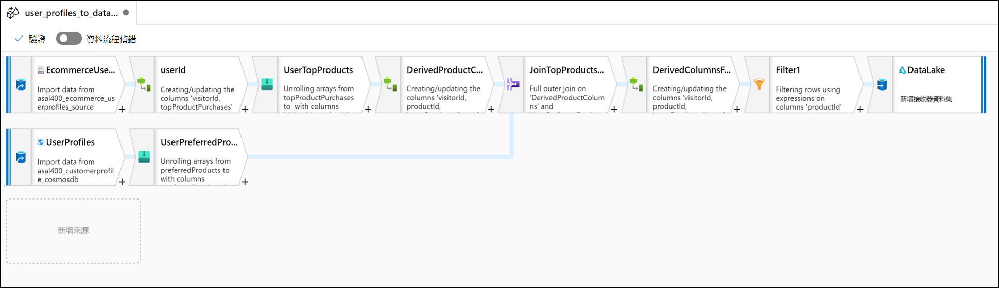

### 任务 2：创建管道

在此步骤中，将创建一个新的集成管道来执行数据流。

1. 在“**集成**”中心的“**+**”菜单中，选择“**管道**”。

    

2. 在新数据流的“**属性**”窗格的“**常规**”部分，将“**名称**”更新为 `User Profiles to Datalake`。选择“**属性**”按钮以隐藏窗格。

    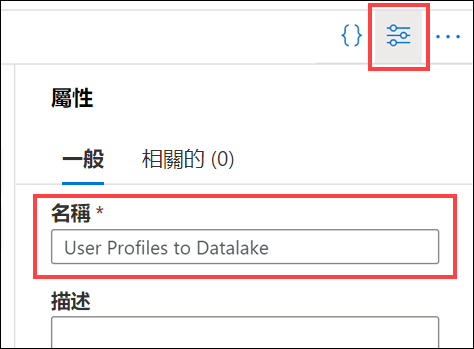

3. 展开“活动”列表中的“**移动和转换**”，然后将“**数据流**”活动拖放到管道画布上。

    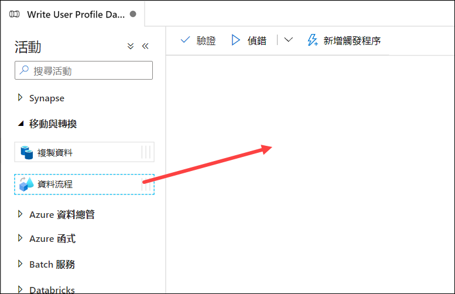

4. 在管道画布下的“**常规**”选项卡下，将名称设置为 `user_profiles_to_datalake`。

    

5. 在“**设置**”选项卡上，选择“**user_profiles_to_datalake**”数据流，确保已选中“**AutoResolveIntegrationRuntime**”。选择“**基本(常规用途)**”计算类型，并将核心数设置为“**4 (+ 4 个驱动程序核心)**”。

    

6. 依次选择“**全部发布**”和“**发布**”，以保存管道。

    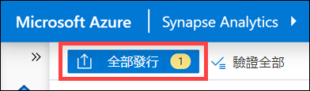

### 任务 3：触发管道

1. 在管道顶部，依次选择“**添加触发器**”、“**立即触发**”。

    

2. 此管道没有参数，因此选择“**确定**”以运行触发器。

    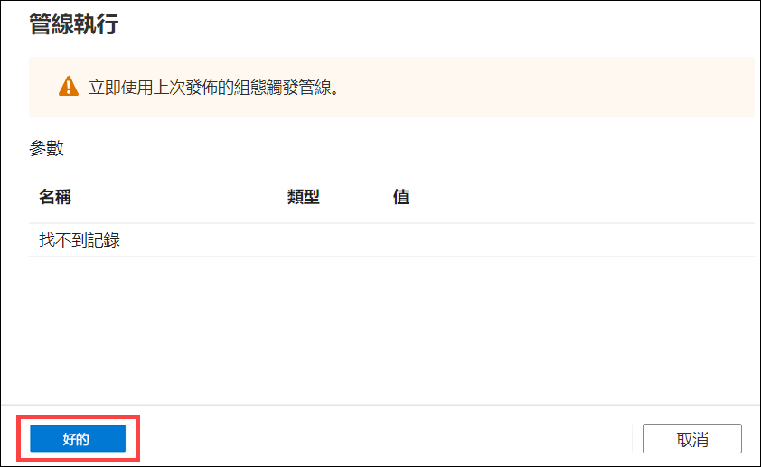

3. 导航到“**监视**”中心。

    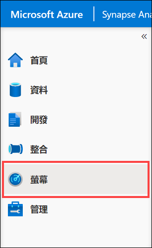

4. 选择“**管道运行**”，并等待管道运行成功完成（这将需要一些时间）。可能需要刷新视图。

    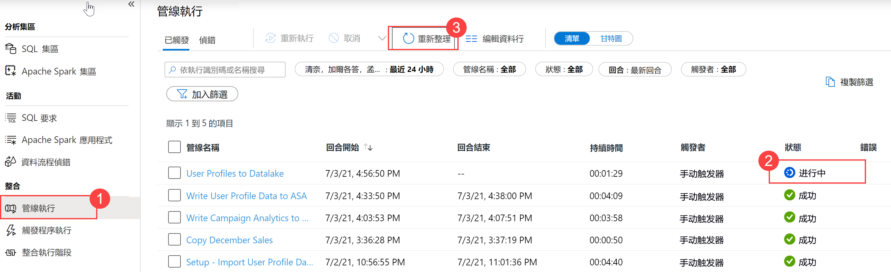

## 练习 2 - 创建 Synapse Spark 笔记本以查找热门产品

Tailwind Traders 使用 Synapse Analytics 中的映射数据流来处理、联接和导入用户配置文件数据。现在，他们想要根据产品的受欢迎度以及过去 12 个月内哪些产品购买次数最多，找出针对每位用户最受欢迎的前 5 种产品。然后，计算出总体排名前 5 的产品。

在此练习中，你将创建一个 Synapse Spark 笔记本来进行这些计算。

### 任务 1：创建笔记本

1. 选择“**数据**”中心。

    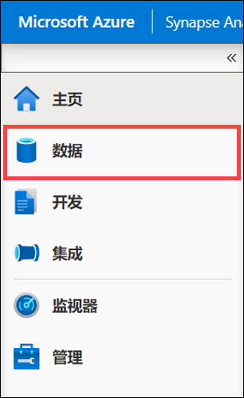

2. 在“**链接**”选项卡上，展开“**Azure Data Lake Storage Gen2**”和 Data Lake Storage 主帐户，并选择“**wwi-02**”容器。然后导航到该容器根目录下的“**top-products**”文件夹（如果没有看到该文件夹，请选择“**刷新**”）。最后，右键单击任意 Parquet 文件，选择“**新建笔记本**”菜单项，然后选择“**加载到 DataFrame**”。

    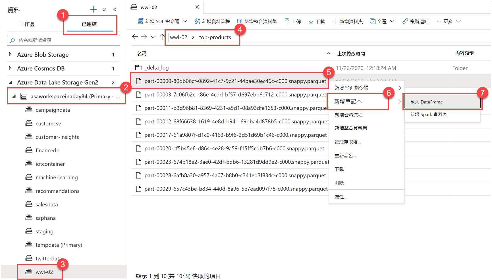

3. 选择笔记本右上角的“**属性**”按钮，然后输入 `Calculate Top 5 Products` 作为“**名称**”。然后再次单击“**属性**”按钮以隐藏窗格。

4. 将笔记本附加到“**SparkPool01**”Spark 池。

    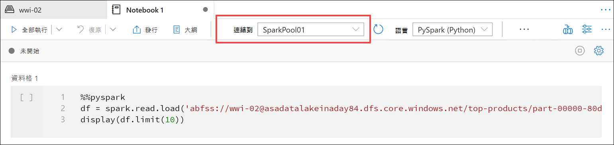

5. 在 Python 代码中，将 Parquet 文件名替换为 `*.parquet`，以选择“**top-products**”文件夹中的所有 Parquet 文件。例如，路径应该类似于：    abfss://wwi-02@asadatalakexxxxxxx.dfs.core.windows.net/top-products/*.parquet。

    

6. 在笔记本工具栏上选择“**全部运行**”，以运行笔记本。

    

    > **备注：** 首次在 Spark 池中运行笔记本时，Synapse 会创建一个新的会话。这大约需要 2-3 分钟时间。

7. 选择“**+ 代码**”按钮，在下方创建一个新的代码单元格。

8. 在新单元格中输入并执行以下内容，填充名为“**topPurchases**”的新 DataFrame，创建一个名为“**top_purchases**”的新临时视图，并显示前 100 行：

    ```python
    topPurchases = df.select(
        "UserId", "ProductId",
        "ItemsPurchasedLast12Months", "IsTopProduct",
        "IsPreferredProduct")

    # Populate a temporary view so we can query from SQL
    topPurchases.createOrReplaceTempView("top_purchases")

    topPurchases.show(100)
    ```

    输出应如下所示：

    ```
    +------+---------+--------------------------+------------+------------------+
    |UserId|ProductId|ItemsPurchasedLast12Months|IsTopProduct|IsPreferredProduct|
    +------+---------+--------------------------+------------+------------------+
    |   148|     2717|                      null|       false|              true|
    |   148|     4002|                      null|       false|              true|
    |   148|     1716|                      null|       false|              true|
    |   148|     4520|                      null|       false|              true|
    |   148|      951|                      null|       false|              true|
    |   148|     1817|                      null|       false|              true|
    |   463|     2634|                      null|       false|              true|
    |   463|     2795|                      null|       false|              true|
    |   471|     1946|                      null|       false|              true|
    |   471|     4431|                      null|       false|              true|
    |   471|      566|                      null|       false|              true|
    |   471|     2179|                      null|       false|              true|
    |   471|     3758|                      null|       false|              true|
    |   471|     2434|                      null|       false|              true|
    |   471|     1793|                      null|       false|              true|
    |   471|     1620|                      null|       false|              true|
    |   471|     1572|                      null|       false|              true|
    |   833|      957|                      null|       false|              true|
    |   833|     3140|                      null|       false|              true|
    |   833|     1087|                      null|       false|              true|
    ```

9. 在新代码单元格中运行以下代码，创建一个新的 DataFrame 以仅保存“**IsTopProduct**”和“**IsPreferredProduct**”都为 true 的首选产品：

    ```python
    from pyspark.sql.functions import *

    topPreferredProducts = (topPurchases
        .filter( col("IsTopProduct") == True)
        .filter( col("IsPreferredProduct") == True)
        .orderBy( col("ItemsPurchasedLast12Months").desc() ))

    topPreferredProducts.show(100)
    ```

    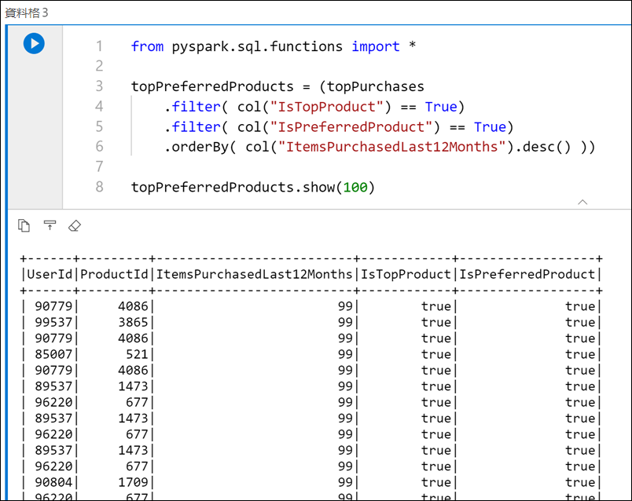

10. 在新代码单元格中运行以下代码，以使用 SQL 创建新的临时视图：

    ```sql
    %%sql

    CREATE OR REPLACE TEMPORARY VIEW top_5_products
    AS
        select UserId, ProductId, ItemsPurchasedLast12Months
        from (select *,
                    row_number() over (partition by UserId order by ItemsPurchasedLast12Months desc) as seqnum
            from top_purchases
            ) a
        where seqnum <= 5 and IsTopProduct == true and IsPreferredProduct = true
        order by a.UserId
    ```

    请注意，上述查询没有输出。该查询使用“**top_purchases**”临时视图作为源，并应用“**row_number()over**”方法为每个用户的记录应用一个行号，其中“**ItemsPurchasedLast12Months**”是最大值。“**where**”子句对结果进行筛选，这样最多只能检索五个产品，其中“**IsTopProduct**”和“**IsPreferredProduct**”都设置为 true。这就为我们提供了每个用户购买最多的五个产品，根据他们存储在 Azure Cosmos DB 中的用户配置文件，*这*些产品也被标识为他们最喜欢的产品。

11. 在新代码单元格中运行以下代码，创建并显示新的 DataFrame，该 DataFrame 存储前一个单元格中创建的“**top_5_products**”临时视图的结果：

    ```python
    top5Products = sqlContext.table("top_5_products")

    top5Products.show(100)
    ```

    你会看到如下所示的输出，其中显示了每个用户的前五个首选产品：

    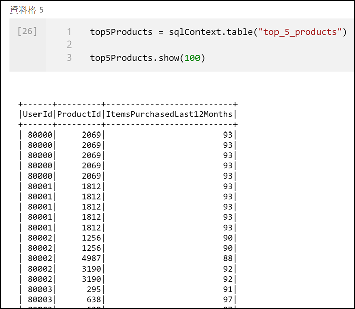

12. 在新代码单元格中运行以下代码，比较每个客户最喜欢的产品数量和前五个首选产品的数量：

    ```python
    print('before filter: ', topPreferredProducts.count(), ', after filter: ', top5Products.count())
    ```

    输出应类似于：
    
    ```
    before filter:  997817 , after filter:  85015
    ```

13. 在新代码单元格中运行以下代码，根据顾客喜欢且购买次数最多的产品，计算出总体排名前五的产品。

    ```python
    top5ProductsOverall = (top5Products.select("ProductId","ItemsPurchasedLast12Months")
        .groupBy("ProductId")
        .agg( sum("ItemsPurchasedLast12Months").alias("Total") )
        .orderBy( col("Total").desc() )
        .limit(5))

    top5ProductsOverall.show()
    ```

    在此单元格中，我们按产品 ID 对前五个首选产品进行分组，汇总过去 12 个月内购买的商品总数，按降序对该值进行排序，然后返回前五个结果。输出应类似于以下内容：

    ```
    +---------+-----+
    |ProductId|Total|
    +---------+-----+
    |      347| 4523|
    |     4833| 4314|
    |     3459| 4233|
    |     2486| 4135|
    |     2107| 4113|
    +---------+-----+
    ```

14. 我们将从管道中执行该笔记本。我们想传入一个参数，该参数设置一个“**runId**”变量值，该值将用于命名 Parquet 文件。在新代码单元格中运行以下代码：

    ```python
    import uuid

    # Generate random GUID
    runId = uuid.uuid4()
    ```

    我们将使用 Spark 附带的“**uuid**”库来生成随机 GUID。我们想用管道传入的参数覆盖 `runId` 变量。为此，需要将其切换为参数单元格。

15. 在单元格上方的小工具栏中选择操作省略号“**(…)**”，然后选择“**切换参数单元格**”。

    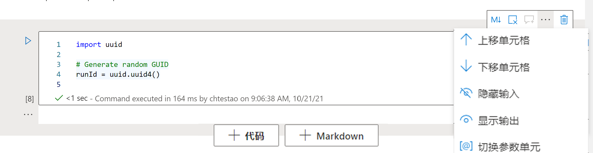

    切换此选项后，你将在单元格的右下角看到“**参数**”一词，这表明它是一个参数单元格。

16. 将以下代码添加到新代码单元格中，以将“**runId**”变量用作 Data Lake 主帐户“*/top5-products/*”路径内的 Parquet 文件名。将路径中的“***SUFFIX***”替换为 Data Lake 主帐户的唯一后缀（你可以在页面顶部的“**单元格 1**”中找到它）。更新代码后，请运行单元格。

    ```python
    %%pyspark

    top5ProductsOverall.write.parquet('abfss://wwi-02@asadatalakeSUFFIX.dfs.core.windows.net/top5-products/' + str(runId) + '.parquet')
    ```

    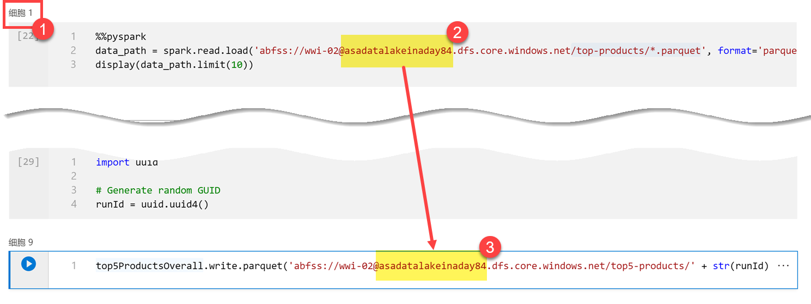

17. 验证文件是否已写入 Data Lake。在“**数据**”中心中，选择“**链接**”选项卡。展开 Data Lake Storage 主帐户，选择 **wwi-02** 容器。导航到 **top5-products** 文件夹（如有必要，请在容器的根目录中刷新文件夹）。你会在目录中看到 Parquet 文件的文件夹，文件名为 GUID。

    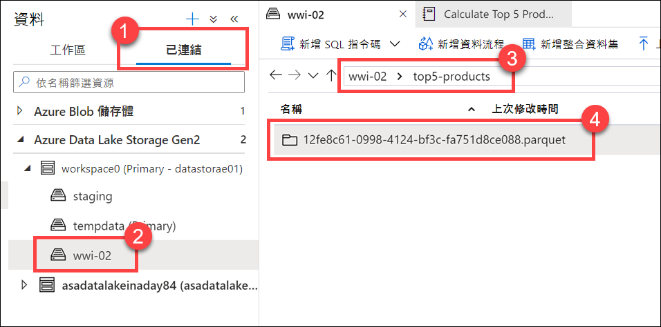

18. 返回到笔记本。选择笔记本右上角的“**停止会话**”，并在提示时确认要立即停止会话。停止会话是为了释放计算资源，以便在下一节的管道中运行笔记本。

    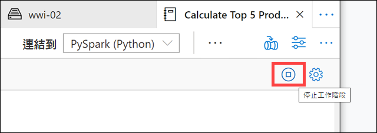

### 任务 2：将笔记本添加到管道

Tailwind Traders 希望在映射数据流运行后执行此笔记本，作为其协调过程的一部分。为此，我们将此笔记本作为新笔记本活动添加到管道中。

1. 返回“**Calculate Top 5 Products**”笔记本。

2. 选择笔记本右上角的“**添加到管道**”按钮，然后选择“**现有管道**”。

    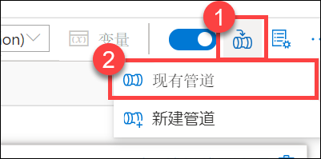

3. 选择“**用户配置文件到 Data Lake**”管道，然后选择“**添加**”。

4. Synapse Studio 将笔记本活动添加到管道中。重新排列“**笔记本活动**”，使其位于“**数据流活动**”的右侧。选择“**数据流活动**”，然后将“**成功**”活动管道连接“**绿色框**”拖到“**笔记本活动**”中。

    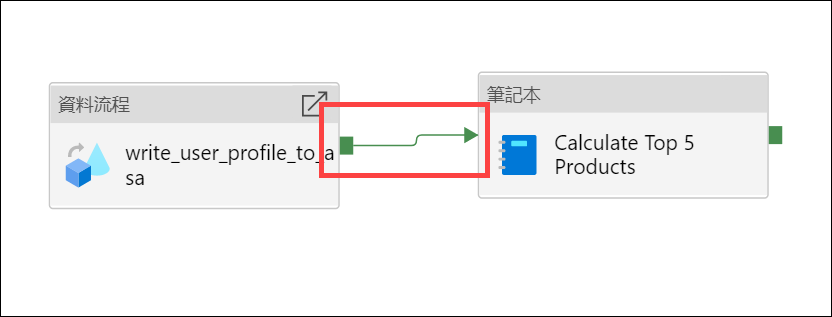

    “成功”活动箭头指示管道在数据流活动成功运行后执行笔记本活动。

5. 选择“**笔记本活动**”，选择“**设置**”选项卡，展开“**基本参数**”，然后选择“**+ 新建**”。在“**名称**”字段中输入 **`runId`**。将“**类型**”设置为“**字符串**”，将“**值**”设置为“**添加动态内容**”。

    

6. 在“**添加动态内容**”窗格中，展开“**系统变量**”，并选择“**管道运行 ID**”。这会将“*@pipeline().RunId*”添加到动态内容框。然后单击“**确定**”，关闭对话框。

    管道运行 ID 值是分配给每个管道运行的唯一 GUID。通过将此值作为 `runId` 笔记本参数传入，我们将使用该值作为 Parquet 文件的名称。然后可以查看管道运行历史记录，并找到为每个管道运行创建的特定 Parquet 文件。

7. 依次选择“**全部发布**”和“**发布**”，以保存更改。

    

### 任务 3：运行更新管道

> **备注**：更新管道可能需要 10 分钟或更长时间！

1. 发布完成后，选择“**添加触发器**”，然后选择“**立即触发**”以运行更新的管道。

    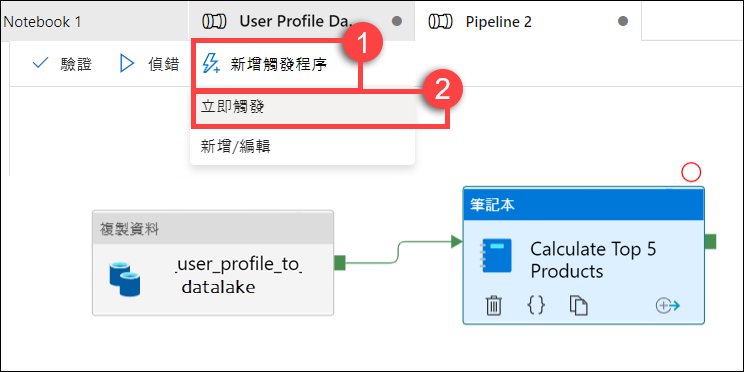

2. 选择“**确定**”以运行触发器。

    

3. 导航到“**监视**”中心。

    

4. 选择“**管道运行**”，并等待管道运行成功完成。可能需要刷新视图。

    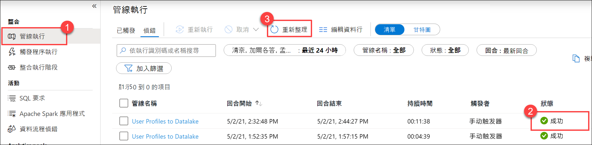

    > 添加笔记本活动后，运行可能需要 10 多分钟才能完成。

5. 选择管道的名称 (**User profiles to Datalake**) 以查看管道的活动运行。

6. 这一次，可以看到“**数据流**”活动和新的“**笔记本**”活动。记下“**管道运行 ID**”值。我们将其与笔记本生成的 Parquet 文件名进行比较。选择“**Calculate Top 5 Products**”笔记本名称，查看其详细信息。

    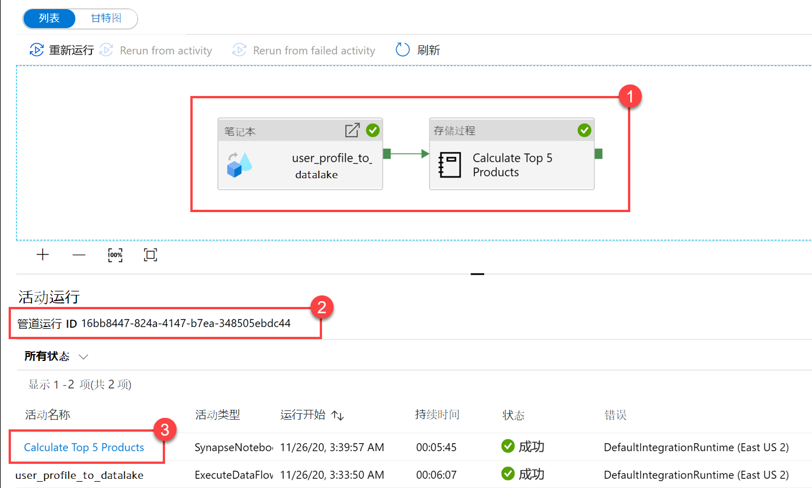

7. 在这里可以看到笔记本运行的详细信息。可以选择“**回放**”按钮来观看“**作业**”的进度回放。在底部，可以使用不同的筛选器选项查看“**诊断**”和“**日志**”。将鼠标悬停在阶段上可查看其详细信息，例如持续时间、任务总数、数据详细信息等。选择“**阶段**”上的“**查看详细信息**”链接以查看其详细信息。

    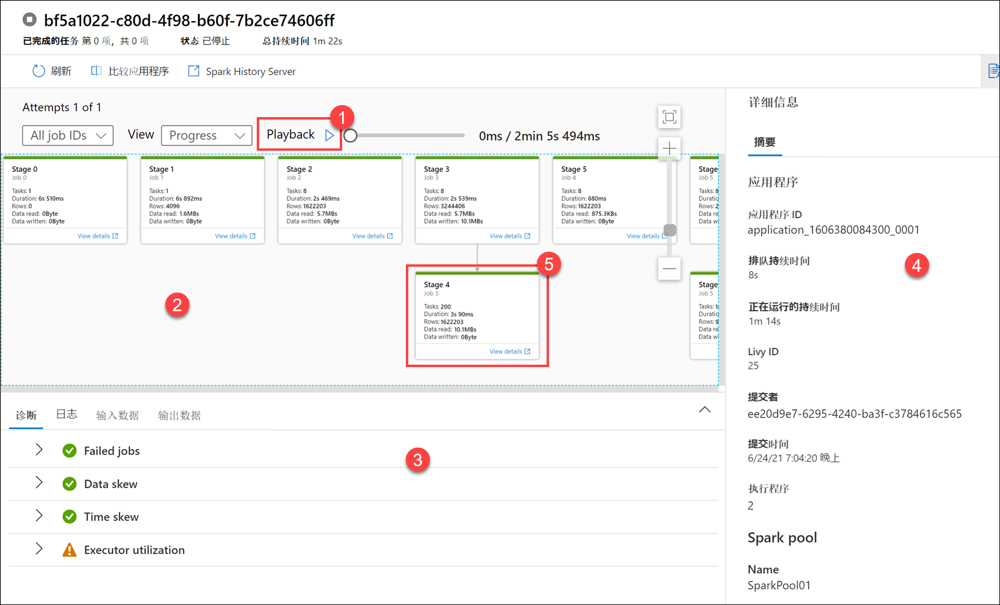

8. Spark 应用程序 UI 在新选项卡中打开，从中可以查看阶段详细信息。展开“**DAG 可视化效果**”以查看阶段详细信息。

    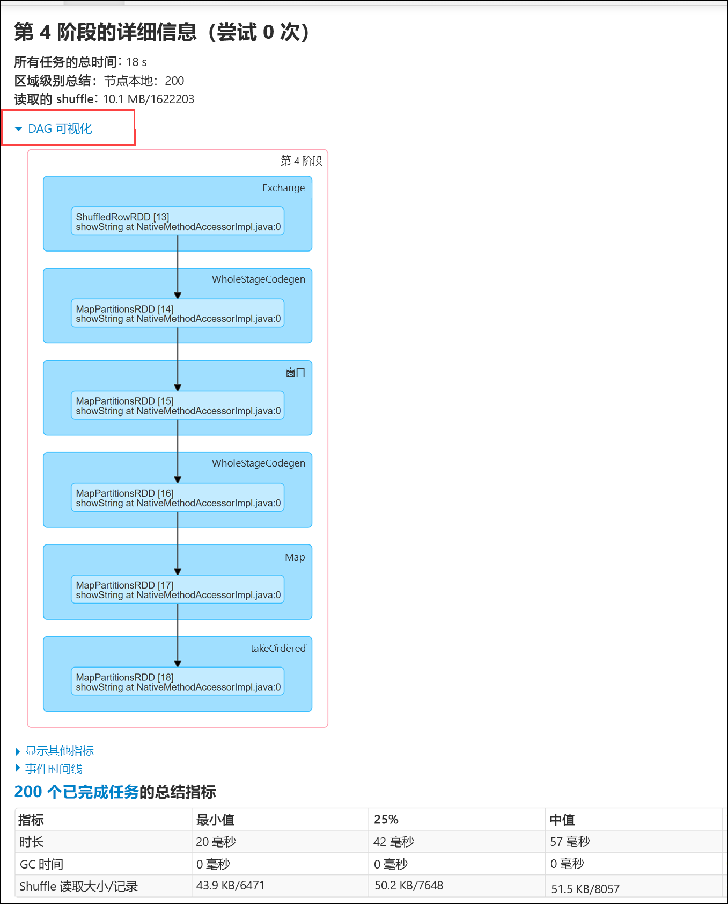

9. 关闭“Spark 详细信息”选项卡，在 Synapse Studio 中导航返回“**数据**”中心。

    

10. 选择“**链接**”选项卡，选择 Data Lake Storage 主帐户上的 **wwi-02** 容器，导航到 **top5-products** 文件夹，然后验证 Parquet 文件的文件夹是否存在，其名称与“**管道运行 ID**”相匹配。

    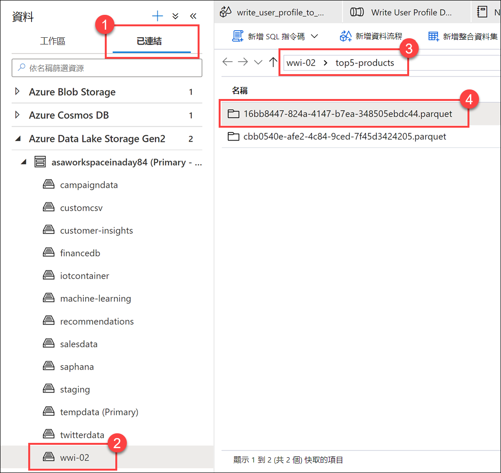

    如你所见，我们有一个文件，其名称与我们之前提到的“**管道运行 ID**”相匹配：

    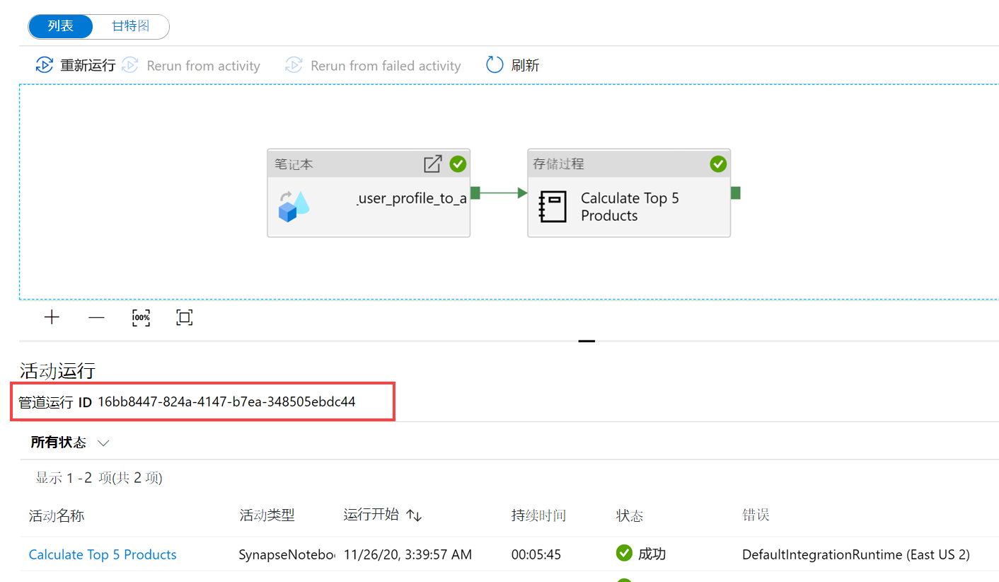

    这些值匹配是因为我们之前将管道运行 ID 传递给了笔记本活动上的“**runId**”参数。
