---
lab:
    title: '使用 Azure Synapse Analytics 实现端到端安全性'
    module: '模块 8'
---

# 实验室 8 - 使用 Azure Synapse Analytics 实现端到端安全性

在本实验室中，你将了解如何保护 Synapse Analytics 工作区及其配套基础结构。你将观察 SQL Active Directory 管理员，管理 IP 防火墙规则，使用 Azure 密钥保管库管理机密以及通过与密钥保管库关联的服务和管道活动访问这些机密。你将了解如何使用专用 SQL 池实现列级别安全性、行级别安全性以及动态数据掩码。

完成本实验室后，你将能够：

- 保护 Azure Synapse Analytics 配套基础结构
- 保护 Azure Synapse Analytics 工作区和托管服务
- 保护 Azure Synapse Analytics 工作区数据

此实验室将指导你完成几个与安全性相关的步骤，涵盖 Azure Synapse Analytics 的端到端安全性案例。从此实验室得出的一些重要结论包括：

1. 利用 Azure 密钥保管库存储敏感连接信息，例如链接服务和管道中的访问密钥和密码。

2. 在有可能公开敏感/机密数据的环境中，对 SQL 池中的数据进行自检。标识表示敏感数据的列，然后通过添加列级别安全性对其提供保护。确定表级别的哪些数据应对特定用户组隐藏，然后定义安全性谓词以在表上应用行级别安全性（筛选器）。如果需要，你还可以选择应用动态数据掩码来逐列屏蔽查询中返回的敏感数据。

## 实验室设置和先决条件

在开始此实验室之前，必须至少完成“实验室 4：使用 Apache Spark 探索、转换数据并将数据加载到数据仓库中”中的设置步骤。

本实验室使用你在上一个实验室中创建的专用 SQL 池。你应该已在上一个实验室结束时暂停了 SQL 池，因此请按照以下说明恢复它：

1. 打开 Azure Synapse Studio (<https://web.azuresynapse.net/>)。
2. 选择“**管理**”中心。
3. 在左侧菜单中，选择“**SQL 池**”。如果 **SQLPool01** 专用 SQL 池已暂停，请将鼠标悬停在其名称上并选择“**&#9655;**”。

    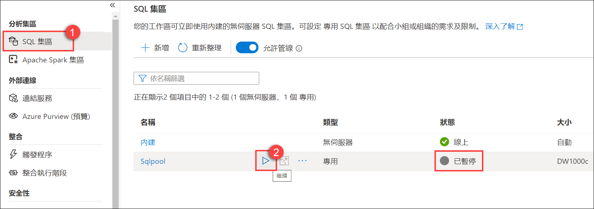

4. 出现提示时，选择“**恢复**”。恢复池可能需要一到两分钟。
5. 恢复专用 SQL 池后，请继续下一个练习。

> **重要说明：** 启动后，专用 SQL 池会消耗 Azure 订阅中的额度，直到暂停为止。如果你要离开该实验室休息一下，或者决定不完成该实验室；请按照实验结尾处的说明暂停 SQL 池！

## 练习 1 - 保护 Azure Synapse Analytics 配套基础结构

Azure Synapse Analytics (ASA) 是一个强大的解决方案，可以为它创建和管理的许多资源处理安全性。然而，为了运行 ASA，需要采取一些基本的安全措施，以确保它所依赖的基础结构是安全的。在本练习中，我们将详细介绍如何保护 ASA 的配套基础结构。

### 任务 1 - 观察 SQL Active Directory 管理员

 SQL Active Directory 管理员可以是用户（默认）或组（最佳做法，以便可以向多个用户提供这些权限）安全主体。分配给它的主体将具有对工作空间中包含的 SQL 池的管理权限。

1. 在 Azure 门户 (<https://portal.azure.com>) 中，浏览到实验室资源组，并从资源列表中打开 Synapse 工作区（但不启动 Synapse Studio）

2. 在左侧菜单中，选择“**SQL Active Directory 管理员**”并观察被列为 SQL Active Directory 管理员的对象。是用户还是组？

    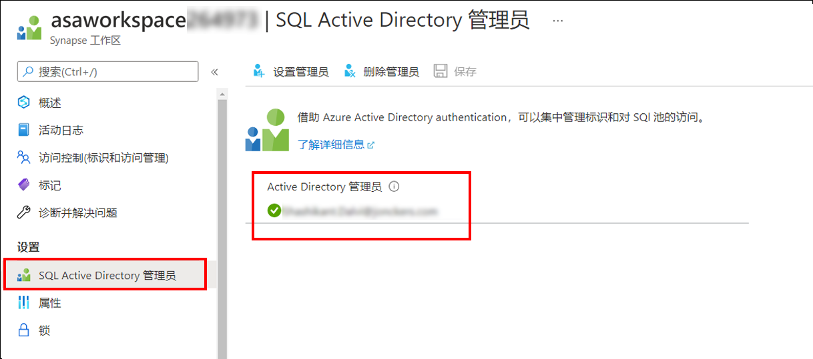

### 任务 2 - 管理 IP 防火墙规则

每一个技术系统都必须具备强大的 Internet 安全性。减少 Internet 入侵载体的一种方法是减少通过使用 IP 防火墙规则访问 Azure Synapse Analytics 工作区的公共 IP 地址的数量。然后 Azure Synapse Analytics 工作区会将这些相同的规则委托给工作区的所有托管公共终结点，包括那些用于 SQL 池的终结点和 SQL 无服务器终结点。

1. 在 Azure 门户中，在 Synapse 工作区的边栏选项卡上，选择“**网络**”。

2. 请注意，实验室环境中已为你创建了“**允许全部**”的 IP 防火墙规则。如果你希望添加特定的 IP 地址，可改为从任务栏菜单选择“**+ 添加客户端 IP**”（目前无需执行此操作）。

    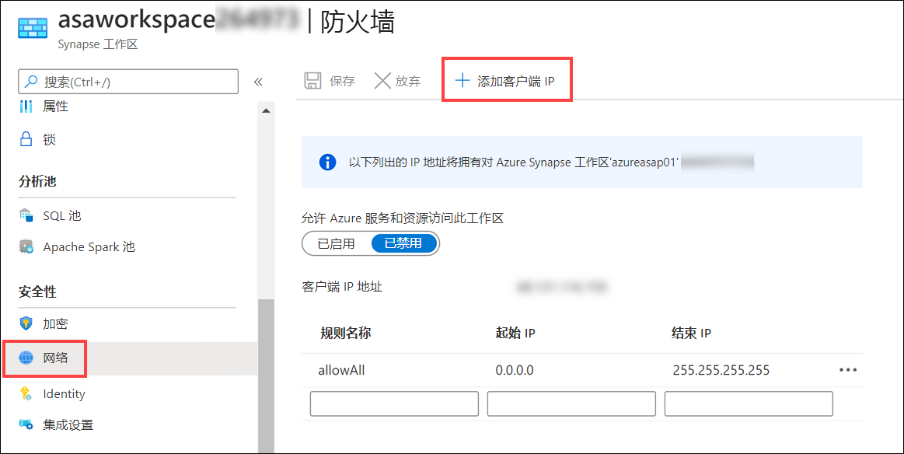

    > **备注**：从本地网络连接到 Synapse 时，需要打开某些端口。为了支持 Synapse Studio 的功能，请确保打开传出 TCP 端口 80、443 和 1143 以及 UDP 端口 53。

## 练习 2 - 保护 Azure Synapse Analytics 工作区和托管服务

### 任务 1 - 使用 Azure 密钥保管库管理机密

处理与外部数据源和服务的连接时，应正确处理密码和访问密钥等敏感连接信息。建议将这类信息存储到 Azure 密钥保管库中。利用 Azure 密钥保管库不仅可保护机密不被泄露，还可作为中央数据源；这意味着如果需要更新某个机密值（例如在存储帐户上循环访问密钥时），可以在一个地方更改它，并且使用此密钥的所有服务都将立即开始提取新值。Azure 密钥保管库使用与 FIPS 140-2 兼容的 256 位 AES 加密以透明方式对信息进行加密和解密。

1. 在 Azure 门户中，打开用于此实验室的资源组，然后从资源列表中，选择“**密钥保管库**”资源。

    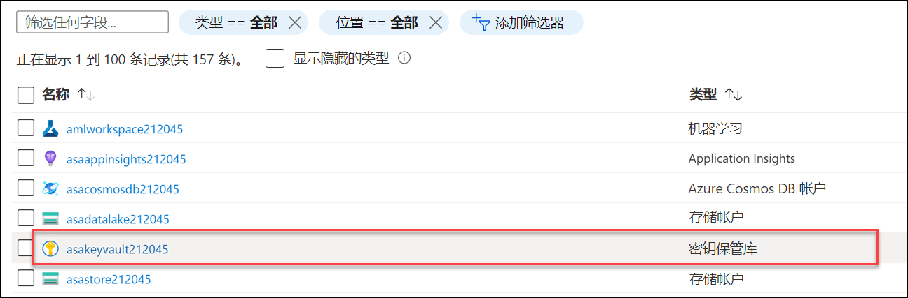

2. 在左侧菜单的“设置”下，选择“**访问策略**”。

3. 观察到表示 Synapse 工作区（名称与 **asaworkspace*xxxxxxx*** 类似）的托管服务标识 (MSI) 已在“应用程序”下列出并且它具有 4 个选定的机密管理操作。

    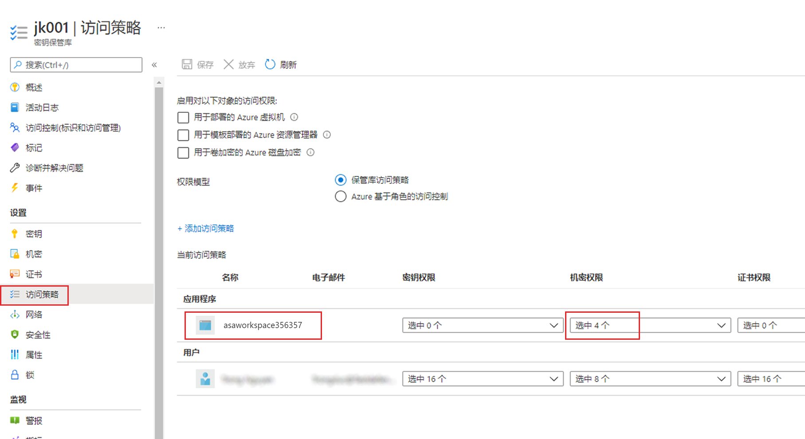

4. 选择在“**机密管理操作**”下显示“**已选中 4 项**”的下拉列表，我们会看到“**获取**”（允许工作区从密钥保管库检索机密值）和“**列出**”（允许工作区枚举机密）已设置。

### 任务 2 - 创建链接服务时使用 Azure 密钥保管库管理机密

在 Azure Synapse Analytics 中，链接服务等同于连接字符串。Azure Synapse Analytics 链接服务可以连接将近 100 种不同类型的外部服务，包括 Azure 存储帐户、Amazon S3 等。连接外部服务时，几乎可以保证具有与连接信息相关的机密。存储这些机密的最佳位置是 Azure 密钥保管库。Azure Synapse Analytics 可使用 Azure 密钥保管库中的值配置所有链接服务的连接。

为了在链接服务中充分利用 Azure 密钥保管库，必须首先将密钥保管库资源作为链接服务添加到 Azure Synapse Analytics 中。

1. 在 Azure Synapse Studio 中，从左侧菜单中选择“**管理**”中心。

    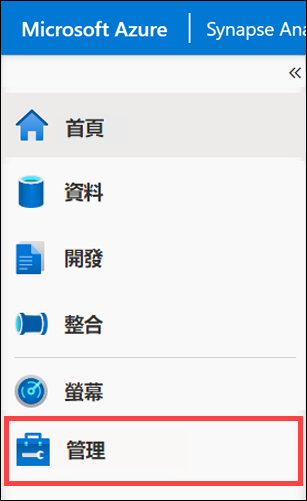

2. 在“**外部连接**”下，选择“**链接服务**”，你会观察到环境中已创建指向密钥保管库的链接服务。

    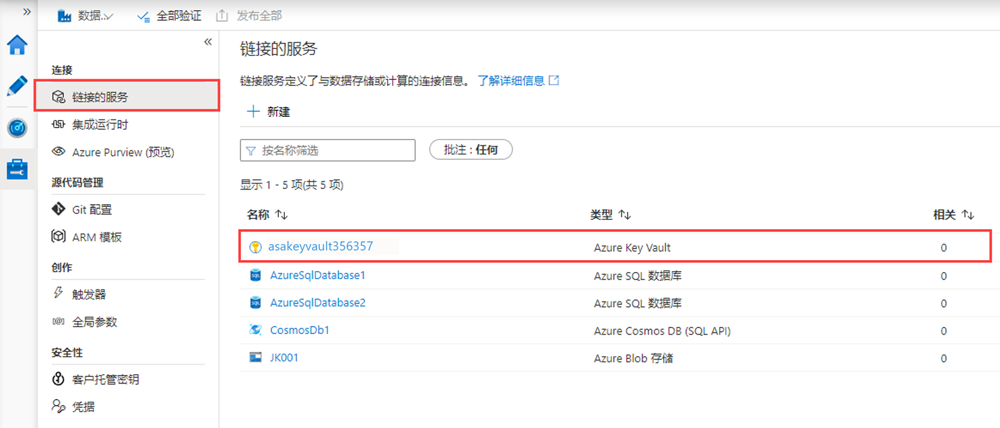

由于我们已将 Azure 密钥保管库设置为链接服务，因此我们可以利用它来定义新的链接服务。每个新的链接服务都会提供从 Azure 密钥保管库检索机密的选项。此表单请求选择 Azure 密钥保管库链接服务、机密名称和机密的特定版本（可选）。

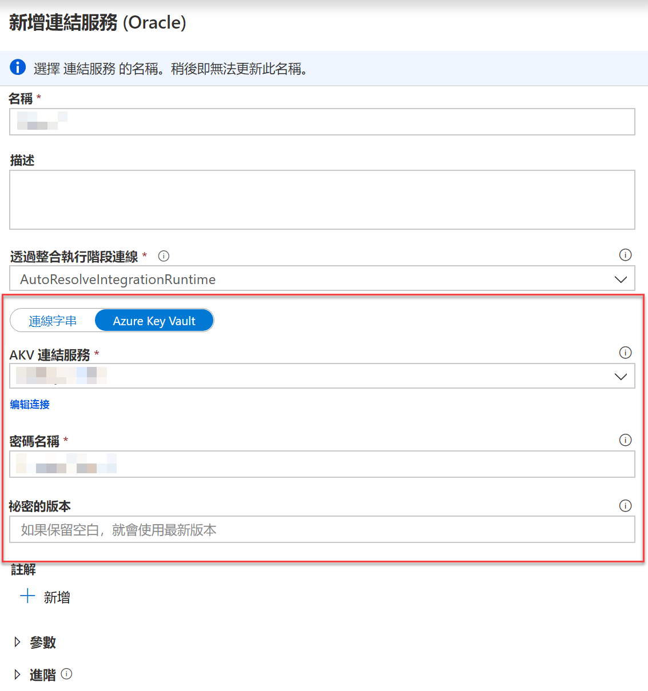

### 任务 3 - 保护工作区管道运行

建议使用 Azure 密钥保管库存储管道中的任何机密。在此任务中，将使用 Web 活动检索这些值，只演示相关机制。此任务的第二部分演示如何使用管道中的 Web 活动从密钥保管库检索机密。

1. 返回到 Azure 门户。

2. 在 **asakeyvault*xxxxxxx*** Azure 密钥保管库资源的边栏选项卡中，从左侧菜单中选择“**机密**”。然后，在顶部的工具栏中，选择“**+ 生成/导入**”。

   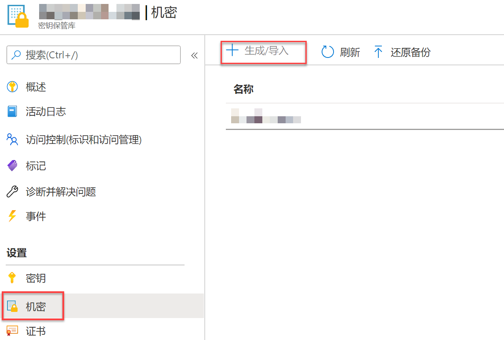

3. 创建名为 `PipelineSecret` 的机密并为其分配值 `IsNotASecret`，然后选择“**创建**”按钮。

   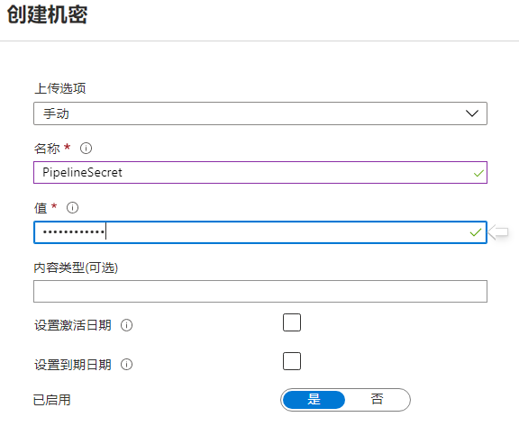

4. 打开你刚才创建的机密，钻取到当前版本并复制“机密标识符”字段中的值。在文本编辑器中保存此值，或将其保留在剪贴板中供后面的步骤使用。

    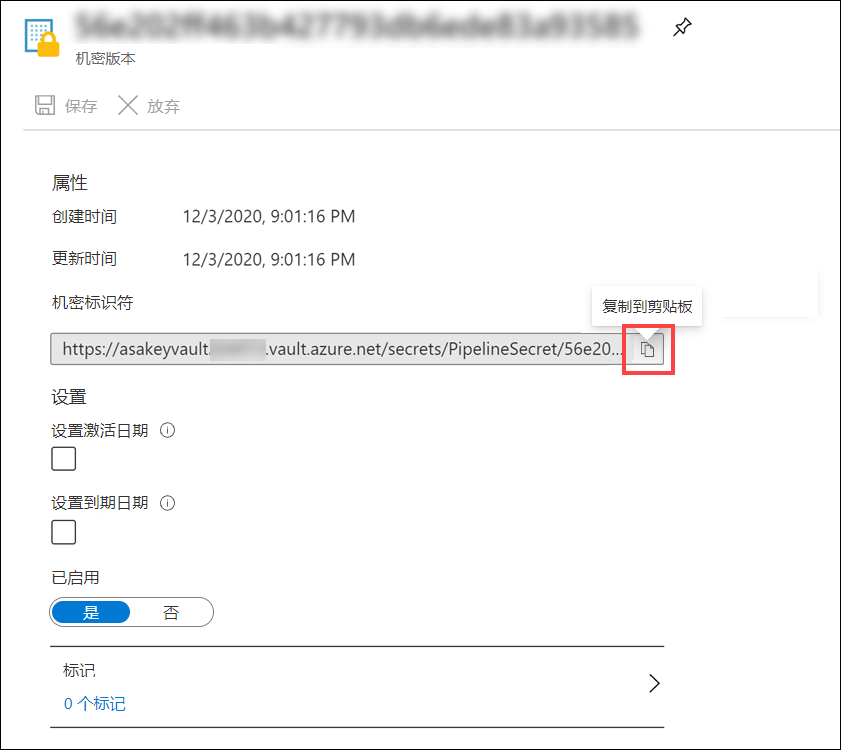

5. 切换回 Synapse Studio，然后从左侧菜单中选择“**集成**”中心。

    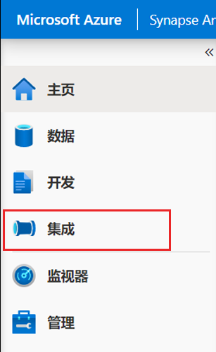

6. 在“**集成**”窗格的“**+**”菜单中，选择“**管道**”。

    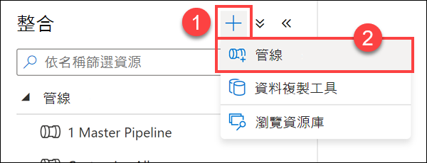

7. 在“**管道**”选项卡的“**活动**”窗格中，搜索 **Web**，然后将 **Web** 活动实例拖入设计区域。

    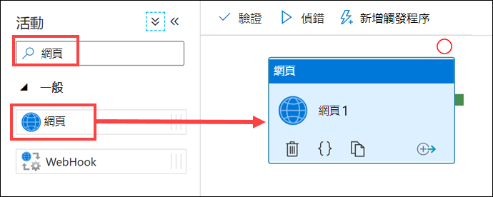

8. 选择 **Web1** Web 活动，然后选择“**设置**”选项卡。按如下所示填写表单：

    1. **URL**：粘贴从前面的步骤 4 中复制的密钥保管库机密标识符值，然后将 `?api-version=7.1` **追加**到此值的末尾。例如，它类似于下面这样：`https://asakeyvaultNNNNN.vault.azure.net/secrets/PipelineSecret/f808d4fa99d84861872010f6c8d25c68?api-version=7.1`.
  
    2. **方法**：选择“**Get**”。

    3. 展开“**高级**”部分，对于“**身份验证**”，请选择“**托管标识**”。我们已为 Synapse 工作区的托管服务标识创建了访问策略，这意味着管道活动有权通过 HTTP 调用访问密钥保管库。
  
    4. **资源**：请输入 **<https://vault.azure.net>**

        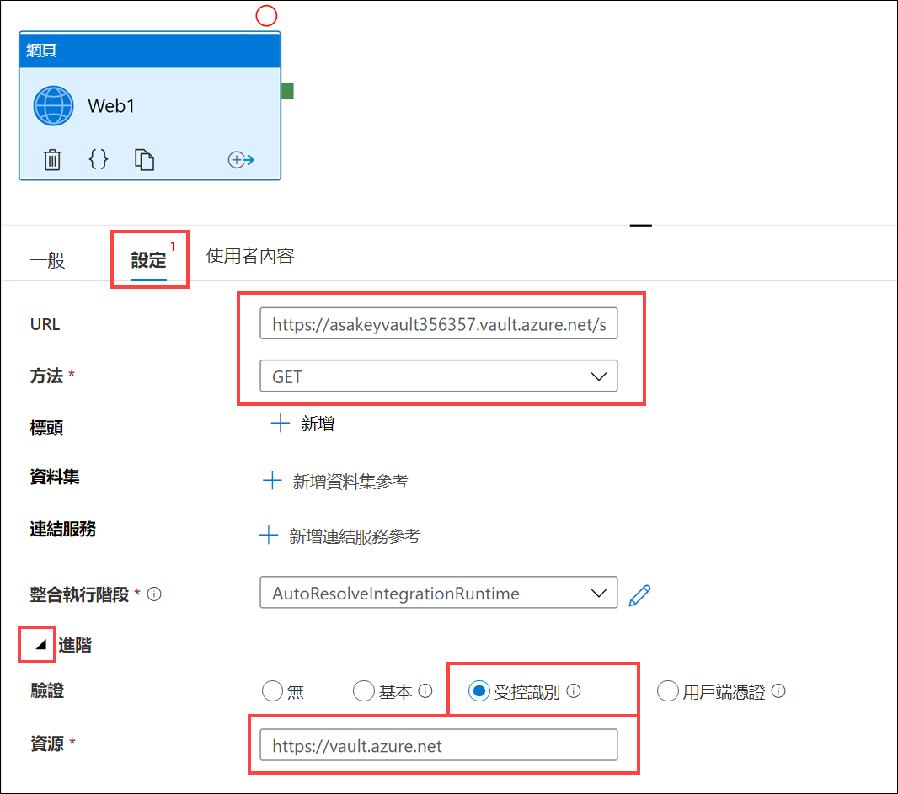

9. 从“活动”窗格中，将“**设置变量**”活动添加到管道的设计图面。

    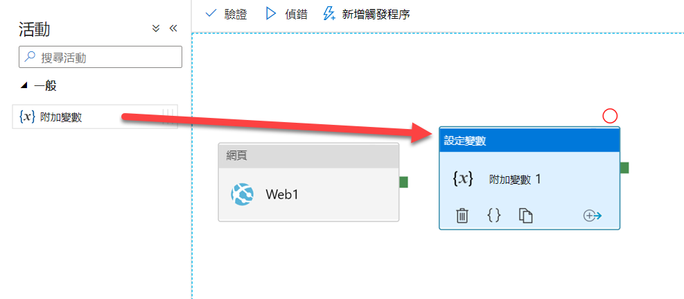

10. 在管道的设计图面上，选择 **Web1** 活动，然后将“**成功**”活动管道连接（绿色框）拖到“**设置变量 1**”活动。

11. 在设计器中选定的管道中（例如选择了任何一个活动），选择“**变量**”选项卡，然后添加新的**字符串**参数 **`SecretValue`**。

      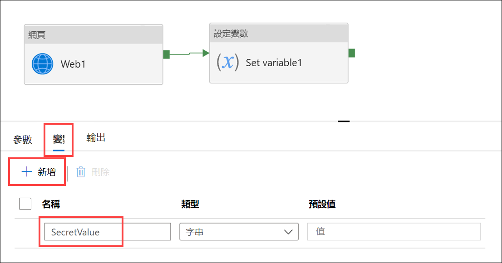

12. 选择“**设置变量 1**”活动，然后选择“**变量**”选项卡。按如下所示填写表单：

    1. **名称**：选择“**SecretValue**”（我们刚创建的变量）。

    2. **值**：输入 `@activity('Web1').output.value`

        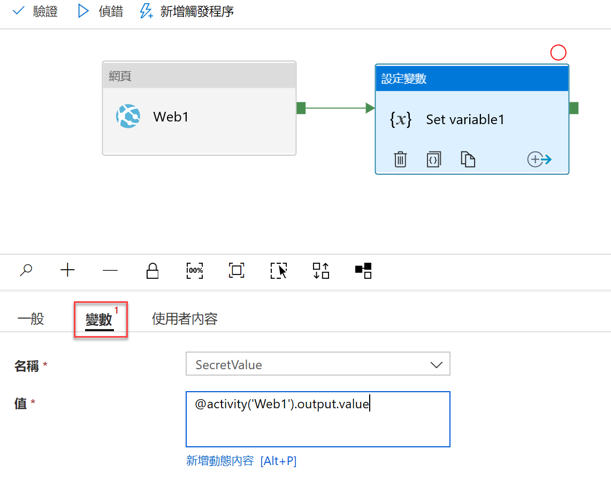

13. 从工具栏菜单选择“**调试**”，调试管道。运行调试时，从管道的“**输出**”选项卡观察这两个活动的输入和输出。

    

    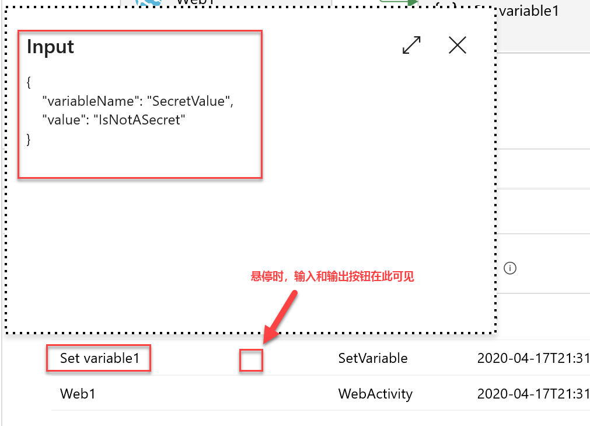

    > **备注**：在 **Web1** 活动的“**常规**”选项卡上，有一个“**安全输出**”复选框，选中此复选框可防止以纯文本形式记录机密值，例如，在管道运行中，可以看到一个被隐藏的值 ，而不是从密钥保管库检索的实际值。使用此值的任何活动还应选中其“**安全输入**”复选框。

### 任务 4 - 保护 Azure Synapse Analytics 专用 SQL 池

透明数据加密是一项 SQL Server 功能，可对静态数据进行加密和解密，这包括数据库、日志文件和备份文件。将此功能与 Synapse Analytics 专用 SQL 池结合使用时，将使用该池自身提供的内置对称数据库加密密钥 (DEK)。使用 TDE，所有存储的数据都在磁盘上进行加密，请求数据时，TDE 将在页面级别对数据进行解密，以便将数据读入内存，反之亦然，将内存中的数据写回磁盘之前会对其进行加密。和命名一样，此行为也以透明方式进行，不会影响任何应用程序代码。通过 Synapse Analytics 创建专用 SQL 池时，不会启用透明数据加密。此任务的第一部分将演示如何启用此功能。

1. 在“**Azure 门户**”中，打开资源组，然后找到并打开“**SqlPool01**”专用 SQL 池资源。

    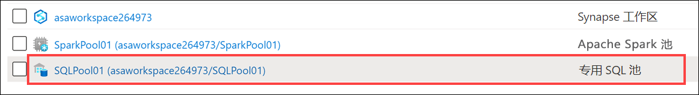

2. 在“**SQL 池**”资源边栏选项卡上，从左侧菜单中选择“**透明数据加密**”。**请勿**启用数据加密。

   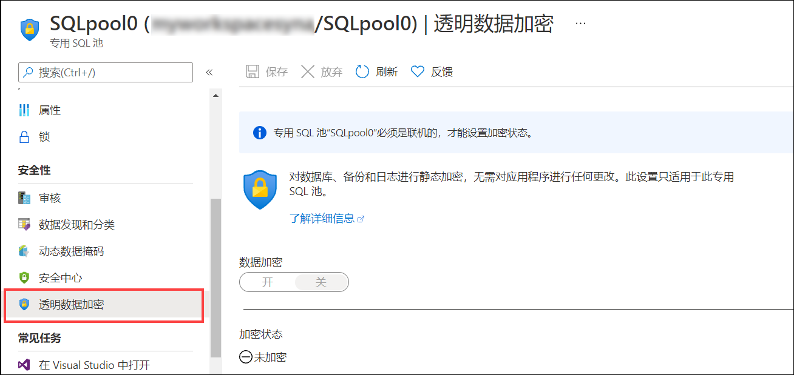

    默认情况下，禁用此选项。如果对此专用 SQL 池启用数据加密，则应用 TDE 时，该池将处于离线状态几分钟。

## 练习 3 - 保护 Azure Synapse Analytics 工作区数据

### 任务 1 - 列级别安全性

标识保存敏感信息的数据列非常重要。敏感类型可以是社会安全号码、电子邮件地址、信用卡号码、财务汇总等。使用 Azure Synapse Analytics，你可以定义权限，阻止用户或角色选择特定列。

1. 在 **Azure Synapse Studio** 的“**开发**”中心，展开“**SQL 脚本**”部分，然后选择“**列级别安全性**”。
2. 在工具栏中，连接到“**SQLPool01**”数据库。
3. 在查询窗口中，通过突出显示查询窗口中该步骤的语句并从工具栏选择“**运行**”按钮（或按 **F5**），**单独运行每个步骤**。
4. 关闭“脚本”选项卡。如果出现提示，请选择“**放弃所有更改**”。

### 任务 2 - 行级别安全性

1. 在“**开发**”中心的“**SQL 脚本**”部分，选择“**行级别安全性**”。
2. 在工具栏中，连接到“**SQLPool01**”数据库。
3. 在查询窗口中，通过突出显示查询窗口中该步骤的语句并从工具栏选择“**运行**”按钮（或按下 **F5**），**单独运行每个步骤**。
4. 关闭“脚本”选项卡。如果出现提示，请选择“**放弃所有更改**”。

### 任务 3 - 动态数据掩码

1. 在“**开发**”中心的“**SQL 脚本**”部分，选择“**动态数据掩码**”。
2. 在工具栏中，连接到“**SQLPool01**”数据库。
3. 在查询窗口中，通过突出显示查询窗口中该步骤的语句并从工具栏选择“**运行**”按钮（或按下 **F5**），**单独运行每个步骤**。
4. 关闭“脚本”选项卡。如果出现提示，请选择“**放弃所有更改**”。

## 重要说明：暂停 SQL 池

完成以下步骤，释放不再需要的资源。

1. 在 Synapse Studio 中，选择“**管理**”中心。
2. 在左侧菜单中，选择“**SQL 池**”。将鼠标悬停在“**SQLPool01**”专用 SQL 池上，并选择 **||**。

    

3. 出现提示时，选择“**暂停**”。

## 参考

- [IP 防火墙](https://docs.microsoft.com/azure/synapse-analytics/security/synapse-workspace-ip-firewall)
- [Synapse 工作区托管标识](https://docs.microsoft.com/azure/synapse-analytics/security/synapse-workspace-managed-identity)
- [Synapse 托管 VNet](https://docs.microsoft.com/azure/synapse-analytics/security/synapse-workspace-managed-vnet)
- [Synapse 托管专用终结点](https://docs.microsoft.com/azure/synapse-analytics/security/synapse-workspace-managed-private-endpoints)
- [保护 Synapse 工作区](https://docs.microsoft.com/azure/synapse-analytics/security/how-to-set-up-access-control)
- [使用专用链接连接到 Synapse 工作区](https://docs.microsoft.com/azure/synapse-analytics/security/how-to-connect-to-workspace-with-private-links)
- [创建数据源的托管专用终结点](https://docs.microsoft.com/azure/synapse-analytics/security/how-to-create-managed-private-endpoints)
- [向工作区托管标识授予权限](https://docs.microsoft.com/azure/synapse-analytics/security/how-to-grant-workspace-managed-identity-permissions)

## 其他资源

- [管理对工作区、数据和管道的访问](https://docs.microsoft.com/azure/synapse-analytics/sql/access-control)
- [使用 Apache Spark 进行分析](https://docs.microsoft.com/azure/synapse-analytics/get-started-analyze-spark)
- [使用 Power BI 直观显示数据](https://docs.microsoft.com/azure/synapse-analytics/get-started-visualize-power-bi)
- [控制按需 SQL 对存储帐户的访问](https://docs.microsoft.com/azure/synapse-analytics/sql/develop-storage-files-storage-access-control)
