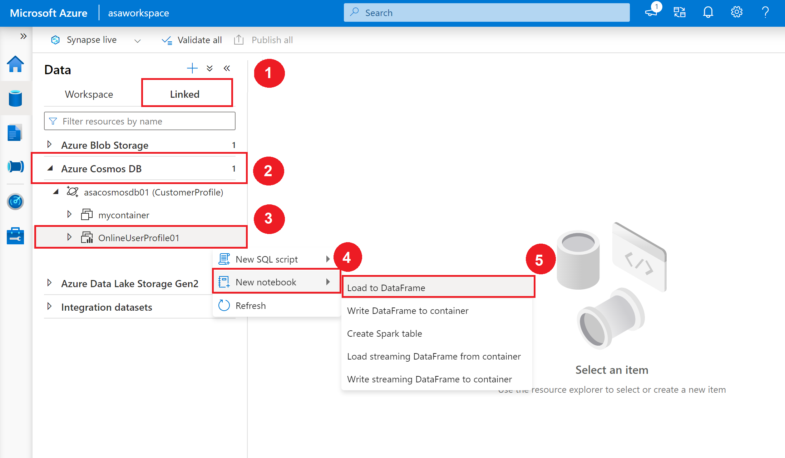
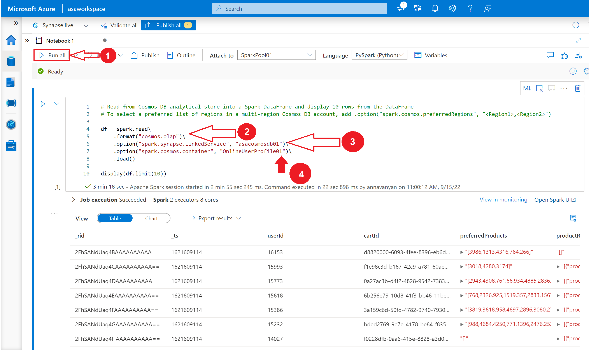

---
lab:
  title: 使用 Azure Synapse Link 支持混合事务分析处理 (HTAP)
  module: Module 9
---

# <a name="lab-9---support-hybrid-transactional-analytical-processing-htap-with-azure-synapse-link"></a>实验室 9 - 使用 Azure Synapse Link 支持混合事务分析处理 (HTAP)

在此实验室中，你将了解如何使用 Azure Synapse Link 将 Azure Cosmos DB 帐户无缝连接到 Synapse 工作区。 你将了解如何启用并配置 Synapse Link，以及如何使用 Apache Spark 和 SQL 无服务器查询 Azure Cosmos DB 分析存储。

完成本实验室后，你将能够：

- 使用 Azure Cosmos DB 配置 Azure Synapse Link
- 使用 Apache Spark for Synapse Analytics 查询 Azure Cosmos DB
- 使用适用于 Azure Synapse Analytics 的无服务器 SQL 池查询 Azure Cosmos DB

## <a name="lab-setup-and-pre-requisites"></a>实验室设置和先决条件

在开始本实验室之前，应先完成“实验室 6：使用 Azure 数据工厂或 Azure Synapse 管道转换数据”。

> 注意：如果你尚未完成实验室 6，但已完成本课程的实验室设置，则可以完成这些步骤，来创建所需的链接服务和数据集。<u></u>
>
> 1. 在 Synapse Studio 的“管理”中心，使用以下设置为 Azure Cosmos DB (SQL API) 添加新的链接服务  ：
>       - **名称**：asacosmosdb01
>       - Cosmos DB 帐户名：asacosmosdbxxxxxxx
>       - 数据库名称：CustomerProfile
> 2. 在“数据”中心，创建以下“集成数据集”：
>       - **源**：Azure Cosmos DB (SQL API)
>       - 名称：asal400_customerprofile_cosmosdb
>       - 链接服务：asacosmosdb01
>       - 集合：OnlineUserProfile01
>       - 导入架构：从连接/存储

## <a name="exercise-1---configuring-azure-synapse-link-with-azure-cosmos-db"></a>练习 1 – 使用 Azure Cosmos DB 配置 Azure Synapse Link

Tailwind Traders 使用 Azure Cosmos DB 存储来自其电子商务网站中的用户资料数据。 可借助 Azure Cosmos DB SQL API 提供的 NoSQL 文档来熟悉如何使用 SQL 语法管理这些数据，同时大规模地在全球范围内读取和写入文件。

虽然 Tailwind Traders 对 Azure Cosmos DB 的功能和性能很满意，但他们想知道在数据仓库中的多个分区上执行大量分析查询（跨分区查询）会产生多少费用。 他们希望能在不增加 Azure Cosmos DB 请求单位 (RU) 的前提下高效访问所有数据。 他们已考虑过一些方案，可在数据湖发生变化时通过 Azure Cosmos DB 更改源机制将容器中的数据提取到数据库。 此方法的问题是会产生额外的服务和代码依赖项以及需要对解决方案进行长期维护。 可以从 Synapse Pipeline 执行批量导出，但其中并不包含任何给定时刻的最新信息。

你决定为 Cosmos DB 启用 Azure Synapse Link，并在 Azure Cosmos DB 容器上启用分析存储。 使用此配置，所有事务数据会自动存储在完全隔离的列存储中。 此存储可实现针对 Azure Cosmos DB 中操作数据的大规模分析，且不会影响事务工作负载，也不会产生资源单元 (RU) 成本。 适用于 Cosmos DB 的 Azure Synapse Link 在 Azure Cosmos DB 与 Azure Synapse Analytics 之间建立了紧密的集成，使 Tailwind Traders 能对其操作数据运行准实时分析，同时无需 ETL 过程，且完全不影响事务工作负载的性能。

通过将 Cosmos DB 的事务处理的分布式缩放与 Azure Synapse Analytics 内置的分析存储和计算能力相结合，Azure Synapse Link 可实现混合事务/分析处理 (HTAP) 体系结构，从而优化 Tailwind Trader 的业务流程。 此集成消除了 ETL 过程，使业务分析师、数据工程师和数据科学家能使用自助功能，并对操作数据运行准实时 BI、分析和机器学习管道。

### <a name="task-1-enable-azure-synapse-link"></a>任务 1：启用 Azure Synapse Link

1. 在 Azure 门户中 (<https://portal.azure.com>)，打开实验室环境的资源组。

2. 选择“Azure Cosmos DB 帐户”。

    

3. 选择左侧菜单中，选择“Azure Synapse Link”。
   a. 确保设置了“已启用帐户”。
   b. 在“已为容器启用 Azure Synapse Link”，确保已选中 cosmos_db_htap 和 OnlineUserProfile01。 

    
  
4. 选择“启用”。

    

    在 Azure Cosmos DB 容器上启用分析存储之前，必须先启用 Azure Synapse Link。

5. 必须等待此操作完成才能继续，这可能需要一分钟时间。 可选择 Azure“通知”图标查看状态。

    

    “启用 Synapse Link”成功完成后，其旁边会显示一个绿色对勾符号。

    

## <a name="exercise-2---querying-azure-cosmos-db-with-apache-spark-for-synapse-analytics"></a>练习 2 - 使用 Apache Spark for Synapse Analytics 查询 Azure Cosmos DB

Tailwind Traders 希望使用 Apache Spark 对新的 Azure Cosmos DB 容器运行分析查询。 在这一段中，我们将使用 Synapse Studio 的内置笔势快速创建一个 Synapse 笔记本，用于从启用了 HTAP 的容器中加载分析存储数据，同时不影响事务存储。

Tailwind Traders 正在尝试解决如何使用每个用户标识的首选产品列表，以及在他们的评论历史记录中任何匹配的产品 ID，以显示所有首选产品评论的列表。

### <a name="task-1-create-a-notebook"></a>任务 1：创建笔记本

1. 导航到“数据”中心。

    

2. 选择“链接”选项卡并展开“Azure Cosmos DB”部分（如果这部分不可见，请使用右上角的 **&#8635;** 按钮刷新 Synapse Studio），然后展开“asacosmosdb01 (CustomerProfile)”链接服务。 右键单击“OnlineUserProfile01”容器，选择“新建笔记本”，然后选择“加载到 DataFrame”。  

    

    请注意，我们创建的“OnlineUserProfile01”容器的图标与其他容器的略有不同。 这表示已启用分析存储。

3. 在新的笔记本中，在“附加到”下拉列表中选择 SparkPool01 Spark 池 。

    

4. 选择“全部运行”。

    

    Spark 会话首次启动时需要几分钟时间。

    请注意，在单元格 1 的生成代码中，“spark.read”格式已设置为“cosmos.olap” 。 这表示 Synapse Link 将使用容器的分析存储。 如果希望连接到事务存储，以便读取更改源中的数据或写入容器，则可改为使用“cosmos.oltp”。

    > **注意：** 不能写入分析存储，而只能从分析存储中读取数据。 如果希望将数据加载到容器，则需要连接到事务存储。

    第一个选项配置 Azure Cosmos DB 链接服务的名称。 第二个 `option` 定义要从中读取数据的 Azure Cosmos DB 容器。

5. 选择运行的单元格下方的“+ 代码”按钮。 此操作将在第一个代码单元格下方添加新的代码单元格。

6. DataFrame 包含我们不需要的额外列。 让我们删除不需要的列，创建一个干净的 DataFrame 版本。 若要实现这一点，请在新代码单元格中输入以下内容并运行它：

    ```python
    unwanted_cols = {'_attachments','_etag','_rid','_self','_ts','collectionType','id'}

    # Remove unwanted columns from the columns collection
    cols = list(set(df.columns) - unwanted_cols)

    profiles = df.select(cols)

    display(profiles.limit(10))
    ```

    输出现在只包含所需的列。 请注意，“preferredProducts”和“productReviews”列包含子元素。 展开某一行的值以查看它们。 你可能在 Azure Cosmos DB 数据资源管理器中看到过“UserProfiles01”容器中的原始 JSON 格式。

    

7. 我们应了解需要处理多少条记录。 若要实现这一点，请在新代码单元格中输入以下内容并运行它：

    ```python
    profiles.count()
    ```

    应会看到计数结果为 99,999。

8. 我们希望对每个用户都使用“preferredProducts”和“productReviews”列数组，并创建一个产品图表，这些产品来自他们的首选列表，与他们评论过的产品相匹配。 为此，我们需要创建两个新的 DataFrame，使其包含这两列中的平展值，以便稍后我们可以联接它们。 在新代码单元格中输入以下内容并“运行”它：

    ```python
    from pyspark.sql.functions import udf, explode

    preferredProductsFlat=profiles.select('userId',explode('preferredProducts').alias('productId'))
    productReviewsFlat=profiles.select('userId',explode('productReviews').alias('productReviews'))
    display(productReviewsFlat.limit(10))
    ```

    在此单元格中，我们导入了一个特殊的 PySpark [explode ](https://spark.apache.org/docs/latest/api/python/pyspark.sql.html?highlight=explode#pyspark.sql.functions.explode) 函数，它为数组的每个元素返回一个新行。 此函数有助于平展“preferredProducts”和“productReviews”列，以提高可读性或方便查询。

    

    观察单元格输出，其中显示了“productReviewFlat”DataFrame 内容。 我们会看到一个新的“productReviews”列，该列包含我们希望与用户的首选产品列表匹配的“productId”，以及我们希望显示或保存的“reviewText”。

9. 我们来看看“preferredProductsFlat”DataFrame 内容。 若要实现这一点，请在新单元格中输入以下内容并运行它：

    ```python
    display(preferredProductsFlat.limit(20))
    ```

    

    由于我们在首选产品数组上使用了“explode”函数，我们已将列值平展到“userId”和“productId”行，并按用户排序。

10. 现在，我们需要进一步平展“productReviewFlat”DataFrame 内容，以提取“productReviews.productId”和“productReviews.reviewText”字段并为每个数据组合创建新行。 若要实现这一点，请在新代码单元格中输入以下内容并运行它：

    ```python
    productReviews = (productReviewsFlat.select('userId','productReviews.productId','productReviews.reviewText')
        .orderBy('userId'))

    display(productReviews.limit(10))
    ```

    在输出中，请注意现在每个 `userId` 有多行。

    

11. 最后一步是联接“userId”和“productId”值上的“preferredProductsFlat”和“productReviews” DataFrame，以创建首选产品评论图表。 若要实现这一点，请在新代码单元格中输入以下内容并运行它：

    ```python
    preferredProductReviews = (preferredProductsFlat.join(productReviews,
        (preferredProductsFlat.userId == productReviews.userId) &
        (preferredProductsFlat.productId == productReviews.productId))
    )

    display(preferredProductReviews.limit(100))
    ```

    > **注意**：可单击表视图中的列标题来对结果集进行排序。

    

12. 使用笔记本右上角的“停止会话”按钮来停止笔记本会话。 然后关闭笔记本，放弃更改。

## <a name="exercise-3---querying-azure-cosmos-db-with-serverless-sql-pool-for-azure-synapse-analytics"></a>练习 3 - 使用 Azure Synapse Analytics 中的无服务器 SQL 池查询 Azure Cosmos DB

Tailwind Traders 希望使用 T-SQL 浏览 Azure Cosmos DB 分析存储。 理想情况下，他们可以创建多个视图，这些视图随后可用于联接其他分析存储容器、Data Lake 中的文件或可被 Power BI 等外部工具使用。

### <a name="task-1-create-a-new-sql-script"></a>任务 1：创建新的 SQL 脚本

1. 导航到“开发”中心。

    

2. 在“+”菜单中，选择“SQL 脚本” 。

    

3. 脚本打开后，在右侧的“属性”窗格中，将“名称”更改为“`User Profile HTAP`” 。 然后使用“属性”按钮关闭窗格。

    

4. 验证是否选择了无服务器 SQL 池（内置）。

    

5. 粘贴下面的 SQL 查询。 在 OPENROWSET 语句中，将“YOUR_ACCOUNT_NAME”替换为 Azure Cosmos DB 帐户名，将“YOUR_ACCOUNT_KEY”替换为 Azure 门户中“密钥”页面中的 Azure Cosmos DB 主密钥（应该仍会在另一个选项卡中打开）。

    ```sql
    USE master
    GO

    IF DB_ID (N'Profiles') IS NULL
    BEGIN
        CREATE DATABASE Profiles;
    END
    GO

    USE Profiles
    GO

    DROP VIEW IF EXISTS OnlineUserProfile01;
    GO

    CREATE VIEW OnlineUserProfile01
    AS
    SELECT
        *
    FROM OPENROWSET(
        'CosmosDB',
        N'account=YOUR_ACCOUNT_NAME;database=CustomerProfile;key=YOUR_ACCOUNT_KEY',
        OnlineUserProfile01
    )
    WITH (
        userId bigint,
        cartId varchar(50),
        preferredProducts varchar(max),
        productReviews varchar(max)
    ) AS profiles
    CROSS APPLY OPENJSON (productReviews)
    WITH (
        productId bigint,
        reviewText varchar(1000)
    ) AS reviews
    GO
    ```

6. 使用“运行”按钮运行查询，会：
    - 创建名为“Profiles”的新无服务器 SQL 池数据库（如果不存在）
    - 将数据库上下文更改为 Profiles 数据库。
    - 如果存在，则删除 OnlineUserProfile01 视图。
    - 创建一个名为 OnlineUserProfile01 的 SQL 视图。
    - 使用 OPENROWSET 语句将数据源类型设置为“CosmosDB”，设置帐户详细信息，并指出我们希望对名为“OnlineUserProfile01”的 Azure Cosmos DB 分析存储容器创建视图。 
    - 匹配 JSON 文件中的属性名并应用合适的 SQL 数据类型。 请注意，我们已将“preferredProducts”和“productReviews”字段设置为“varchar(max)”。 这是因为这两个属性都包含 JSON 格式的数据。
    - 由于 JSON 文档中的“productReviews”属性包含嵌套子数组，因此脚本需要将文档中的属性与数组的所有元素联接起来。 借助 Synapse SQL，我们可以对嵌套数组应用 OPENJSON 函数，从而平展嵌套结构。 平展“productReviews”中的值，就像我们在前面的 Synapse 笔记本中使用 Python explode 函数执行的操作一样 。

7. 导航到“数据”中心。

    

8. 选择“工作区”选项卡并展开“SQL 数据库”组 。 展开 Profiles 按需 SQL 数据库（如果没有在列表中看到它，请刷新“数据库”列表） 。 展开“视图”，然后右键单击“OnlineUserProfile01”视图，选择“新建 SQL 脚本”，然后“选择前 100 行”。   

    

9. 确保脚本已连接到内置 SQL 池，然后运行查询并查看结果。

    

    视图中包含“preferredProducts”和“productReviews”字段，它们都包含 JSON 格式的值 。 注意视图中的 CROSS APPLY OPENJSON 语句如何通过将“productId”和“reviewText”值提取到新字段，成功平展“productReviews”字段中的嵌套子数组值  。
