---
lab:
    title: '使用流分析进行实时流处理'
    module: '模块 10'
---

# 实验室 10 - 使用流分析进行实时流处理

在本实验室中，你将学习如何使用 Azure 流分析来处理流式数据。你将车辆遥测数据引入事件中心，然后使用 Azure 流分析中的各种开窗函数实时处理该数据。他们会将数据输出到 Azure Synapse Analytics。最后，你将学习如何缩放流分析作业以提高吞吐量。

完成本实验室后，你将能够：

- 使用流分析来处理事件中心内的实时数据
- 使用流分析开窗函数来构建聚合并输出到 Synapse Analytics
- 扩展 Azure 流分析作业以通过分区提高吞吐量
- 重新分区流输入以优化并行

## 技术概述

### Azure 流分析

随着越来越多的数据从各种连接的设备和传感器中生成，将这些数据以准实时的方式转化为可执行的见解和预测现已成为一项必备操作。[Azure 流分析](https://docs.microsoft.com/azure/stream-analytics/stream-analytics-introduction)与实时应用程序体系结构无缝集成，无论数据量如何，都可对数据进行功能强大的实时分析。

借助 Azure 流分析，你可以轻松开发大规模并行复杂事件处理 (CEP) 管道。它使你可以利用 [SQL 之类](https://docs.microsoft.com/stream-analytics-query/stream-analytics-query-language-reference)的非常简单的声明式语言以及对时态逻辑的嵌入式支持来创作功能强大的实时分析解决方案。大量[开箱即用的连接器](https://docs.microsoft.com/azure/stream-analytics/stream-analytics-define-outputs)、高级调试和作业监控功能通过显著减少开发人员所需的技能来帮助降低成本。此外，Azure 流分析具有高度可扩展性，通过对自定义代码的支持以及 [JavaScript 用户定义函数](https://docs.microsoft.com/azure/stream-analytics/stream-analytics-javascript-user-defined-functions)，进一步扩展了用 SQL 编写的流逻辑。

使用 Azure 流分析，几秒钟就可以轻松入门，因为无需担心基础结构，也无需管理服务器、虚拟机或群集。对于任何作业，你都可以立即将[处理能力](https://docs.microsoft.com/azure/stream-analytics/stream-analytics-streaming-unit-consumption)从一个流单元扩展到数百个流单元。你只需为每个作业使用的处理资源付费。

[有保证的事件交付](https://docs.microsoft.com/stream-analytics-query/event-delivery-guarantees-azure-stream-analytics)和企业级 SLA，提供 99.9% 的可用性，确保 Azure 流分析适用于任务关键型工作负载。自动检查点支持容错操作，以及快速重启且不会丢失数据。

### Azure 事件中心

[Azure 事件中心](https://docs.microsoft.com/azure/event-hubs/event-hubs-about)是每秒可引入数百万个事件的大数据管道。它使用 HTTPS、AMQP、AMQP over websockets 和 Kafka 等标准协议促进遥测和事件流数据的捕获、保留和重放。数据可以来自多个并发源，并且多达 20 个使用者组允许应用程序按照自己的节奏独立读取整个事件中心。

## 场景概述

Contoso Auto 正在收集车辆遥测数据，并希望使用事件中心快速引入和存储原始形式的数据，然后进行一些准实时的处理。最后，他们希望创建一个仪表板，当新数据在经过处理后流入时，该仪表板会自动更新。他们希望在仪表板上看到检测到的异常（例如引擎过热、油压异常和激进驾驶）的各种可视化效果，使用地图等组件来显示与城市相关的异常，以及使用各种图表和图形来清晰地描述这些信息。

在此体验中，你将使用 Azure 事件中心来引入流式车辆遥测数据，作为基于事件中心、Azure 流分析和 Azure Synapse Analytics 构建的准实时分析管道的入口点。Azure 流分析从事件中心提取车辆传感器数据，在一段时间内执行聚合，然后将聚合数据发送到 Azure Synapse Analytics 以进行数据分析。车辆遥测数据生成器将用于向事件中心发送车辆遥测数据。

## 实验室设置和先决条件

在开始此实验室之前，必须至少完成“实验室 4：使用 Apache Spark 探索、转换数据并将数据加载到数据仓库中”中的设置步骤。

本实验室使用你在上一个实验室中创建的专用 SQL 池。你应该已在上一个实验室结束时暂停了 SQL 池，因此请按照以下说明恢复它：

1. 打开 Azure Synapse Studio (<https://web.azuresynapse.net/>)。
2. 选择“**管理**”中心。
3. 在左侧菜单中，选择“**SQL 池**”。如果 **SQLPool01** 专用 SQL 池已暂停，请将鼠标悬停在其名称上并选择“**&#9655;**”。

    

4. 出现提示时，选择“**恢复**”。恢复池可能需要一到两分钟。
5. 恢复专用 SQL 池后，请继续下一个练习。

> **重要说明：** 启动后，专用 SQL 池会消耗 Azure 订阅中的额度，直到暂停为止。如果你要离开该实验室休息一下，或者决定不完成该实验室；请按照实验结尾处的说明暂停 SQL 池！

## 练习 1 - 配置服务

Azure 事件中心是一种大数据流式处理平台和事件引入服务，每秒能够接收和处理数百万个事件。我们正在使用它来临时存储已经过处理并准备发送到实时仪表板的车辆遥测数据。数据流入事件中心后，Azure 流分析将查询数据、应用聚合和标记异常，然后将其发送到 Azure Synapse Analytics 和 Power BI。

### 任务 1：配置事件中心

在此任务中，你将在提供的事件中心命名空间内创建并配置新的事件中心。在你稍后创建的 Azure 函数对车辆遥测数据进行处理和丰富后，将使用该事件中心来捕获车辆遥测数据。

1. 浏览到 [Azure 门户](https://portal.azure.com)。

2. 在左侧菜单中选择“**资源组**”。然后选择“**data-engineering-synapse-*xxxxxxx***”资源组。

3. 选择“**eventhub*xxxxxxx***”事件中心命名空间。

    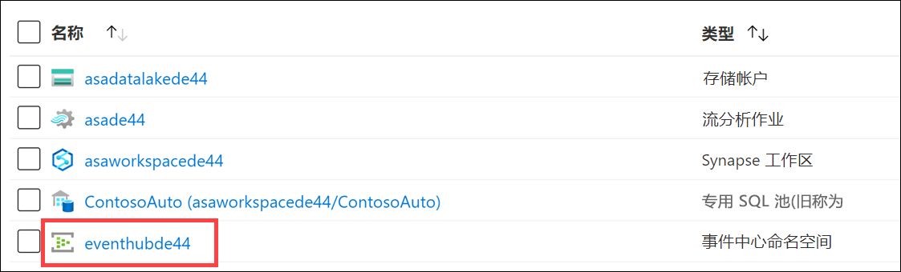

4. 在“事件中心命名空间”边栏选项卡上，选择左侧菜单中的“**事件中心**”。

    

5. 选择“**遥测**”事件中心。

    

6. 在左侧菜单中选择“**共享访问策略**”。

    

7. 在顶部工具栏中选择“**+ 添加**”，创建新的共享访问策略。

    

8. 在“**添加 SAS 策略**”边栏选项卡中，进行以下配置：

    - **名称：** `Read`
    - **托管：** 未选中
    - **发送：** 未选中
    - **侦听：** 已选中

        

        > 最佳做法是针对读取、写入和管理事件创建单独的策略。这遵循最低权限原则，以防止服务和应用程序执行未经授权的操作。

9. 输入完值后，选择表单底部的“**创建**”。

10. 在顶部工具栏中选择“**+ 添加**”，创建第二个新的共享访问策略。

    

11. 在“**添加 SAS 策略**”边栏选项卡中，进行以下配置：

    - **名称：** `Write`
    - **托管：** 未选中
    - **发送：** 已选中
    - **侦听：** 未选中

        

12. 输入完值后，选择表单底部的“**创建**”。

13. 从列表中选择“**写入**”策略。通过选择字段右侧的“复制”按钮，复制“**连接字符串 - 主密钥**”值。在记事本或类似的文本编辑器中保存此值供以后使用。

    

### 任务 2：配置 Azure Synapse Analytics

Azure Synapse 是一个端到端的分析平台，它在一个单一的集成环境中提供 SQL 数据仓库、大数据分析和数据集成功能。它使用户能够快速访问他们的所有数据并获得见解，使性能和规模达到一个全新的水平，这在业界简直是无与伦比的。

在此任务中，你将在 Synapse 专用 SQL 池中创建一个表，以存储由流分析作业提供的聚合车辆数据，该作业处理事件中心引入的车辆遥测数据。

1. 在 Azure Synapse Studio 中，选择“**数据**”中心。

    

2. 选择“**工作区**”选项卡，展开“**SQL 数据库组**”并右键单击“**SQLPool01**”。然后选择“**新建 SQL 脚本**”，并选择“**空脚本**”。

    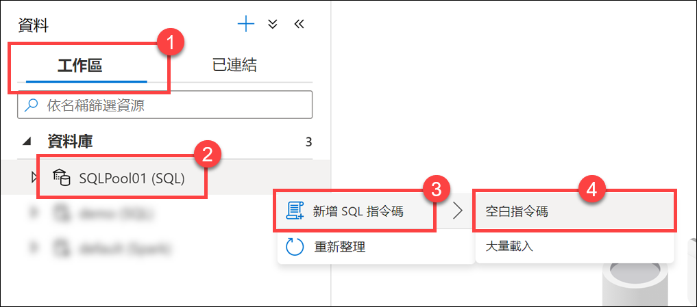

3. 确保该脚本已连接到“**SQLPool01**”，然后将该脚本替换为以下内容并选择“**运行**”以创建新表：

    ```sql
    CREATE TABLE dbo.VehicleAverages
    ( 
        [AverageEngineTemperature] [float] NOT  NULL,
        [AverageSpeed] [float] NOT  NULL,
        [Snapshot] [datetime] NOT  NULL
    )
    WITH
    (
        DISTRIBUTION = ROUND_ROBIN,
        CLUSTERED COLUMNSTORE INDEX
    )
    GO
    ```

    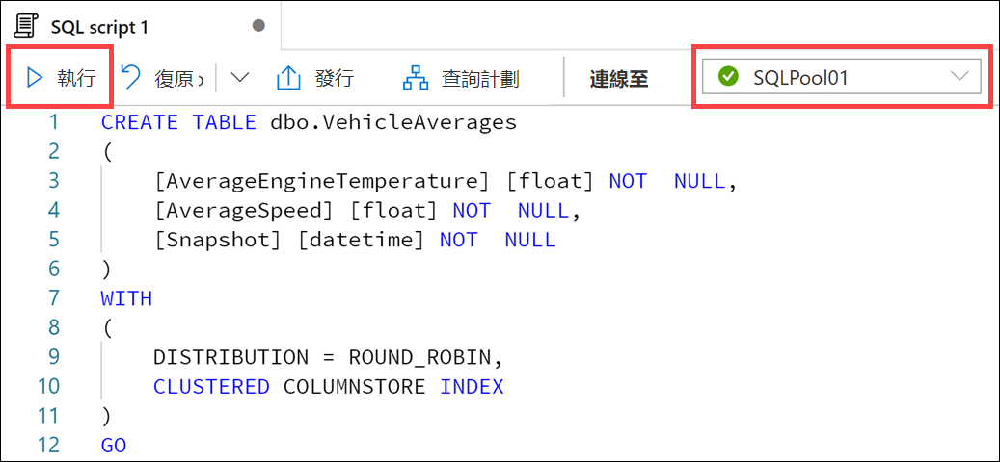

### 任务 3：配置流分析

Azure 流分析是一个事件处理引擎，你可以使用它来检查从设备流式传输的大量数据。传入数据可以来自设备、传感器、网站、社交媒体订阅源、应用程序等。它还支持从数据流中提取信息，识别模式和关系。然后，你可以使用这些模式触发下游其他操作，例如创建警报、将信息提供给报告工具，或将其存储以供以后使用。

在此任务中，你将配置流分析，以使用你创建的事件中心作为源，查询和分析该数据，然后将其发送到 Power BI，以向 Azure Synapse Analytics 报告聚合数据。

1. 在 Azure 门户的“**data-engineering-synapse-*xxxxxxx***”资源组中，选择“**as*xxxxxxx***”流分析作业。

    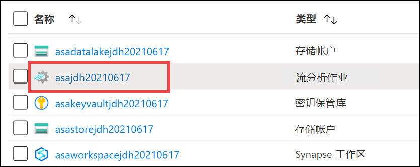

2. 在“流分析作业”中，选择左侧菜单中的“**存储帐户设置**”，然后选择“**添加存储帐户**”。由于我们将使用 Synapse Analytics 作为输出之一，因此需要首先配置作业存储帐户。

    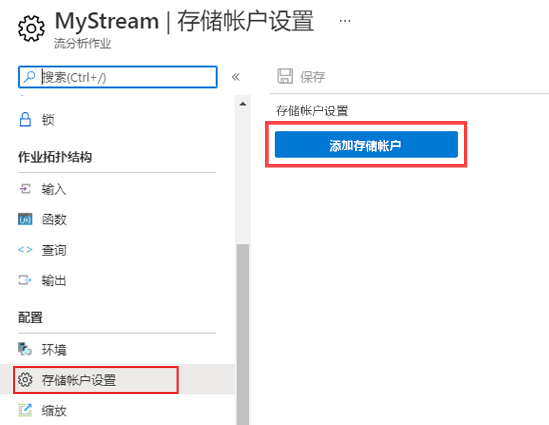

3. 在“**存储帐户设置**”表单中，进行以下配置：

   - **从订阅选择存储帐户：** 已选中。
   - **订阅：** 确保选择了用于本实验室的订阅。
   - **存储帐户：** 选择名为“**asadatalake*xxxxxxx***”的存储帐户。
   - **身份验证模式：** 选择“连接字符串”。

        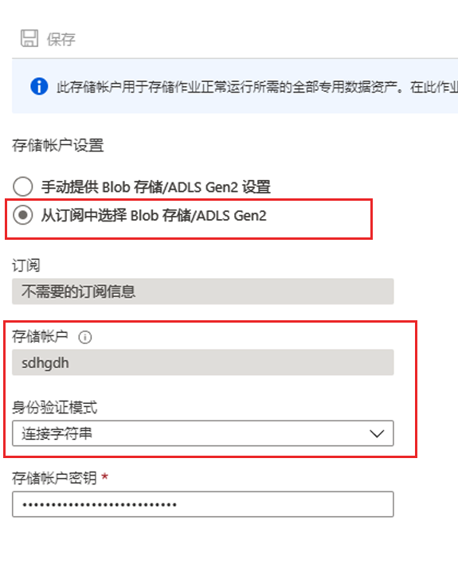

4. 选择“**保存**”，然后在提示保存存储帐户设置时选择“**是**”。

5. 在“流分析作业”中，选择左侧菜单中的“**输入**”。

    

6. 在顶部工具栏中选择“**+ 添加流输入**”，然后选择“**事件中心**”以创建新的事件中心输入。

    

7. 在“**新建输入**”边栏选项卡中，进行以下配置：

    - **名称：**` eventhub`
    - **从订阅选择事件中心：** 已选中
    - **订阅：** 确保选择了用于本实验室的订阅。
    - **事件中心命名空间：** 选择“**eventhub*xxxxxxx***”事件中心命名空间。
    - **事件中心名称：** 选择“**使用现有事件中心**”，然后选择你之前创建的“**遥测**”。
    - **事件中心使用者组：** 选择“**使用现有使用者组**”，然后选择“**$Default**”。
    - **身份验证模式：** 选择“**连接字符串**”。
    - **事件中心策略名称：** 选择“**使用现有策略**”，然后选择“**读取**”。
    - 将所有其他值均保留为其默认值。

        

8. 输入完值后，选择表单底部的“**保存**”。

9. 在“流分析作业”边栏选项卡中，选择左侧菜单中的“**输出**”。

    

10. 在顶部工具栏中选择“**+ 添加**”，然后选择“**Azure Synapse Analytics**”以创建新的 Synapse Analytics 输出。

    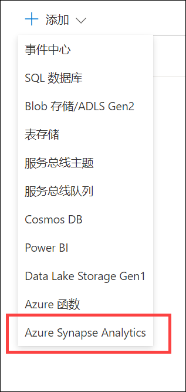

11. 在“**新建输出**”边栏选项卡中，进行以下配置：

    - **输出别名：** `synapse`
    - **从订阅选择 Azure Synapse Analytics：** 已选中。
    - **订阅：** 选择用于本实验室的订阅。
    - **数据库：** 选择“**SQLPool01**”。确保“**服务器名称**”下显示正确的 Synapse 工作区名称。
    - **身份验证模式：** 选择“**连接字符串**”。
    - **用户名**：`asa.sql.admin`
    - **密码：** 输入你在部署实验室环境时输入的 SQL 管理员密码值，或者托管实验室环境向你提供的密码。如果不确定 SQL 管理员用户名，请导航到 Azure 资源组中的 Synapse 工作区。SQL 管理员用户名显示在“概述”窗格中。
    - **服务器名称**：asaworkspace*xxxxxxx*
    - **表：** `dbo.VehicleAverages`

        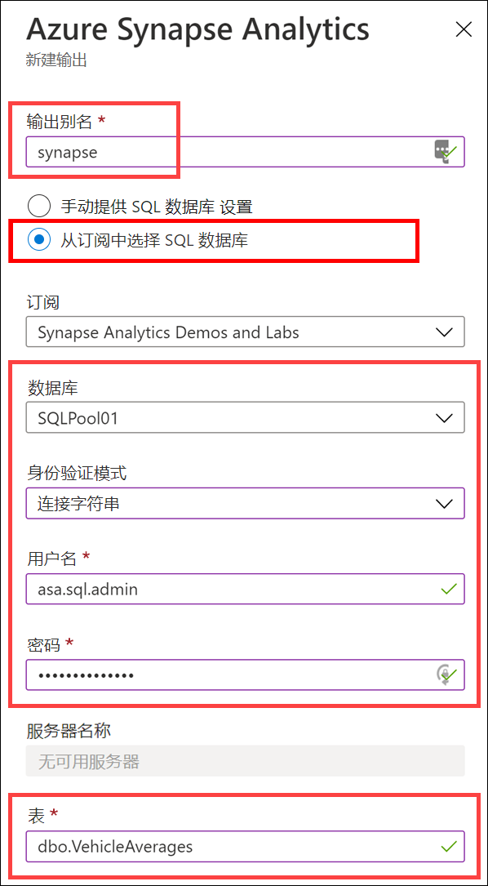

        > **备注：** 如果不确定 SQL 管理员用户名，请导航到 Azure 资源组中的 Synapse 工作区。SQL 管理员用户名显示在“概述”窗格中。

        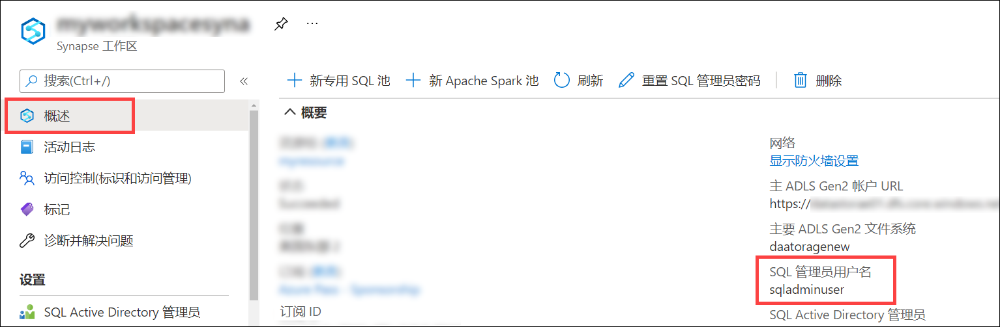

12. 输入完值后，选择表单底部的“**保存**”。

13. 在“流分析作业”边栏选项卡中，选择左侧菜单中的“**查询**”。

    

14. 输入以下查询：

    ```sql
    WITH
    VehicleAverages AS (
        select
            AVG(engineTemperature) averageEngineTemperature,
            AVG(speed) averageSpeed,
            System.TimeStamp() as snapshot
        FROM
            eventhub TIMESTAMP BY [timestamp]
        GROUP BY
            TumblingWindow(Duration(minute, 2))
    )
    -- INSERT INTO SYNAPSE ANALYTICS
    SELECT
        *
    INTO
        synapse
    FROM
        VehicleAverages
    ```

    

    该查询在两秒的时间内对引擎温度和速度取平均值。该查询使用“**TumblingWindow(Duration(minute, 2))**”汇总过去两分钟内所有车辆的平均引擎温度和速度，并将这些字段输出到“**synapse**”输出。

15. 完成查询更新后，选择顶部工具栏中的“**保存查询**”。

16. 在“流分析作业”边栏选项卡中，选择左侧菜单中的“**概述**”。在“概述”边栏选项卡顶部，选择“**启动**”。

    

19. 在显示的“启动作业”边栏选项卡中，对于作业输出启动时间，选择“**现在**”，然后选择“**启动**”。这将启动流分析作业，以便稍后开始处理事件并将其发送到 Azure Synapse Analytics。

    

## 练习 2 - 生成和聚合数据

### 任务 1：运行数据生成器

数据生成器控制台应用程序为一系列车辆（由 VIN（车辆识别号码）表示）创建模拟车辆传感器遥测数据并将这些数据直接发送到事件中心。为此，首先需要使用事件中心连接字符串对其进行配置。

在此任务中，你将配置并运行数据生成器。数据生成器将模拟车辆遥测数据保存到事件中心，提示流分析作业聚合和分析丰富的数据，并将这些数据发送到 Synapse Analytics。

1. 在实验室 VM 上，使用 Windows 资源管理器查看“**c:\dp-203\data-engineering-ilt-deployment\Allfiles**”文件夹。
2. 将“**TransactionGenerator.zip**”存档解压缩到名为“**TransactionGenerator**”的子文件夹中。
3. 在提取的“**TransactionGenerator**”文件夹中，打开“**appsettings.json**”文件。将“**遥测**”事件中心连接字符串值粘贴到“**EVENT_HUB_CONNECTION_STRING**”旁边。确保在该值周围添加引号 ("")，如图所示。“**保存**”文件。

    

    > **备注：** 确保连接字符串以 *EntityPath=telemetry* 结尾（例如 *Endpoint=sb://YOUR_EVENTHUB_NAMESPACE.servicebus.windows.net/;SharedAccessKeyName=Write;SharedAccessKey=REDACTED/S/U=;EntityPath=telemetry*）。如果不是，则表明你没有从事件中心的“**写入**”策略中复制连接字符串。

    SECONDS_TO_LEAD 是发送车辆遥测数据之前要等待的时间。默认值为 0。

    SECONDS_TO_RUN 是在停止数据传输之前允许生成器运行的最长时间。默认值为 1800。如果你在生成器运行时输入 Ctrl+C，或关闭窗口，数据也将停止传输。

4. 在提取的 **TransactionGenerator** 文件夹中，运行 **TransactionGenerator.exe**。

5. 如果显示“**Windows 保护你的电脑**”对话框，请选择“**详细信息**”，然后选择“**仍要运行**”。

    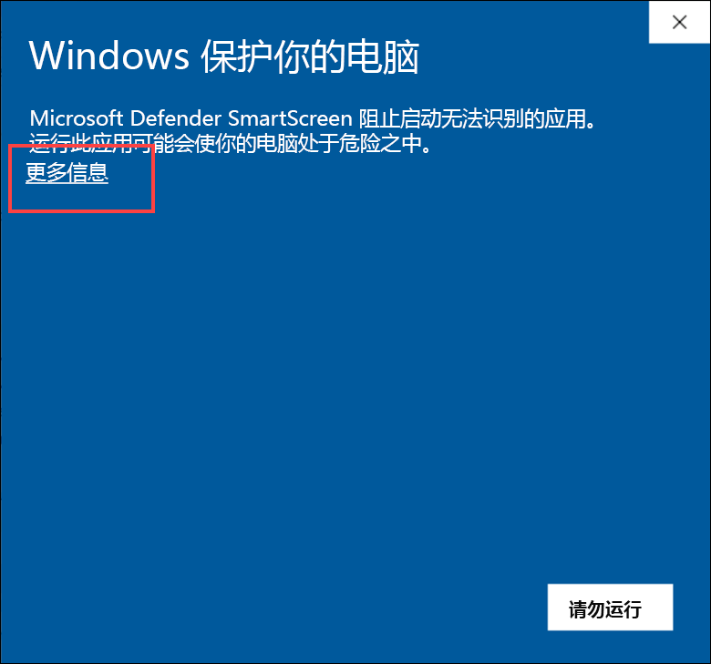

    

6.  随即将打开一个新的控制台窗口，你应该会看到它在几秒钟后开始发送数据。你看到该窗口向事件中心发送数据后，将其*最小化*并让其在后台运行。在进入下一步之前，让它运行至少三分钟。

    

    每当请求发送 500 条记录后，你将看到输出统计信息。

### 任务 2：在 Synapse Analytics 中查看聚合数据

回想一下，你在流分析中创建查询后，每两分钟聚合一次引擎温度和车速数据，并将这些数据保存到了 Synapse Analytics。此功能演示了流分析查询能够以不同的时间间隔将数据写入多个输出。通过写入 Synapse Analytics 专用 SQL 池，我们能够将历史和当前聚合数据保留为数据仓库的一部分，而无需 ETL/ELT 过程。

在此任务中，你将查看 Synapse Analytics 中的异常数据。

1. 在 Synapse Studio 中，选择左侧菜单中的“**数据**”以导航到“数据中心”。

    

2. 选择“**工作区**”选项卡，展开“**SQLPool01**”数据库，展开“**表**”，然后右键单击“**dbo.VehicleAverages**”表（如果没有看到列出的表，请刷新表列表）。选择“**新建 SQL 脚本**”，然后“**选择前 100 行**”。

    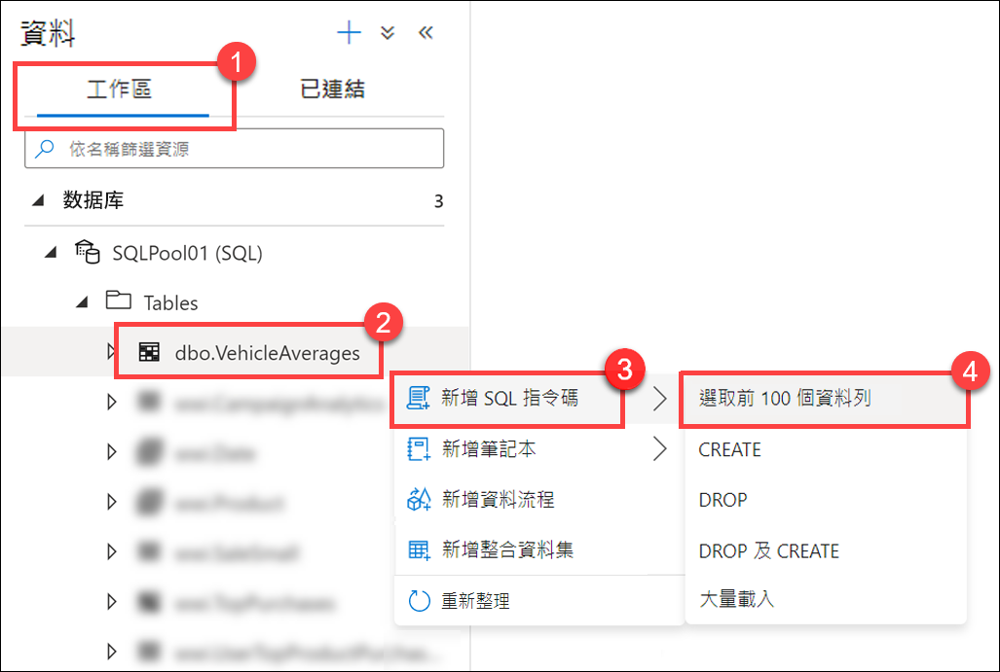

3. 运行查询并查看结果。观察存储在“**AverageEngineTemperature**”和“**AverageSpeed**”中的聚合数据。“**Snapshot**”值在这些记录之间每两分钟更改一次。

   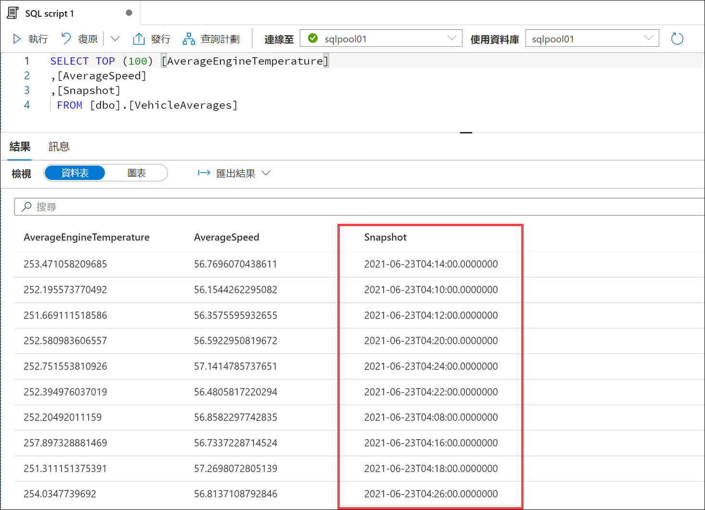

4. 在“结果”输出中选择“**图表**”视图，然后将图表类型设置为“**区域**”。此可视化效果显示一段时间内平均引擎温度与平均速度的关系。请随意尝试图表设置。数据生成器运行的时间越长，生成的数据点就越多。以下可视化是运行超过 10 分钟的会话示例，可能不代表你在屏幕上看到的内容。

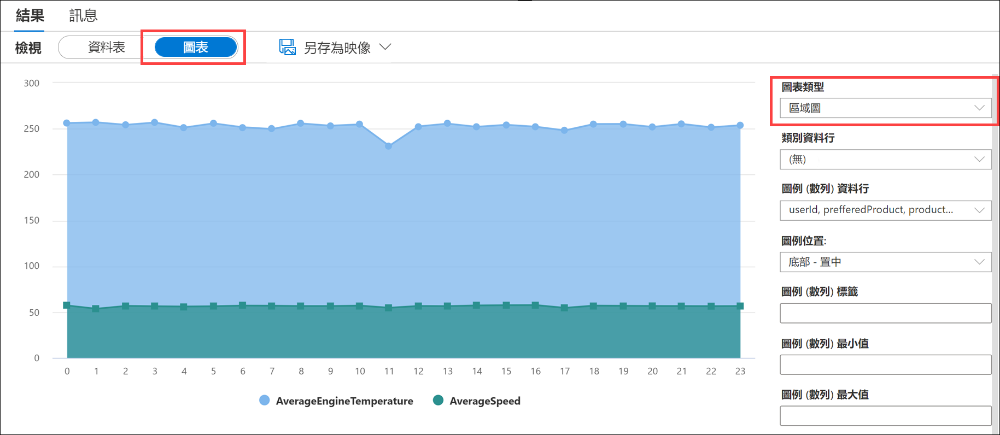

## 重要说明：清理

完成以下步骤，停止数据生成器并释放不再需要的资源。

### 任务 1：停止数据生成器

1. 返回运行数据生成器的控制台/终端窗口。关闭窗口以停止生成器。

### 任务 2：停止流分析作业

1. 导航到 Azure 门户中的流分析作业。

2. 在“概览”窗格中，选择“**停止**”，然后在出现提示时选择“**是**”。

    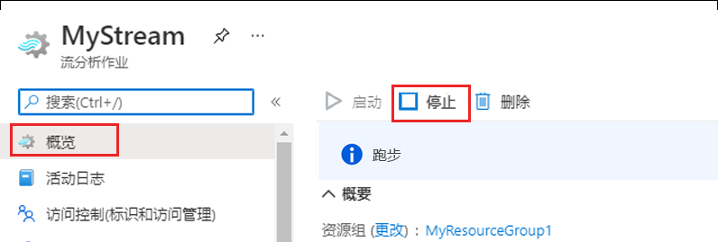

### 任务 3：暂停专用 SQL 池

完成以下步骤，释放不再需要的资源。

1. 在 Synapse Studio 中，选择“**管理**”中心。
2. 在左侧菜单中，选择“**SQL 池**”。将鼠标悬停在“**SQLPool01**”专用 SQL 池上，并选择 **||**。

    

3. 出现提示时，选择“**暂停**”。
