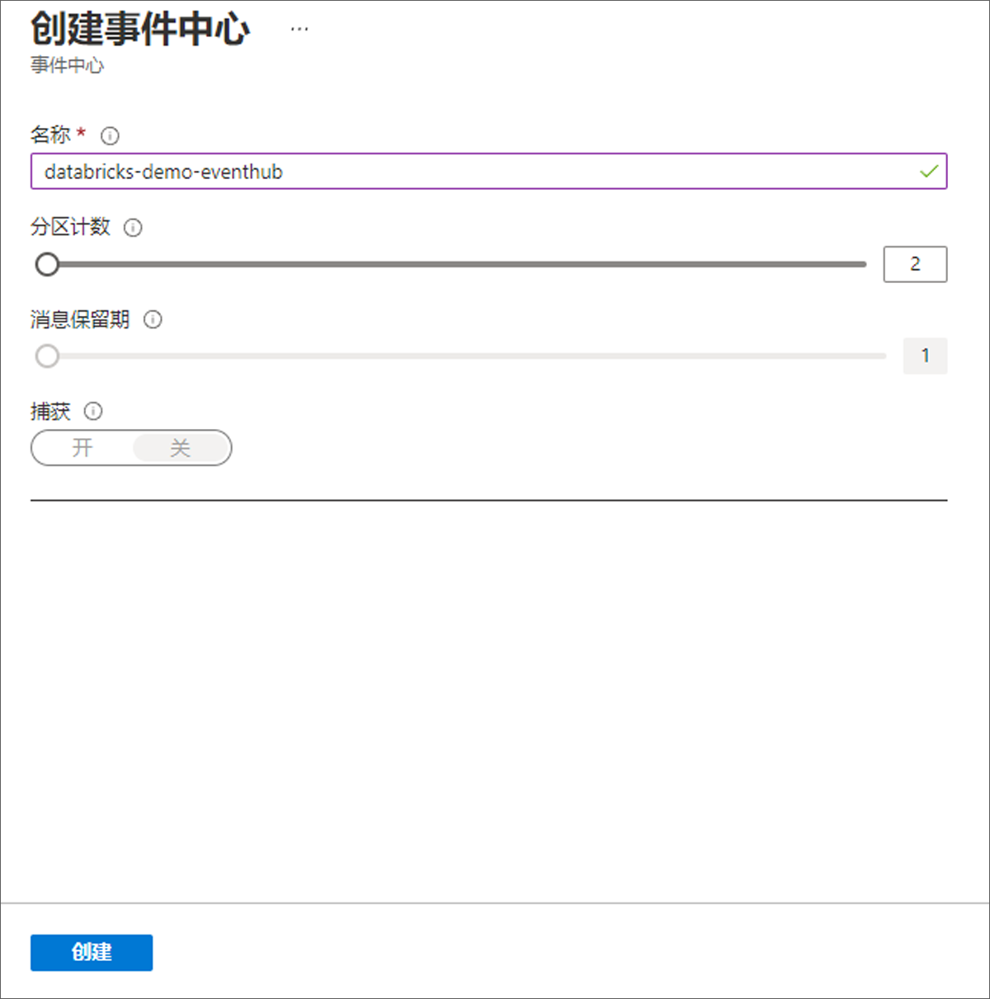
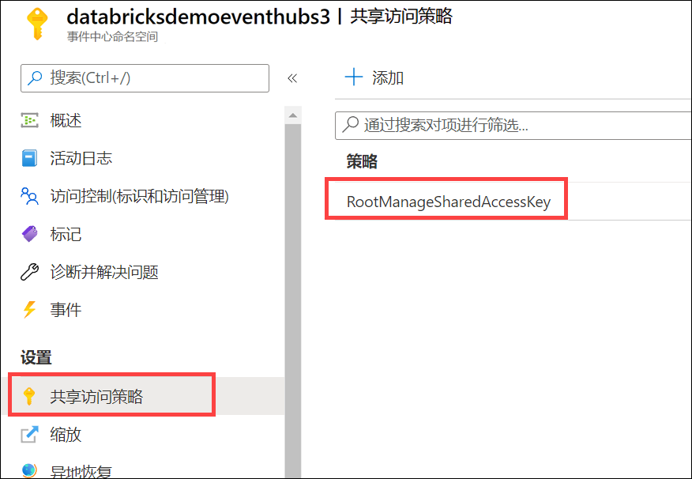
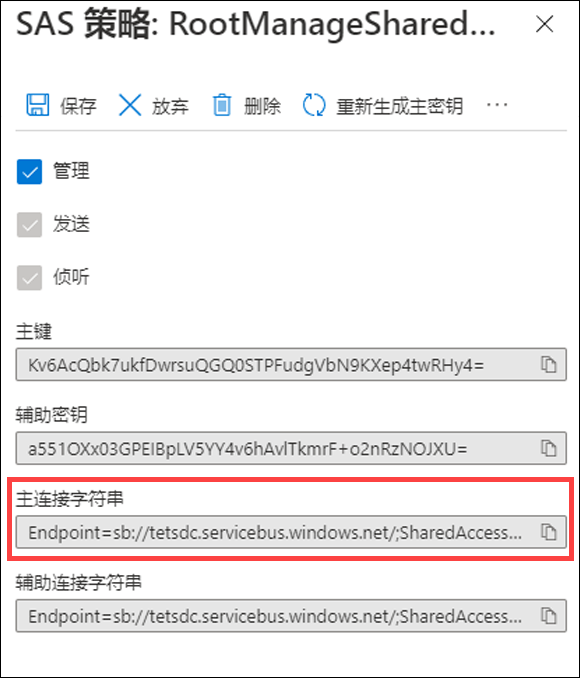

---
lab:
    title: '使用事件中心和 Azure Databricks 创建流式处理解决方案'
    module: '模块 11'
---

# 实验室 11 - 使用事件中心和 Azure Databricks 创建流式处理解决方案

在此实验室中，你将了解如何在 Azure Databricks 中使用事件中心和 Spark 结构化流大规模引入和处理流式数据。你将了解结构化流的主要功能和使用方式。你将实现滑动窗口以聚合数据块并应用水印以删除过时数据。最后，将连接到事件中心以读取流和写入流。

完成本实验室后，你将能够：

- 了解结构化流的主要功能和使用方式
- 对文件中的数据进行流式处理，并将其写出到分布式文件系统
- 使用滑动窗口来聚合数据块（而不是所有数据）
- 应用水印以删除过时数据
- 连接到事件中心以读取流和写入流

## 概念

Apache Spark Structured Streaming 是一种快速、可缩放且容错的流处理 API。可用它近实时地对流数据执行分析。

借助 Structured Streaming，可以使用 SQL 查询来处理流数据，其方式与处理静态数据的方式相同。API 不断递增并更新最终数据。

### 事件中心和 Spark Structured Streaming

Azure 事件中心是一种可缩放的实时数据引入服务，可在几秒钟内处理数百万个数据。Azure 事件中心可从多个源接收大量数据，并将准备好的数据流式传输到 Azure Data Lake 或 Azure Blob 存储。

Azure 事件中心可以与 Spark Structured Streaming 集成，执行近实时消息处理。使用 Structured Streaming 查询和 Spark SQL，可以在数据出现时查询和分析已处理的数据。

### 流式处理概念

流式处理是不断将新数据合并到 Data Lake 存储并计算结果的地方。流数据的传入速度比使用传统批处理相关技术对其进行处理时的速度更快。数据流被视为连续追加??数据的表。此类数据的示例包括银行卡交易、物联网 (IoT) 设备数据和视频游戏播放事件。

流式处理系统包括：

- Kafka、Azure 事件中心、IoT 中心、分布式系统上的文件或 TCP-IP 套接字等输入源
- 针对 forEach 接收器、内存接收器等使用结构化流进行流处理

## 实验室设置和先决条件

开始本实验室之前，请确保已成功完成创建实验室环境的安装步骤。

## 练习 1 - 了解结构化流式处理概念

### 任务 1：克隆 Databricks 存档

1. 如果当前没有打开 Azure Databricks 工作区：在 Azure 门户中，导航到已部署的 Azure Databricks 工作区并选择“**启动工作区**”。
1. 在左侧窗格中，选择“**计算**”。如果你拥有现有群集，请确保其正在运行（根据需要启动）。如果你没有现有群集，请创建使用最新运行时和 **Scala 2.12** 或更高版本的单节点群集。
1. 当群集正在运行时，请在左窗格中，依次选择“**工作区**” > “**用户**”和你的用户名（带房屋图标的条目）。
1. 在显示的窗格中，选择名称旁边的箭头，然后选择“**导入**”。

    

1. 在“**导入笔记本**”对话框中，选择 URL 并粘贴以下 URL：

 ```
   https://github.com/MicrosoftLearning/DP-203-Data-Engineer/raw/master/Allfiles/microsoft-learning-paths-databricks-notebooks/data-engineering/DBC/10-Structured-Streaming.dbc
 ```

1. 选择“**导入**”。
1. 选择出现的“**10-Structured-Streaming**”文件夹。

### 任务 2：完成笔记本

1. 打开“**1.Structured-Streaming-Concepts**”笔记本。确保将群集附加到笔记本上，然后按照说明在笔记本中运行单元格。

   在笔记本中，你将：

   - 对文件中的数据进行流式处理，并将其写出到分布式文件系统
   - 列出活动的流
   - 停止活动的流

## 练习 2 - 使用时间窗口

### 任务 1：完成笔记本

1. 在 Azure Databricks 工作区中，打开你在用户文件夹中导入的“**10-Structured-Streaming**”文件夹。

2. 打开“**2.Time-Windows**”笔记本。确保将群集附加到笔记本上，然后按照说明在笔记本中运行单元格。

   在笔记本中，你将：

   - 使用滑动窗口来聚合数据块（而不是所有数据）
   - 应用水印以丢弃没有空间保留的过时旧数据
   - 使用“显示”绘制实时图

## 练习 3 - 将结构化流式处理与 Azure 事件中心结合使用

### 任务 1：创建事件中心

1. 在 Azure 门户 (<https://portal.azure.com>) 的“**data-engineering-synapse-*xxxxxxx***”资源组中（该资源组包含本课程的 Azure 资源），打开“**eventhub*xxxxxxx***”事件中心命名空间。
2. 通过选择工具栏上的“**+ 事件中心**”按钮添加新的事件中心。
3. 在“**创建事件中心**”窗格中，使用以下详细信息创建一个新事件中心：

   - **名称**：`databricks-demo-eventhub`
   - **分区计数**：`2`
   - **消息保留**：`1`
   - **捕获**：*关*

   选择“**创建**”。

   

### 任务 2：复制共享访问策略的连接字符串主键

1. 在事件中心命名空间的左侧菜单中，选择“**设置**”下的“**共享访问策略**”，然后选择“**RootManageSharedAccessKey**”策略。

   

2. 通过选择复制按钮来复制连接字符串的主键。

   

3. 将复制的主键保存到记事本或其他文本编辑器，以供以后参考。

### 任务 3：运行笔记本

1. 切换回包含 Azure Databricks 工作区的浏览器选项卡，打开你在用户文件夹中导入的“**10-Structured-Streaming**”文件夹。

2. 打开“**3.Streaming-With-Event-Hubs-Demo**”笔记本。确保将群集附加到笔记本上，然后按照说明在笔记本中运行单元格。

   在笔记本中，你将：

   - 连接到事件中心并将流写入事件中心
   - 从事件中心读取流
   - 定义 JSON 有效负载的架构并分析数据，以在表中显示数据

## 关闭群集

1. 完成实验室后，在左侧窗格中，选择“**计算**”并选择群集。然后选择“**终止**”以停止群集。
